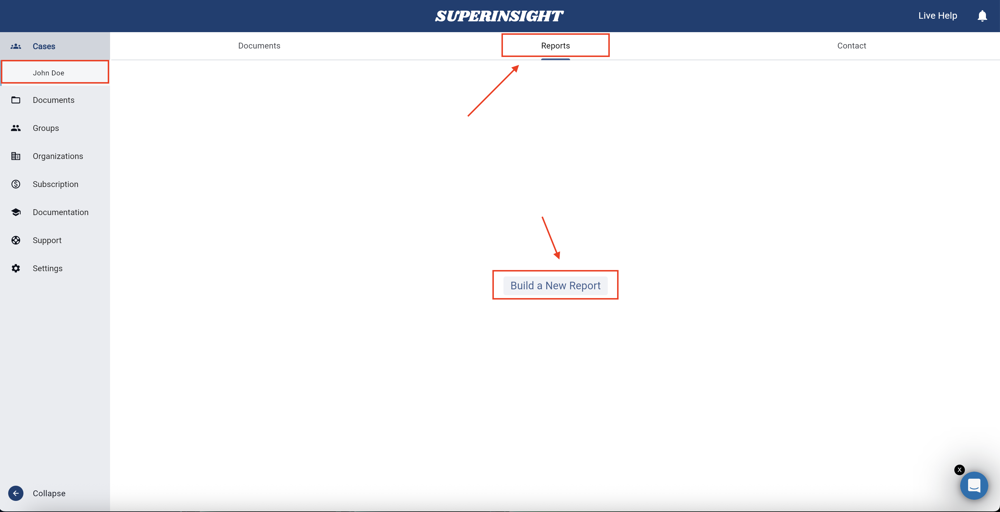
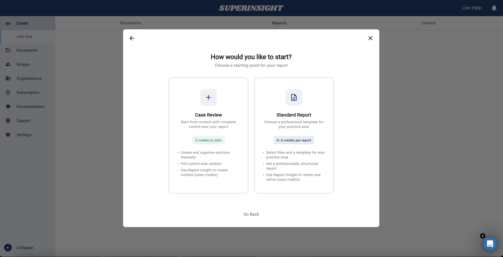
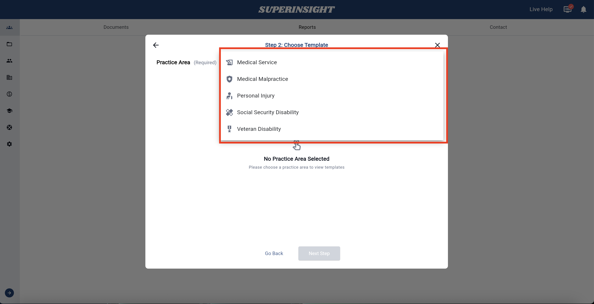
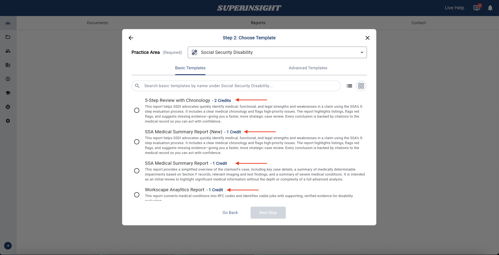
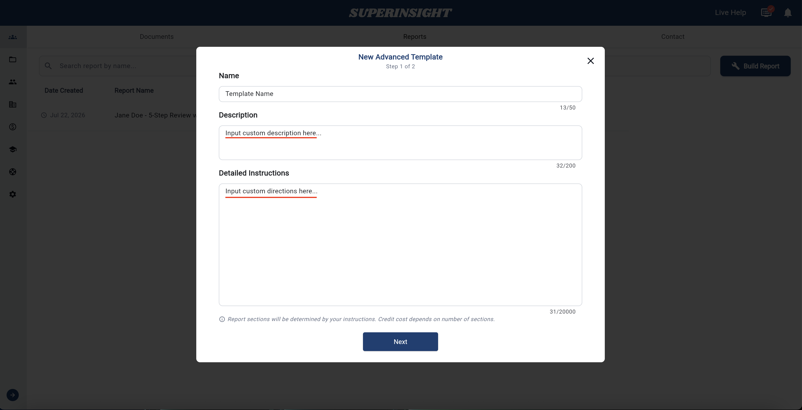
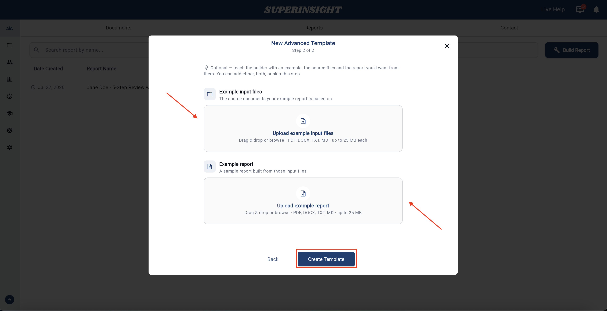
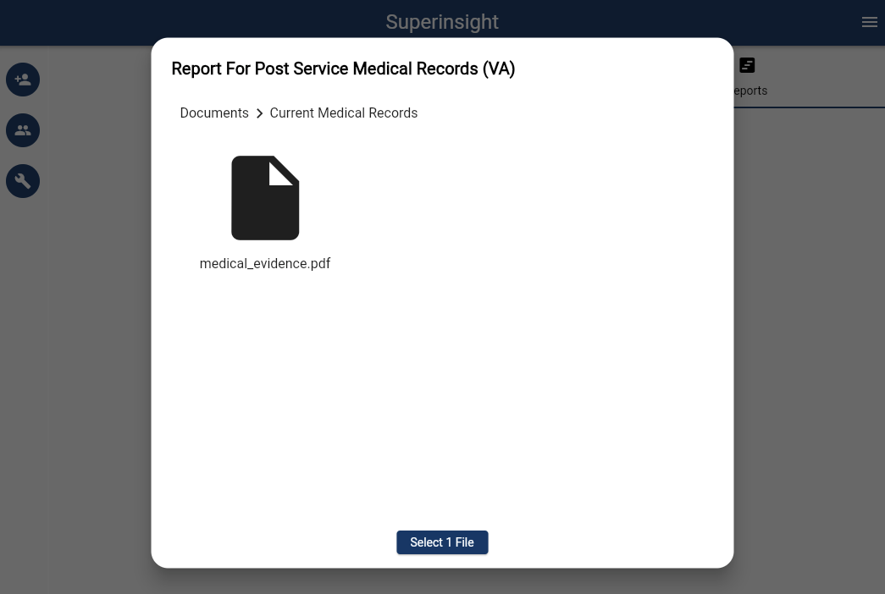
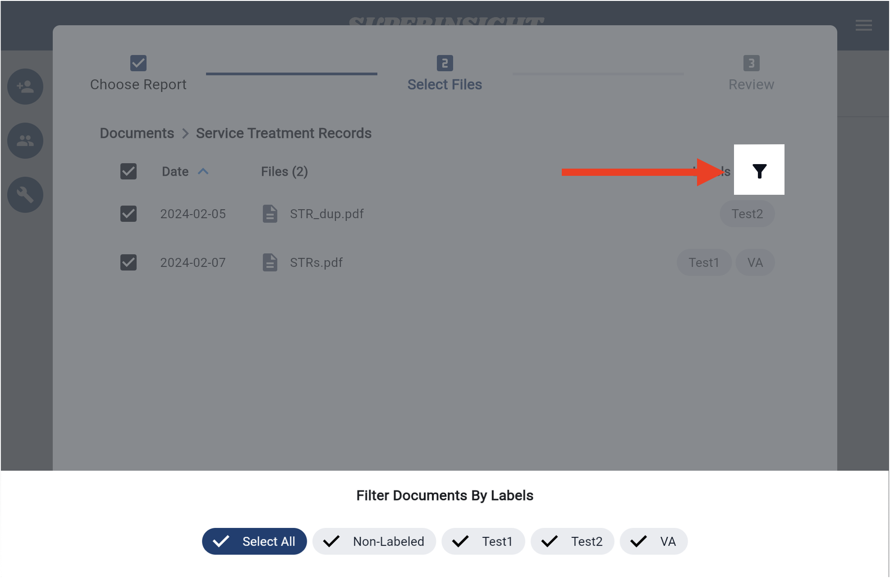
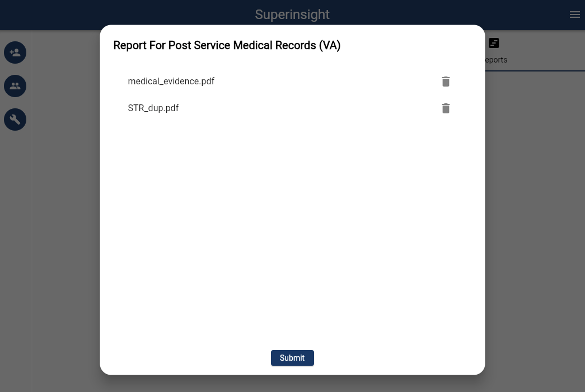
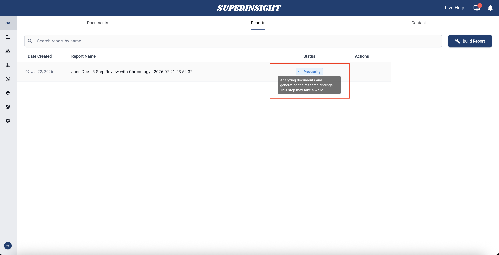

# Build a Report

Superinsight turns your case documents into structured reports — chronologies, summaries, disability analyses, and more. This guide walks you through **building a report** and **choosing the right template** for your case.

For downloading, editing, rebuilding, or deleting reports after they are created, see [Manage my reports](manage-reports.md).

<iframe width="560" height="315" 
src="https://www.youtube.com/embed/sI9clpIOlis?rel=0&si=XJezGeCH_ctuhxxm" 
title="YouTube video player" 
frameborder="0" 
allow="accelerometer; autoplay; clipboard-write; encrypted-media; gyroscope; picture-in-picture; web-share" 
referrerpolicy="strict-origin-when-cross-origin" 
allowfullscreen></iframe>

## Before you start

1. **Create a case** and [upload your documents](case-folder.md).
2. Wait for files to finish processing — reports can only use files that are ready.
3. Check your **credit balance**. Each report typically costs **1–5 credits**, depending on the template and files selected. You can see the exact cost before you submit.

    See [Credits and Usage](credit-usage.md) for plan details.

!!! tip "Need a report type we do not offer yet?"
    [Contact us](mailto:help@superinsight.ai) — we are happy to discuss custom needs. You can also download a [sample SSD report](deprecated/sample-report.md) to preview output quality.

## Open the report builder

1. Open a **case** from your case list.
2. Go to the **Reports** tab.
3. Click **Build a New Report** (or **Build Report** if you already have reports in the list).

## Choose how to start

Superinsight asks how you want to begin:

| Option | Best for |
| --- | --- |
| **Case Review** | Start from scratch with full control — chat with your files and build sections as you go (**0 credits to start**) |
| **Standard Report** | Choose a professional template for your practice area (**0–3 credits per report**, depending on template) |

Both options support [Research Insight](research-insight.md) for follow-up questions once your report is open.

## Choose a practice area

For **Standard Report**, select the **practice area** that matches your case type. This helps Superinsight surface the right templates and instructions.

## Choose a template

Templates control the **structure**, **sections**, and **analysis focus** of your report. Superinsight offers several ways to build:

| Option | Best for |
| --- | --- |
| **Basic templates** | Common report types with predefined sections (e.g., chronologies, summaries) — each template shows its **credit cost** |
| **Build My Own** | Custom prompts when you want full control over what the report covers |
| **Advanced Templates** | Custom section layouts for cases that need a unique structure |
| **Case Review** | A flexible workspace with no pre-built sections — useful for open-ended exploration and [Research Insight](research-insight.md) |

### Basic templates

After you pick a practice area, choose a template from the **Basic Templates** tab. Each template includes preset sections, analysis instructions, and a credit cost suited to that report type.

### Advanced Templates

**Advanced Templates** give you more control over report structure than basic templates. Use them when you need custom sections or a layout tailored to a specific workflow.

1. When building a report, open the **Advanced Templates** tab in the Choose Template step, or click **New Advanced Template**.
2. Enter a name, description, and detailed instructions for the template.

    

3. Optionally upload example input files and an example report to teach the builder.

    

4. Continue to file selection and build the report.

Advanced Templates are a good fit when:

- Standard templates do not match your case type
- You need a unique section structure
- You want to focus on specific parts of the medical record

## Select source files

Choose which documents to include in the report. You can select multiple files and filter by **labels** to find what you need quickly.

=== "Select Files"
    

=== "Filter Labels"
    

!!! tip "File selection tips"
    - Include all records relevant to the report’s time period or topic.
    - Use labels (applied during upload) to narrow large case folders.
    - Fewer, well-chosen files can reduce processing time for focused reports.

## Confirm and build

Review your template, files, and **credit cost**, then submit to start generation.

While the report generates, it appears in the Reports list with a **Processing** status. When complete, the status changes to **Ready** and you can open, export, or edit it.

## After your report is ready

Once generation finishes:

- **Open the report** to read sections and source citations.
- **Export** as PDF or DOCX.
- **Edit** sections or ask questions in [Research Insight](research-insight.md).
- **Rebuild** if you need to regenerate with updated files (up to 3 times, free).

See [Manage my reports](manage-reports.md) for the full walkthrough of viewing, editing, rebuilding, and deleting reports.

## Next steps

- [Manage my reports](manage-reports.md) — download, edit, rebuild, and delete
- [Research Insight](research-insight.md) — ask questions inside a report
- [Organize my files](case-folder.md) — upload and label documents
- [Credits and Usage](credit-usage.md) — understand report costs
