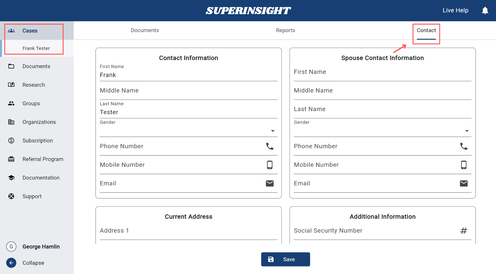
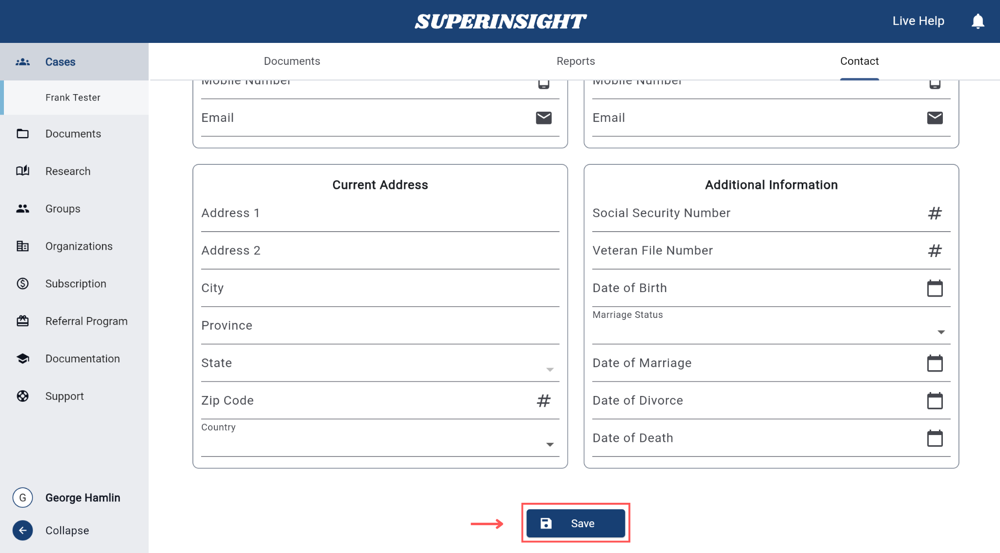

# Update Contact Info

Use the **Contacts** tab inside a case to store client and related contact details. This information is shared with teammates who have permission to view Contacts.

## Steps

1. Open the case you want to update.
2. Click the **Contacts** tab.

    

3. Fill in the details you need:
    - **Primary Contact** — name, gender, phone, email
    - **Spouse Info** (if any) — name, gender, phone, email
    - **Address** — street, city, state, zip, country
    - **Additional Info** — SSN, veteran file number, date of birth, marriage status and dates
4. Click **Save**.

    

!!! success "You're done when…"
    Your changes are saved, and teammates with access can see the updated contact information.

## Next steps

- [Create a case](case-create.md)
- [Share a case](case-share.md) — control who can view Contacts
- [Find and open a case](case-find.md)
