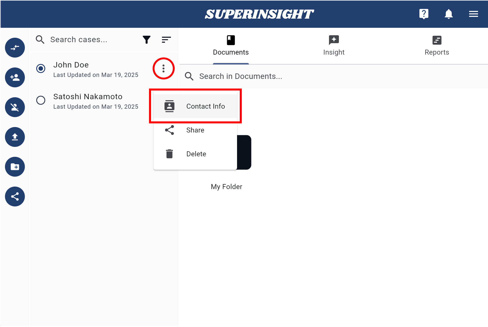
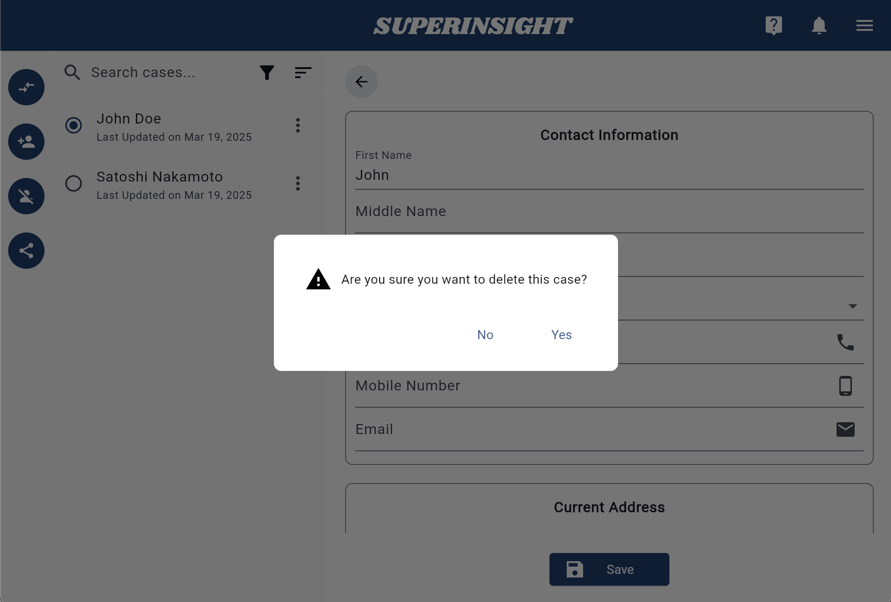

# Manage Contact

## 1. Create Contacts

Build up your case information before everything! Click **Start a New Case** or the **New Case** button in the navigation on left to add a new contact.

Simply Fill in your contact's name and click **Create**. The contact list will shown on the left and you can easily switch contacts.

You can go to the **Contact** tab if you need to modify contact's personal info or even delete the contact.

=== "New Case"

    

=== "Contact Info"

    

=== "Contact List"

    

## 2. Delete Contacts

When you select the contacts that you want to remove from your contact list, you can see the **Delete Case** button in the navigation on left. Click the button and confirm the deletion to remove the contact.

=== "Delete Case Button"
    

=== "Confirm Delete"
    