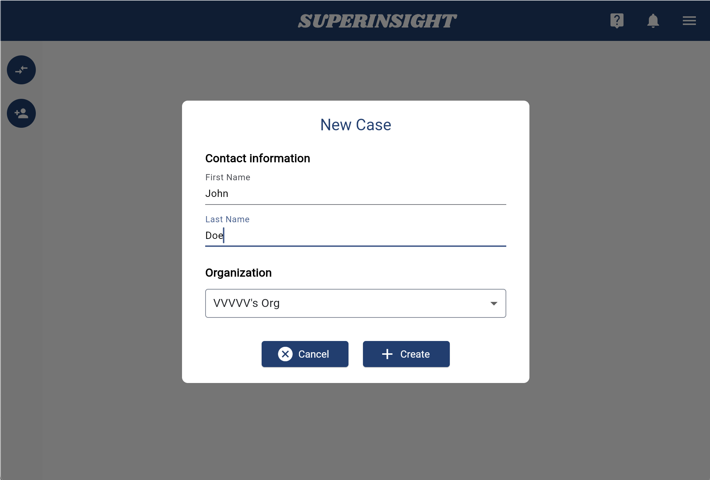

# Manage Case

## Create Case

To get started, click **Start a New Case** or the **New Case** button on the left to add a new contact.

Simply fill in your claimant's name and click **Create**. The case list will appear on the left and you can easily switch from case to case.

You can go to the **Contact Info** page by clicking the dots button on the list item if you need to edit the contact info of the case.

=== "Get Started"

    

=== "New Case"

    

=== "Case List"

    

=== "Contact Info"

    

## Delete Case

When you select the case that you want to remove from your case list, you can see the **Delete Case** button on the left. Click the button and confirm the deletion to remove the case.

=== "Delete Case Button"
    

=== "Confirm Deletion"
    