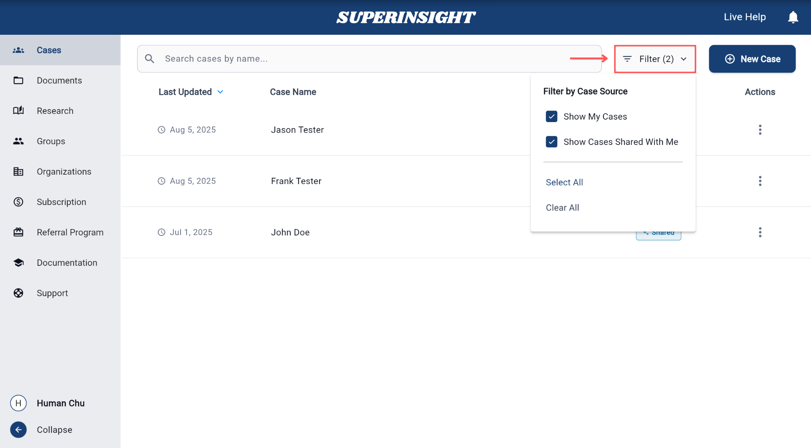
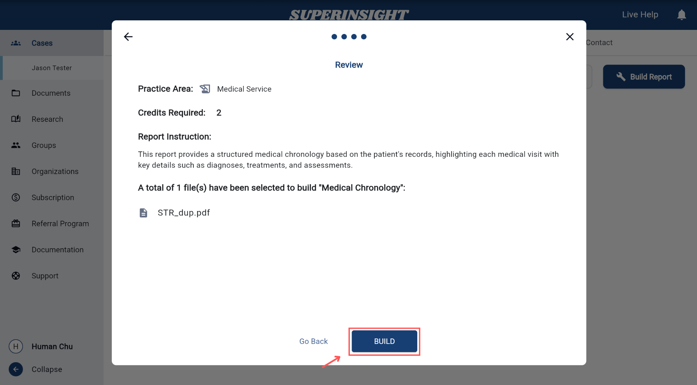

# Manage Case

## Overview

The **Case Management** system is the central hub for organizing and processing your legal cases in Superinsight. This comprehensive tool allows you to create, organize, and collaborate on cases with team members while maintaining complete control over documents, reports, and contact information.

This section will guide you through each aspect of case management, from initial setup to advanced collaboration features.

<iframe width="560" height="315" 
src="https://www.youtube.com/embed/K_RJNONhUmc?rel=0" 
title="YouTube video player" frameborder="0" 
allow="accelerometer; autoplay; clipboard-write; encrypted-media; gyroscope; picture-in-picture; web-share" 
referrerpolicy="strict-origin-when-cross-origin" allowfullscreen></iframe>

## Manage Case

### Add New Case

=== "Get Started"
    To begin creating a new case, click **New Case** button on the right. 
    
    This opens the case creation dialog where you can enter the required information.

    

=== "Add New Case"
    When creating a case, you must provide:
    
    • First Name
    
    • Last Name
    
    • Organization: The case must be linked to an organization

    After entering the information, click **Create** to add the case to your list.

    

=== "Delete Case"
    To delete a case, first select the case you want to remove from the case list. Then click the three dots menu (⋮) next to the case name to open the quick access menu.

    In the options menu, you'll see a **Delete** button. Click this button to initiate the deletion process. The system will display a confirmation dialog to ensure you want to proceed with the deletion.

    

    !!! Warning "Important"

        Deleting a case will permanently remove all associated data, including documents, reports, and contact information. This action cannot be undone.

    After confirming the deletion, the case will be permanently removed from your case list and all associated data will be deleted from the system.

    

### Case List

The case list displays all your cases in an organized view. Each case shows key information including:

- **Last Updated**: Shows the most recent modification date of each case.  
- **Case Name**: Typically the claimant's full name.  
- **Ownership**: Indicates whether you are the owner or if the case is shared with you.  
- **Actions**: Click the three-dot menu to view, share, or delete case options.

You can click on any case in the list to open it and access its details, documents, and reports. The list automatically updates when you create new cases or make changes to existing ones.

### Share Case

Easily share your case with teammates or collaborators by following a few simple steps. This guide walks you through the process.

<iframe width="560" height="315" 
src="https://www.youtube.com/embed/GmUYhPkIbOU?rel=0&si=ce4dFYqS2eZy8ZLn" 
title="YouTube video player" 
frameborder="0" 
allow="accelerometer; autoplay; clipboard-write; encrypted-media; gyroscope; picture-in-picture; web-share" 
referrerpolicy="strict-origin-when-cross-origin" 
allowfullscreen></iframe>

=== "Share Case Button"
    To share a case, first in the Case List page and then click the three dots menu (⋮) next to case name, select **Share** buttom to open the sharing dialog.

    

=== "Share Options"
    In the sharing dialog, choose whether you want to share the case with an individual User or a Group of users.  
    Use the dropdown to switch between these two options.

    • Select **User** to share with one person.  
    • Select **Group** to share with an entire team or department.

    Only one option can be selected at a time. You can repeat the process to add more users or groups.

    

=== "Enter Email"
    If you've selected User, enter the email address of the person you want to invite.  
    You can invite multiple collaborators by adding their email addresses one by one.

    The system will automatically send an invitation to each email address so they can access the case.

    

Once shared

After sharing, all invited users or groups will be listed under the "Who has access to this case?" section.  
You can remove access anytime if needed.

=== "Access Control"
    You can customize access levels for each user or group by using the **Access Control** feature.

    This ensures that collaborators only see and edit what they're authorized to handle.

    **Set Access**

    Next to each person listed in the **Who has access to this case?** section, you'll find a **gear icon**.  
    Click this icon to open the Access Control dialog and manage permissions.

    

    **Set Permissions**

    In the Access Control dialog, you can assign different access levels to individual parts of the case including **Documents**, **Reports**, and **Contact**.

    For each part, choose one of the following roles:

    - **Read** – View-only access. The user can see the content but cannot make any changes.  
    - **Write** – Full access to view, edit, and update content.  
    - **None** – The user has no access to this section.

    These settings can be customized per person. Click **Update** to save your changes.

    > Example: You might allow a reviewer to read Documents but restrict them from accessing Contacts.

    

### Filter Cases

Use filters to quickly narrow down your case list and focus only on the cases that matter to you.

This feature helps you switch between different case sources with just a few clicks.

Click the **Filter** button at the top right of the case list to open the dropdown menu.

You'll see two filtering options:

- **Show My Cases** – Displays cases that you created or own  
- **Show Cases Shared With Me** – Displays cases that other users have shared with you

You can enable one or both options depending on your viewing preference.

At the bottom of the menu, you'll also find:

- **Select All** – Check both filters at once  
- **Clear All** – Uncheck both filters to reset the list

> Your selection will immediately update the visible case list.

## Case Documents

### Manage Folders

To manage your documents, first click on the case you want to work with from the case list.
Once inside the case, navigate to the **Documents** tab on the page.

Organize your case documents by creating and managing folders. This helps you keep files structured and easy to find.

=== "Create New Folder"
    To add a new folder to your case:

    1. Click on the **New Folder** button located in the left sidebar under the **Documents** tab.  
    2. Enter a name for your folder when prompted.

    The new folder will appear in the current case's document view.

    

=== "Delete Folder"
    To delete a folder:

    1. Navigate into the folder you want to remove.  
    2. Click the **Delete Folder** button in the left sidebar.

    

    ⚠️ Deleting a folder will also remove all documents stored in it. Please make sure you've backed up any important files before proceeding.

### Upload File

You can upload file to your case folders for storage, review, or building a report. All uploaded files are automatically processed and logged in the system.

=== "Upload a File"
    To upload a file into a folder:

    1. Click the **Upload File** button on the left panel.  
    2. Select a file from your device and confirm the upload.

    Once uploaded, the file will appear in the file list with its upload date, name, and any assigned labels.

    

=== "Upload Confirmation"
    After a file is successfully uploaded, a confirmation panel will appear at the bottom right of the screen.  
    It will show the file name and notify you that it's ready for use.

    > You can proceed to the **Reports** tab to build reports using the uploaded documents.

     

## Build Report

### How to Build a Report  
<!-- These are step-by-step instructions -->

This section walks users through the full report generation process in four steps.

To begin building a report, go to any **Case**, then click the **Reports** tab at the top.

#### Step 1: Open the Report Builder  
- Navigate to the **Reports** tab inside any case.  
- Click the **Build Report** button to start.

  

#### Step 2: Select Source Files  
- Choose which files you'd like to include in the report.  
- You can filter by labels or use folders and may select one or multiple documents.

#### Step 3: Select Report Type  
- Choose your **Practice Area** (e.g., Medical Service or Personal Injury etc...)
- Choose your **Report Type** (e.g., Medical Chronology, Basic Summary, or Advanced Templates).
Each option will display how many credits are required.

#### Step 4: Build Report  
Confirm your report detail:

• Practice Area

• Report Type

• Selected Files

• The Number of Credits Required

And build the report click **Build** to generate your report.  

The report status will show as `In Progress` in the Reports tab.  
Processing may take a few minutes.

## Contact Information

The Contacts section manages all contact information related to your case. This includes client details, witnesses, experts, and other relevant parties.

To manage contacts in your case:

1. Go to the Contacts tab in your case.  
   

2. Fill in the details:  
   • **Primary Contact**: Name, Gender, Phone, Email  
   • **Spouse Info (if any)**: Name, Gender, Phone, Email  
   • **Address**: Street, City, State, Zip, Country  
   • **Additional Info**: SSN, Veteran File Number, Date of Birth, Marriage Status & Dates  

3. Click Save to store the contact information.  
   

Contact information is automatically synchronized across all team members with appropriate access permissions. 