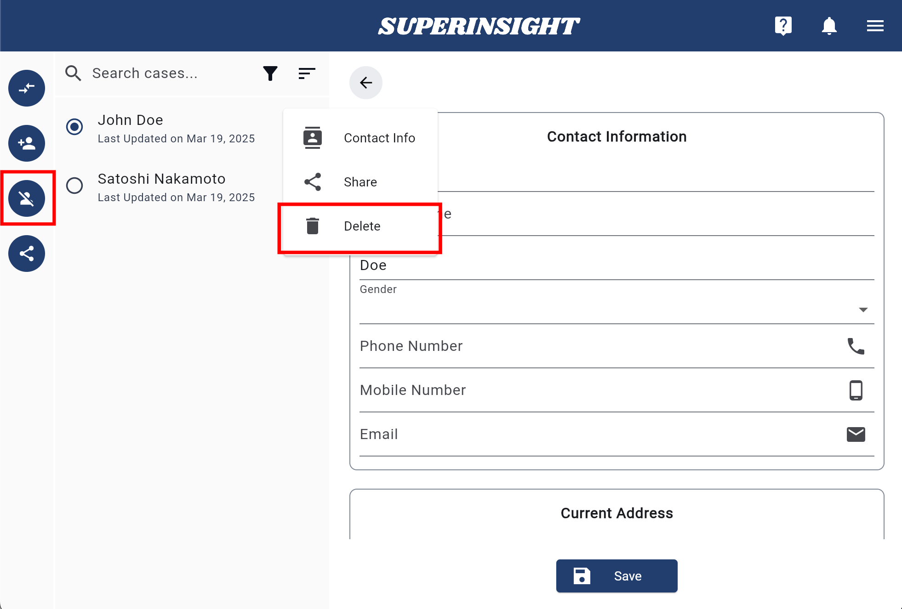

# Manage Case

## Create Case

Build up your case information before everything! Click **Start a New Case** or the **New Case** button in the navigation on left to add a new contact.

Simply Fill in your claimant's name and click **Create**. The case list will shown on the left and you can easily switch from case to case.

You can go to the **Contact** tab if you need to modify personal info of the case or even delete this case.

=== "New Case"

    

=== "Contact Info"

    

=== "Case List"

    

## Delete Case

When you select the case that you want to remove from your case list, you can see the **Delete Case** button in the navigation on left. Click the button and confirm the deletion to remove the case.

=== "Delete Case Button"
    

=== "Confirm Delete"
    