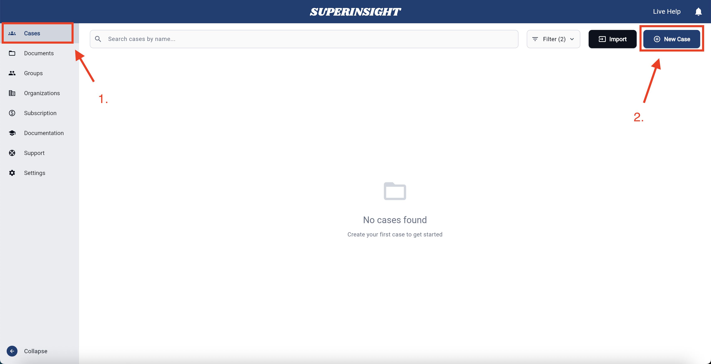
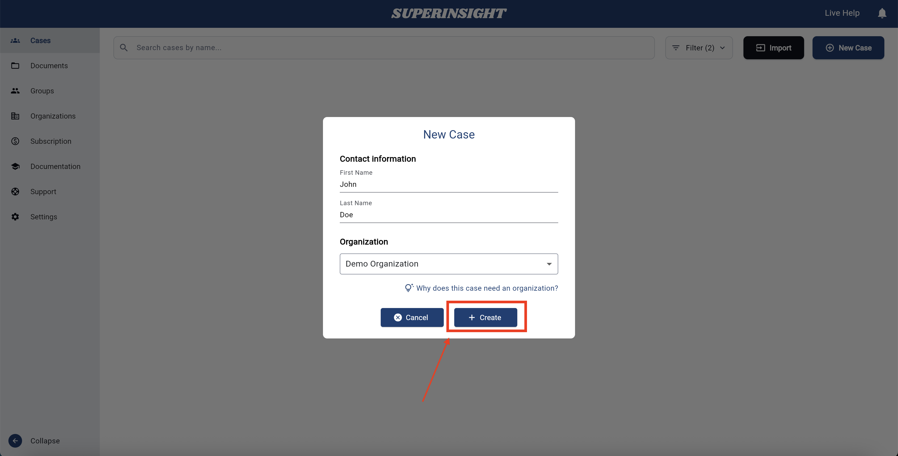

# Create a Case

Create a new case when you start work for a client. Each case holds that client’s documents, reports, and contact details.

## Steps

1. Open the **Cases** section in Superinsight.
2. Click the **New Case** button on the right.

    

3. Enter the required information:
    - **First Name**
    - **Last Name**
    - **Organization** — every case must be linked to an organization
4. Click **Create**.

    

!!! success "You're done when…"
    The new case appears in your case list with the client’s name.

## Next steps

- [Find and open a case](case-find.md)
- [Organize my files](case-folder.md) — upload documents to the case
- [Update contact info](case-contact-info.md)
