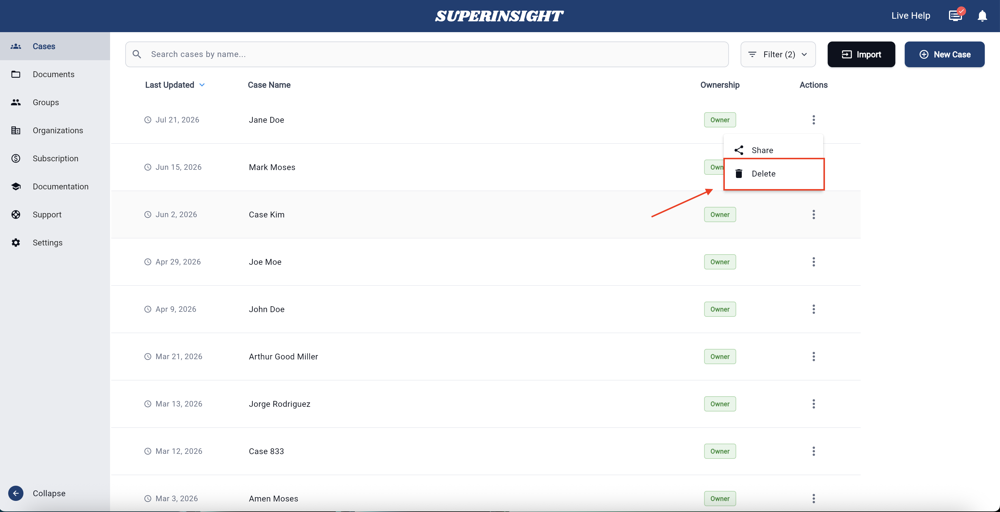
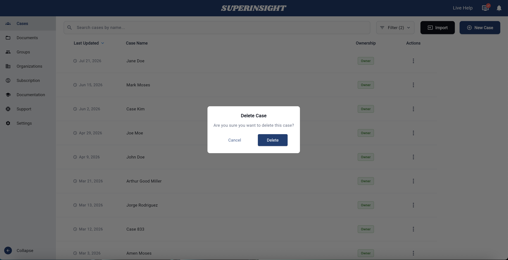

# Delete a Case

Delete a case when you no longer need it. This permanently removes the case and everything inside it.

!!! warning "Important"
    Deleting a case permanently removes all associated data, including documents, reports, and contact information. This cannot be undone.

## Steps

1. Open the **Cases** list.
2. Find the case you want to delete.
3. Click the three-dot menu (⋮) next to the case name.
4. Click **Delete**.

    

5. Confirm the deletion in the dialog that appears.

    

!!! success "You're done when…"
    The case no longer appears in your case list.

## Next steps

- [Create a case](case-create.md)
- [Find and open a case](case-find.md)
- Need help? [Contact Support](support.md)
