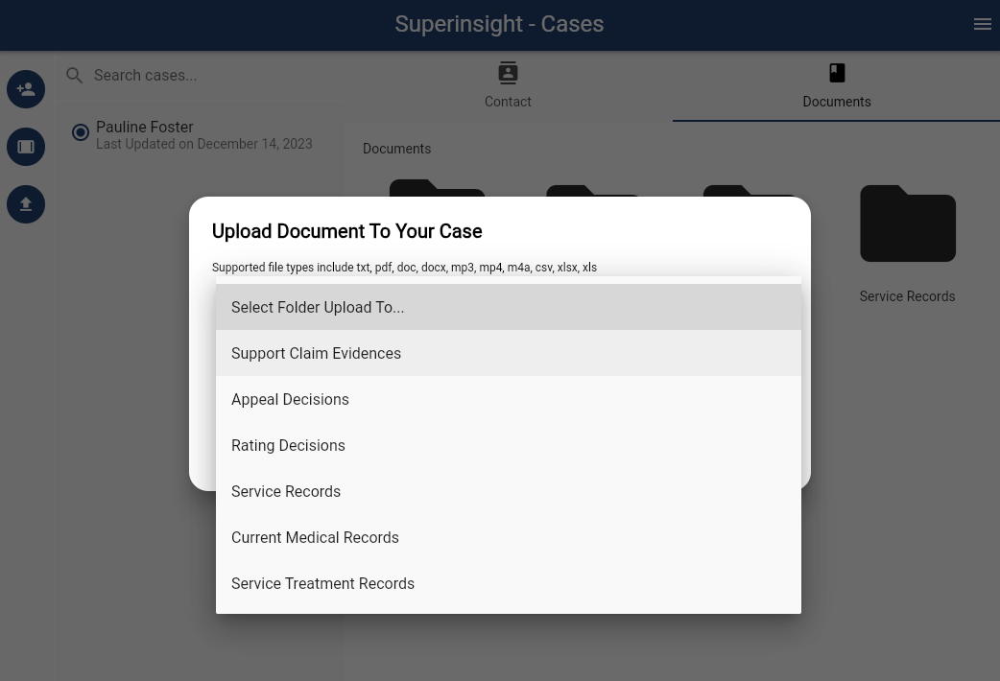

# Veteran File

You can upload all the files that can help the veteran claim like STRs, medical evidence, rating decisions, and so on to the folders that Superinsight prepares and organizes for you.

After file is uploaded, you will see it in the folder as a gray color and can not be clicked on. Behind the scenes, Superinsight is processing and analyzing all the contents in your file. Depending on how big your files are, this process can take a few minutes to up to hours.

=== "Upload File To Folder"

    

=== "File In Progress"

    

=== "File Is Ready"

    

Once your file is ready, you can click on the file you uploaded earlier and Superinsight will show all the key points and insights that are found in the file.

=== "Original File"

    

=== "File Analysis"

    