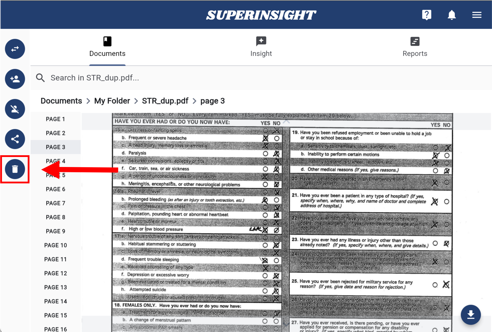
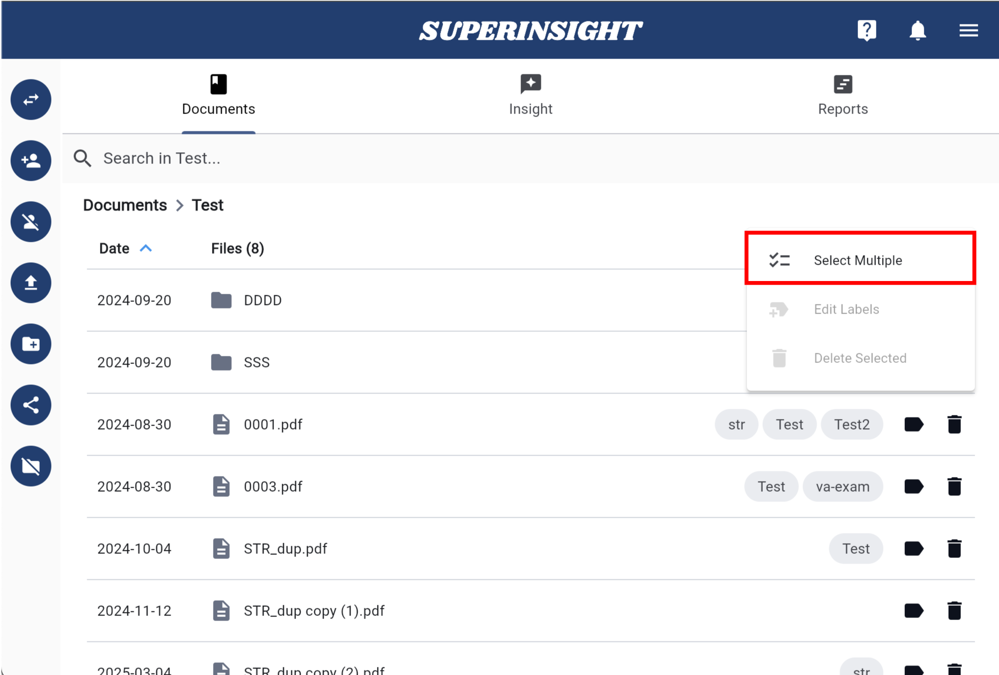
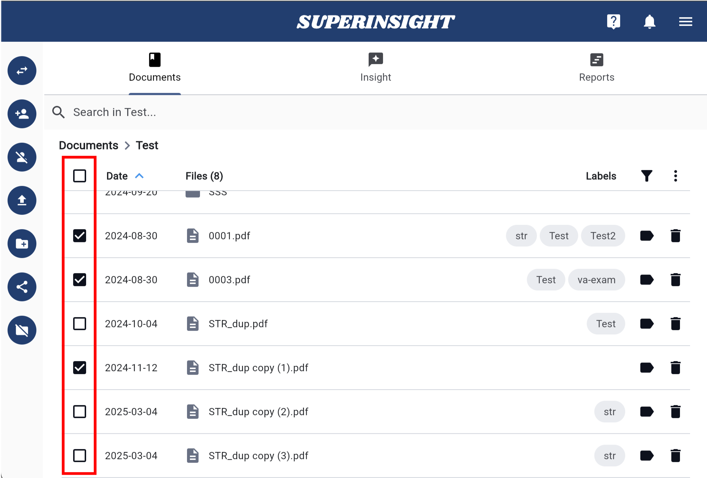

# Manage File

## Upload Files

Depending on the purpose, you can upload files that support your legal claims to the folders you have created after navigating to the folder level.

!!! TIP
    We now support ZIP file uploads! You can compress multiple files into a single ZIP file and upload them at once. The maximum file size is 2GB.

Click the upload button on the left and select the files to upload. Once you submit the files, a small window will appear in the bottom-right corner of the screen, displaying your file upload progress.

After the files are uploaded, you will see them in the folder with a red processing icon on the right. These files cannot be clicked on at this stage. Behind the scenes, Superinsight is processing the content of your files. Depending on the size of your files, this process can take anywhere from a few minutes to several hours.

=== "Click to Upload"
    

=== "Uploading File"
    

=== "File In Progress"
    

=== "File Is Ready"
    

Once your file is ready, you can click on it to preview the file in our viewer.

=== "Document Viewer"
    

## File Labeling

During file processing, your files will be automatically labeled. Superinsight categorizes all files by type, allowing you to easily find specific files using the filter feature.

In addition to auto-labeling, you can manually add or remove labels from files as needed.

=== "Manage Labels"
    Click on the label icon to manage labels for this file.
    

=== "Add New Labels"
    You can assign existing labels to files or create new labels by clicking the + icon on the left
    

=== "Filter by Labels"
    Click the filter icon and select the labels you want to display. You can also use the "Non-Labeled" option to find all unlabeled files.
    

## Delete Files

To delete a file, click the Delete File button next to the file you want to remove. Alternatively, you can open the file, where you will also find the Delete File button on the left. Click the button and confirm the deletion to remove the file.

=== "Delete in Folder"
    

=== "Delete in Preview"
    

=== "Confirm Delete"
    

## Batch Management

If you need to delete multiple files or apply labels to multiple files at once, Superinsight provides a batch management feature.

Click the dots icon next to the filter to enable multi-selection, then select all the files you want to manage.

=== "Advanced Actions"
    

=== "Select Multiple"
    

=== "Batch Manage"
    

**Batch Labeling**

After selecting the files to which you want to add labels, click the dots icon again and choose Edit Labels to open the batch label management window.

In this window, you can add existing labels to the selected files. You can also apply labels to all selected files via drag and drop, and create new labels as needed.

=== "Edit Labels"
    

=== "Drag Labels to Add"
    

=== "Create New Label"
    

=== "Save Changes"
    