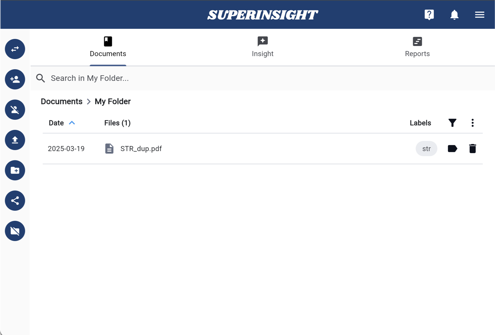

# Upload File

Depending on the purpose, you can upload files that can help your legal claims to the folders you created after you click into the folder level.

After the file is uploaded, you will see it in the folder as a gray color and can not be clicked on. Behind the scenes, Superinsight is processing all the contents in your file. Depending on how large your files are, this process can take a few minutes to hours.

=== "Click to Upload"

    

=== "File In Progress"

    

=== "File Is Ready"

    

Once your file is ready, you can click on it and preview it in our viewer. Meanwhile, Superinsight will find you all the key points and insights from the file in real time.

=== "Original File"

    

=== "File Analysis"

    