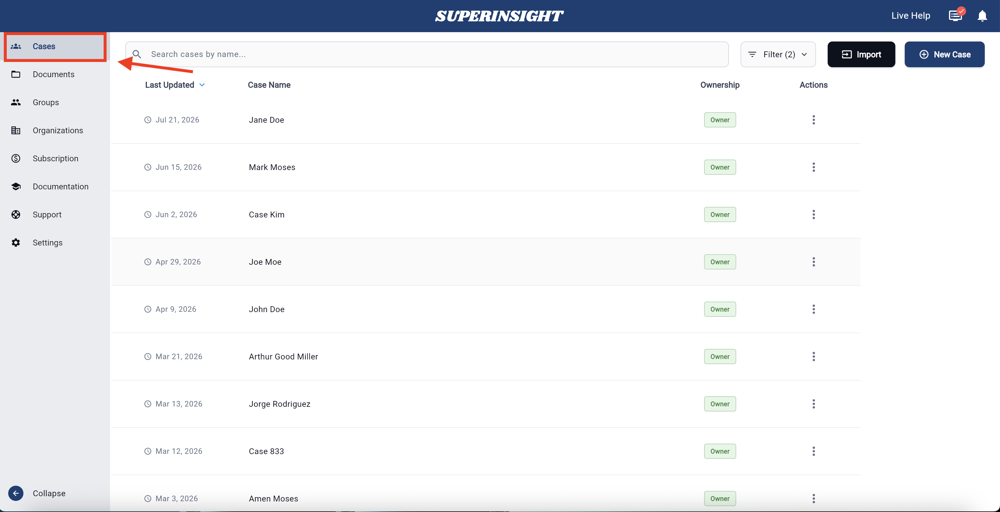
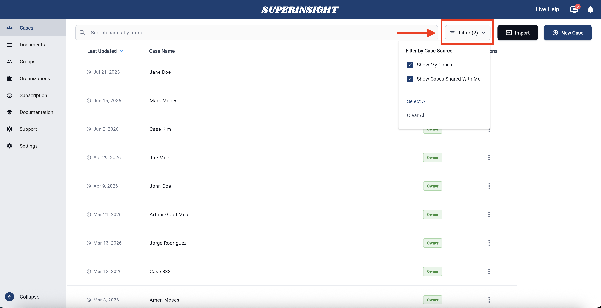

# Find and Open a Case

Use the case list to find a case, see who owns it, and open it to work on documents or reports.

## What you’ll see in the case list

Each case shows:

- **Last Updated** — the most recent change date
- **Case Name** — usually the claimant’s full name
- **Ownership** — whether you own the case or it was shared with you
- **Actions** — the three-dot menu (⋮) for share, delete, and other options

## Open a case

1. Go to the **Cases** section.
2. Find the case in the list.
3. Click the case name to open it.

Once open, you can use the **Documents**, **Reports**, and **Contacts** tabs for that case.

## Filter your cases

Use filters when your list gets long.

1. Click the **Filter** button at the top right of the case list.
2. Choose one or both options:
    - **Show My Cases** — cases you created or own
    - **Show Cases Shared With Me** — cases others shared with you
3. Optional:
    - **Select All** — turn both filters on
    - **Clear All** — reset the filters

Your list updates right away based on what you select.

!!! tip "Shared vs owned"
    Cases shared with you may show a different icon. See [Share a case](case-share.md) for more on shared access.

## Next steps

- [Create a case](case-create.md)
- [Share a case](case-share.md)
- [Organize my files](case-folder.md)
