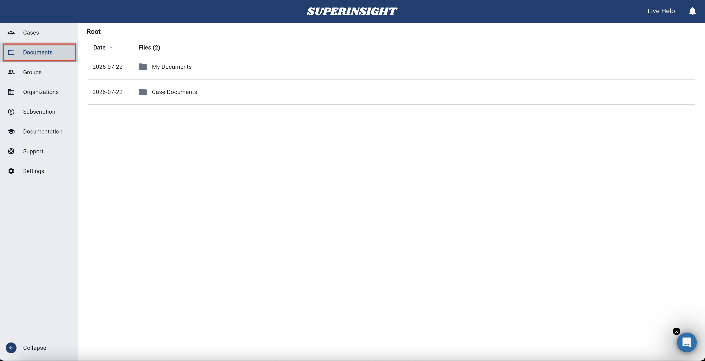
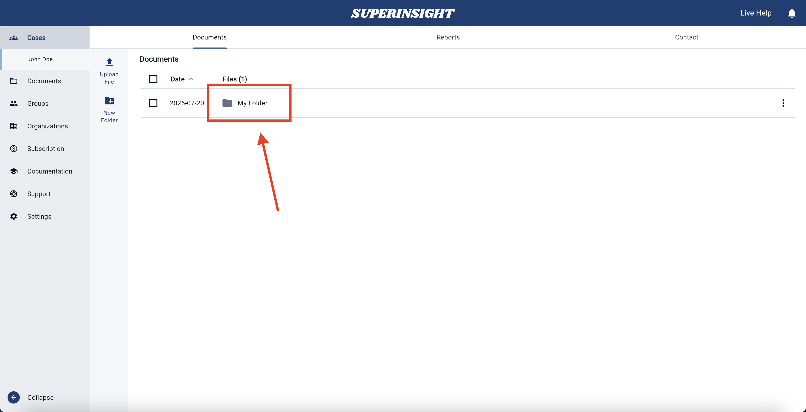
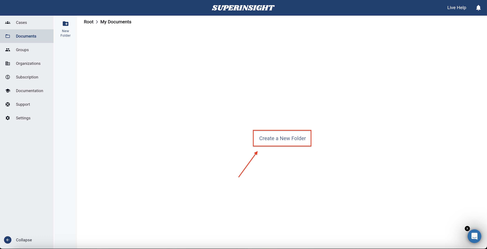
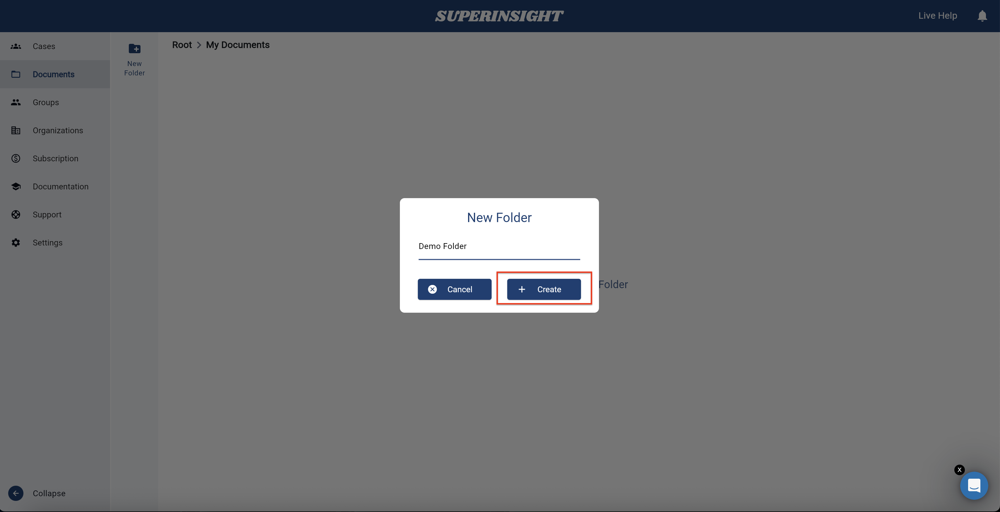
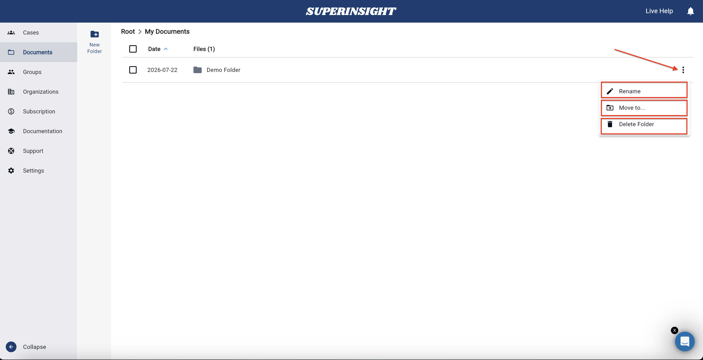

# Manage Documents

## Overview

The **Documents** section provides a comprehensive file management system with two main organizational areas:

- **My Documents**: A personal workspace for your own file uploads and organization
- **Case Documents**: A dedicated space for files that are linked to specific cases

This updated layout offers better organization and clearer separation between personal files and case-related documents.

## Navigation

Access the Documents section from the left-hand sidebar. The Documents tab is prominently displayed and provides easy access to both your personal documents and case-related files.

## Upload files to a case

To upload documents for reports and Research Insight:

1. Open a **case** from your case list.
2. Go to the **Documents** tab inside the case.
3. Click **Upload File** on the left and select the files to upload.

    

4. Wait for files to finish processing before using them in reports. Larger medical records can take longer.

!!! tip "Password-protected PDFs"
    Superinsight supports password-protected PDFs. When you select an encrypted file, you will be prompted for the password so it can unlock and process the document.

## Folder Management

### Accessing Document Areas

To manage your documents, open **Documents** from the sidebar and enter either:

=== "My Documents"
    Click on **My Documents** to access your personal file workspace.

    

=== "Case Documents"
    Click on **Case Documents** to access files linked to specific cases.

    Case documents are also available from the **Documents** tab inside each case.

### Folder Operations

You can perform various folder operations in either area:

=== "Create a Folder"
    Click the **New Folder** button to create a folder in the current area, or click **Create a New Folder** when the area is empty.

    

    Enter a folder name and click **Create**.

=== "Rename, Move, or Delete"
    Click the **three-dot menu** (⋮) next to a folder to **Rename**, **Move to…**, or **Delete Folder**.

    

    !!! Warning "NOTICE"
        Deleting a folder also deletes all files inside it.

## UI Updates

The updated Documents interface provides a more intuitive and organized experience compared to the previous version. The clear separation between personal and case documents helps users better manage their files and maintain proper organization.
