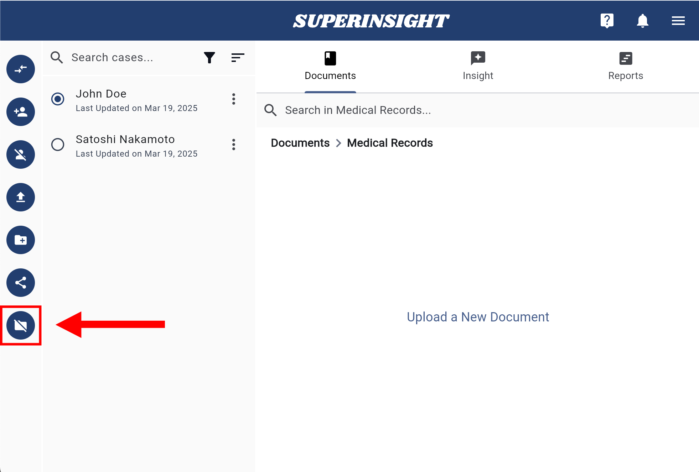

# Manage Folder

## Create Folder

In the **Documents** tab, you can create your own folders based on your needs.

Click the **Create a New Folder** button on the left and give the folder an easily identifiable name.

=== "Create Folders"

    

=== "Enter Folder Name"

    

## Delete Folders

If you need to delete your folder, click into the folder, and you will see the **Delete Folder** button on the left. Click the button and confirm the deletion to remove the folder.

!!! Warning "NOTICE"

    All the files in the folder you choose to delete will also be deleted!

=== "Delete Folder Button"

    

=== "Confirm Deletion"

    