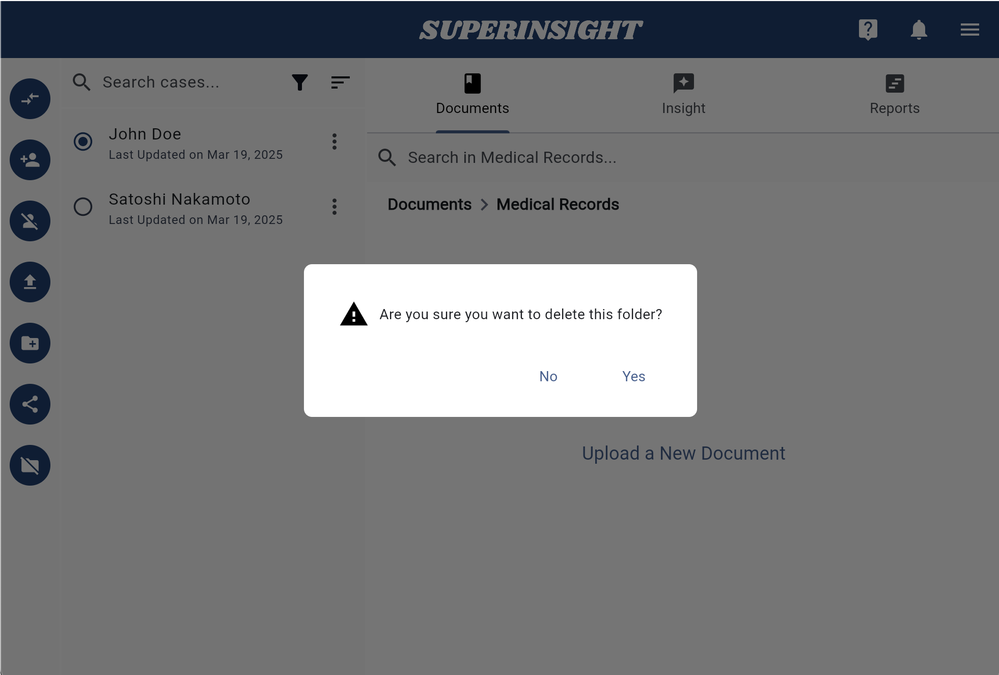

# Manage Folder

## 1. Create Folders

In the **Documents** tab, you can create your own folders based on the contacts and your workflow needs. 

Click the **Create a New Folder** button on the left and give this folder an easily identified name.

=== "Create Folders"

    

=== "Enter Folder Name"

    

## 2. Delete Folders

If you need to delete your folder, click into the folder and you will see the **Delete Folder** button in the navigation on left. Click the button and confirm the deletion to remove the folder.

!!! Warning "NOTICE"

    All the files in the folder you choose to delete will be deleted during the deletion!

=== "Delete Folder Button"

    

=== "Confirm Delete"

    