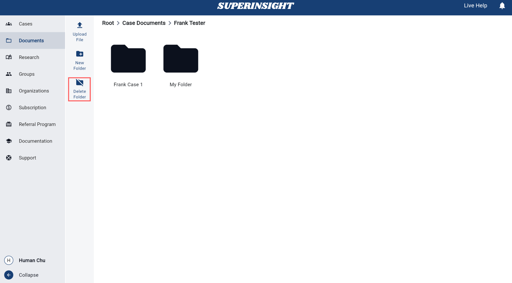

# Manage Documents

## Overview

The **Documents** section provides a comprehensive file management system with two main organizational areas:

- **My Documents**: A personal workspace for your own file uploads and organization
- **Case Documents**: A dedicated space for files that are linked to specific cases

This updated layout offers better organization and clearer separation between personal files and case-related documents.

## Navigation

Access the Documents section from the left-hand sidebar. The Documents tab is prominently displayed and provides easy access to both your personal documents and case-related files.

=== "Documents Section"

    

## Folder Management

### Accessing Document Areas

To manage your documents, you can enter either:

=== "My Documents"
    Click on **My Documents** to access your personal file workspace.

    

=== "Case Documents"
    Click on **Case Documents** to access files linked to specific cases.

    

### Folder Operations

You can perform various folder operations in either area:

=== "New Folder Button"
    Click the **New Folder** button to create a new folder in the current area. The button is prominently displayed in the left sidebar and provides easy access to folder creation functionality.

    

    

=== "Delete a Folder"
    To delete a folder, click on the **Delete Folder** button in the left sidebar. This button is prominently displayed and provides easy access to folder deletion functionality.

    

    After clicking the Delete Folder button, a confirmation dialog will appear asking "Are you sure you want to delete this folder?". Click **Yes** to confirm the deletion or **No** to cancel the operation.

    

    !!! Warning "NOTICE"
        All the files in the folder you choose to delete will also be deleted!

## UI Updates

The updated Documents interface provides a more intuitive and organized experience compared to the previous version. The clear separation between personal and case documents helps users better manage their files and maintain proper organization.

