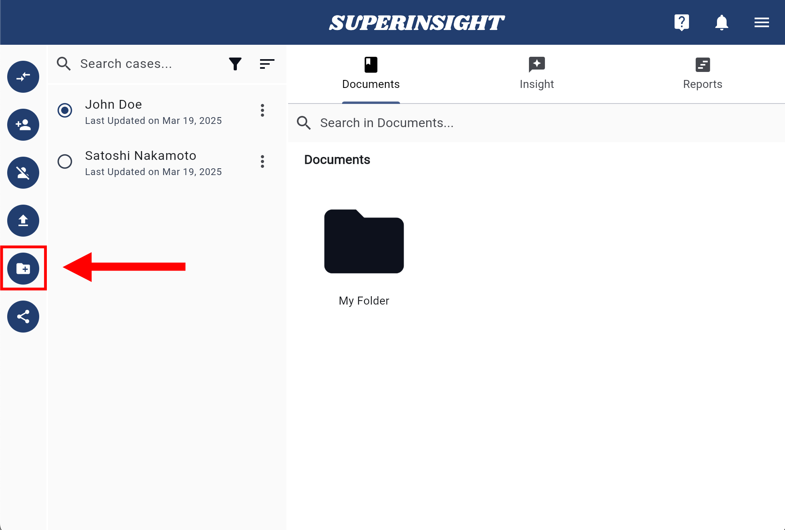

# Manage Documents

## Overview

The **Documents** section provides a comprehensive file management system with two main organizational areas:

- **My Documents**: A personal workspace for your own file uploads and organization
- **Case Documents**: A dedicated space for files that are linked to specific cases

This updated layout offers better organization and clearer separation between personal files and case-related documents.

<!--
## Navigation

Access the Documents section from the left-hand sidebar. The Documents tab is prominently displayed and provides easy access to both your personal documents and case-related files.

=== "Documents Section"

    

## Folder Management

### Accessing Document Areas

To manage your documents, you can enter either:

=== "My Documents"
    Click on **My Documents** to access your personal file workspace.

    

=== "Case Documents"
    Click on **Case Documents** to access files linked to specific cases.

    

### Creating New Folders

You can create new folders in either area using the following methods:

=== "New Folder Button"
    Click the **New Folder** button to create a new folder in the current area.

    

=== "Create a New Folder Link"
    Alternatively, use the **Create a New Folder** link for the same functionality.

    

=== "Name and Create"
    Enter a descriptive name for your folder and click **Create** to confirm.

    

## UI Updates

The updated Documents interface provides a more intuitive and organized experience compared to the previous version. The clear separation between personal and case documents helps users better manage their files and maintain proper organization.

## Delete Folders

If you need to delete a folder, click into the folder, and you will see the **Delete Folder** button on the left. Click the button and confirm the deletion to remove the folder.

!!! Warning "NOTICE"

    All the files in the folder you choose to delete will also be deleted!

=== "Delete Folder Button"

    

=== "Confirm Deletion"

    
-->