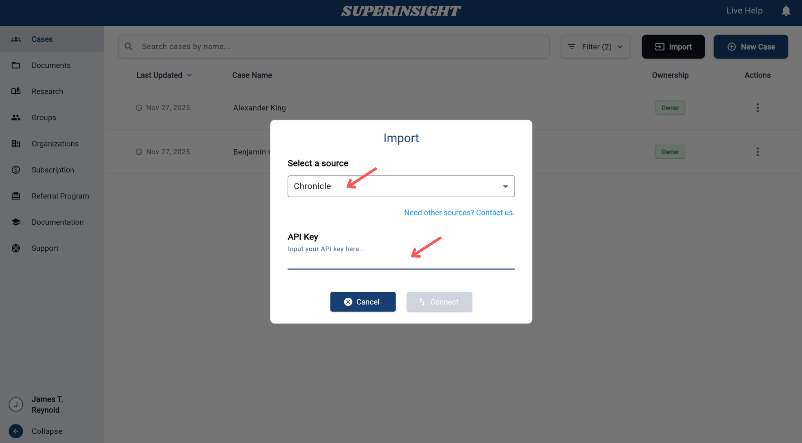
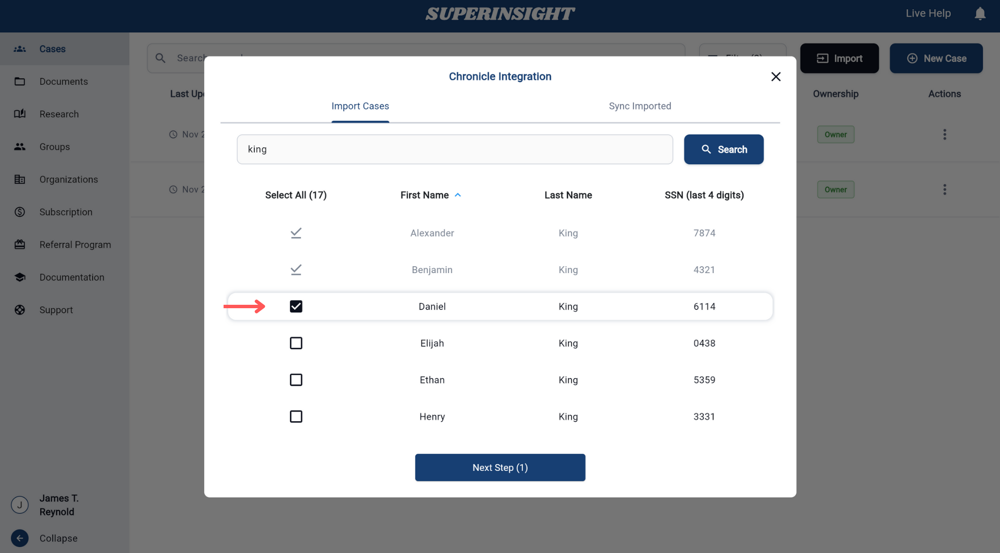
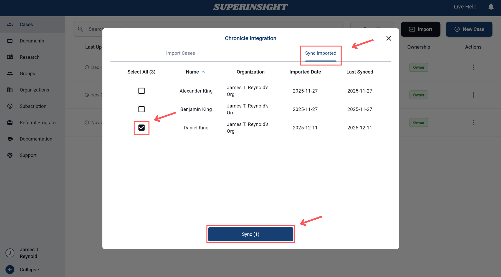
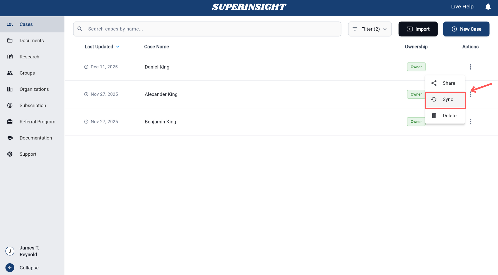

# Integration

## Overview

The **Integration** feature allows you to import cases from external systems such as Chronicle into Superinsight. This streamlines your workflow by eliminating manual case creation and ensuring data consistency between systems.

## Available Integrations

Superinsight supports integration with the following external systems:

### Chronicle
- **Type**: Legal practice management system
- **Features**: Case import, data synchronization
- **Status**: Available
- **Requirements**: Chronicle API key

!!! info "More Integrations Coming"
    Additional integrations with other legal practice management systems will be available in the near future. Contact support for specific integration requests.

## How to Use Integration

### Step 1: Access Import Function

Navigate to the **Cases** page from the left sidebar. Click the **Import** button located in the top-right corner of the case list to begin the integration process.

### Step 2: Configure Source and API Key

In the Import dialog:

1. **Select a Source**: Choose your integration source from the dropdown menu (e.g., Chronicle)
2. **Enter API Key**: Input your API key in the provided field to establish the connection
3. **Connect**: Click the **Connect** button to authenticate your integration

### Step 3: Search and Select Cases

Once connected, you can search for cases to import:

1. **Search by Name**: Enter the case name or client name in the search field
2. **Search by SSN**: Use the last 4 digits of SSN to locate specific cases

3. **Review Results**: Browse through the search results showing First Name, Last Name, and SSN details
4. **Select Cases**: Check the boxes next to the cases you want to import
5. **Next Step**: Click **Next Step** to proceed with the selected cases

### Step 4: Import Process

After selecting your cases:

1. **Confirm Selection**: Review your selected cases in the import queue
2. **Start Import**: Click the import button to begin the process
3. **Wait for Sync**: The import process may take several minutes to complete as the system synchronizes data from the external source

!!! info "Import Time"
    Import cases need to wait a few minutes to sync. Please be patient while the system retrieves and processes the case data from the external source.

## Syncing Imported Cases

Once cases have been imported, you have multiple options to keep them synchronized with the external source.

### Method 1: Sync Imported Tab

Use the **Sync Imported** tab in the integration interface to manage previously imported cases:

1. **Access Sync Imported**: Click on the "Sync Imported" tab in the integration dialog
2. **View Imported Cases**: See all previously imported cases with their import dates and last sync status
3. **Select Cases to Sync**: Choose which cases you want to update
4. **Sync**: Click the **Sync** button to update the selected cases

### Method 2: Individual Case Sync

You can also sync individual cases directly from the case list:

1. **Locate Case**: Find the case you want to sync in your case list
2. **Actions Menu**: Click the three dots (⋮) in the Actions column for that case
3. **Select Sync**: Choose **Sync** from the dropdown menu to update that specific case

!!! info "Requirements"
    Integration requires API access from your external system provider. Contact them to obtain the necessary API key.

!!! warning "Security"
    Only use API keys from trusted sources and ensure your external system meets security requirements.
