# Manage Report

## 1. Build a Report

Besides real-time file analysis, Superinsight allows you to select multiple files and generate a complex report that helps you significantly reduce time you spend on reading tons of paper and get your claim way more efficiently.

Simply click on the "Build Report" button on the left and select all the files you want to be included in reports Superinsight supported. Before you submit to generate, make sure your file list is correct!

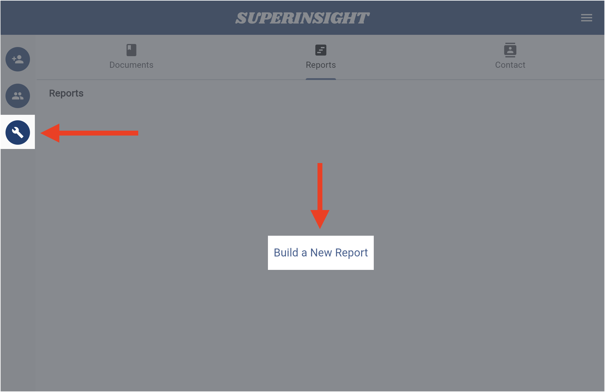

Select the report types that you want to build. Now we offer 3 types of report, including:

* Veteran Disability
* Social Security Disability
* Mass Tort.
* Personal Injury

=== "Veteran Disability"
    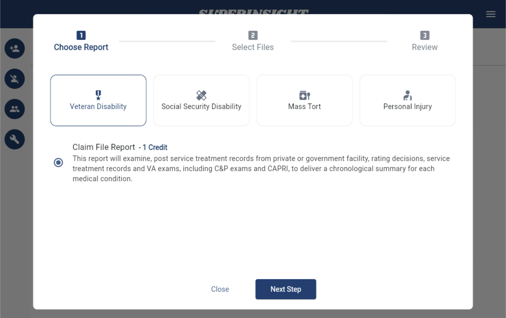

=== "Social Security Disability"
    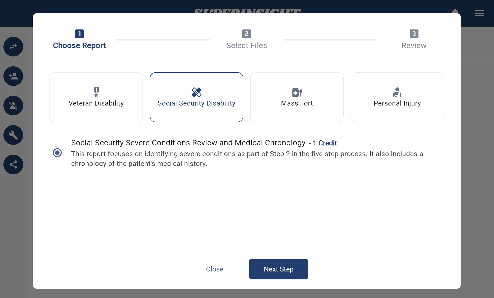

=== "Mass Tort"
    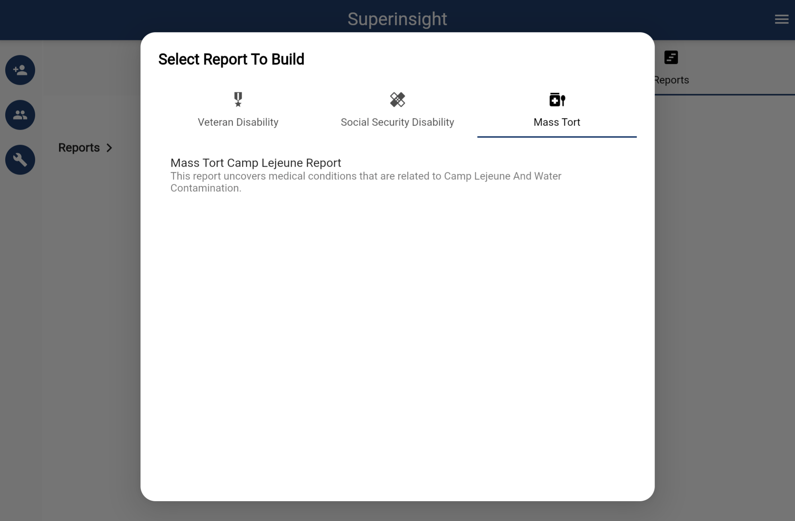

=== "Personal Injury"
    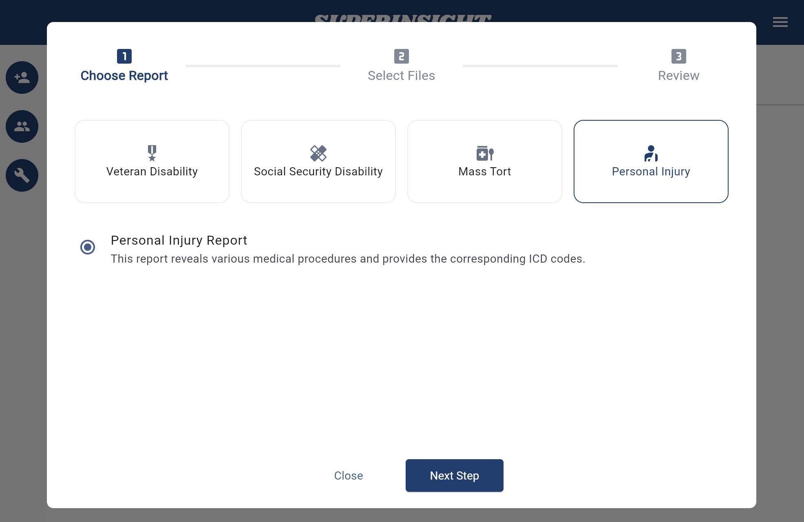

Select files you want to include in the report. And of course, you can filter certain labels to find the files you need more efficiently.

=== "Select Files"
    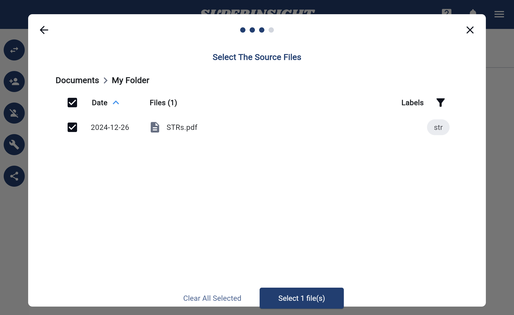

=== "Filter Labels"
    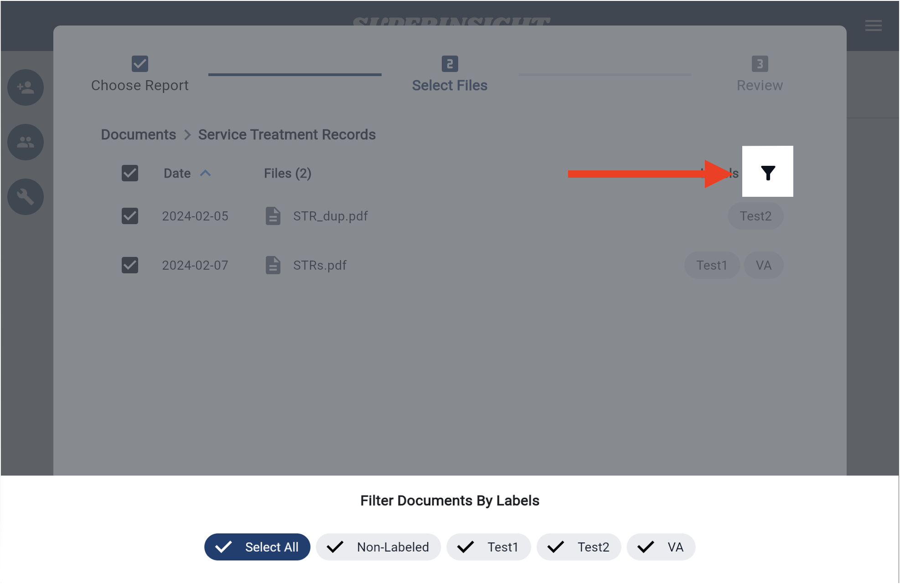

Confirm all your selections and submit.

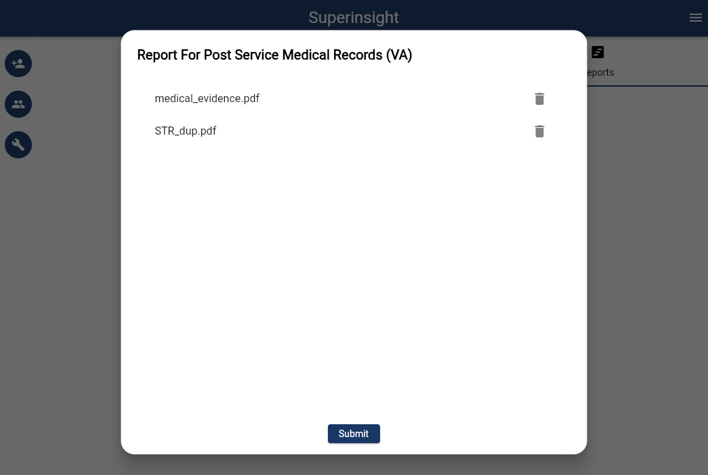

After files are submitted, you will see the unclickable report in the "Reports" tab building behind the scenes. Once it is complete, it will turn black with the download icon, and you can check your reports anytime you want.

If you check the report, you will see the elaborate summary to help you find all the key evidence you need. To your preference, you can switch to the different format of view as well.

=== "Report List"
    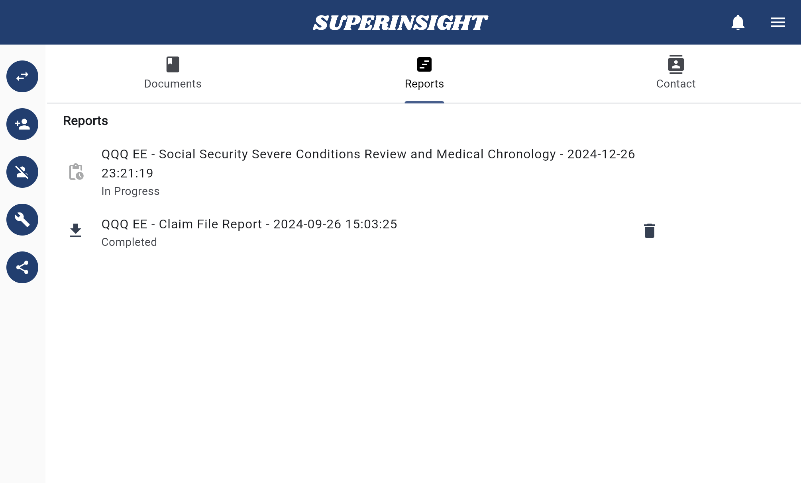

=== "Summary"
    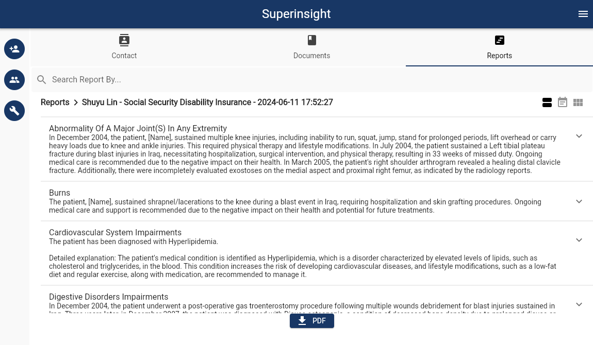

=== "Timeline"
    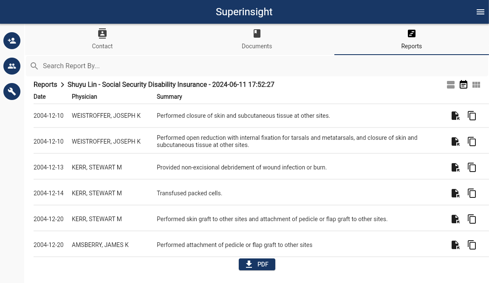

=== "Table of Content"
    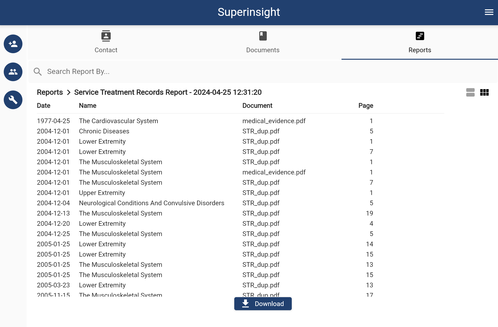

You can download your report in PDF format. Superinsight will combine the report and the original files so that you can easily find the critical evidence after you click on the table of contents we provided, and we will add the bookmarks for you as well.

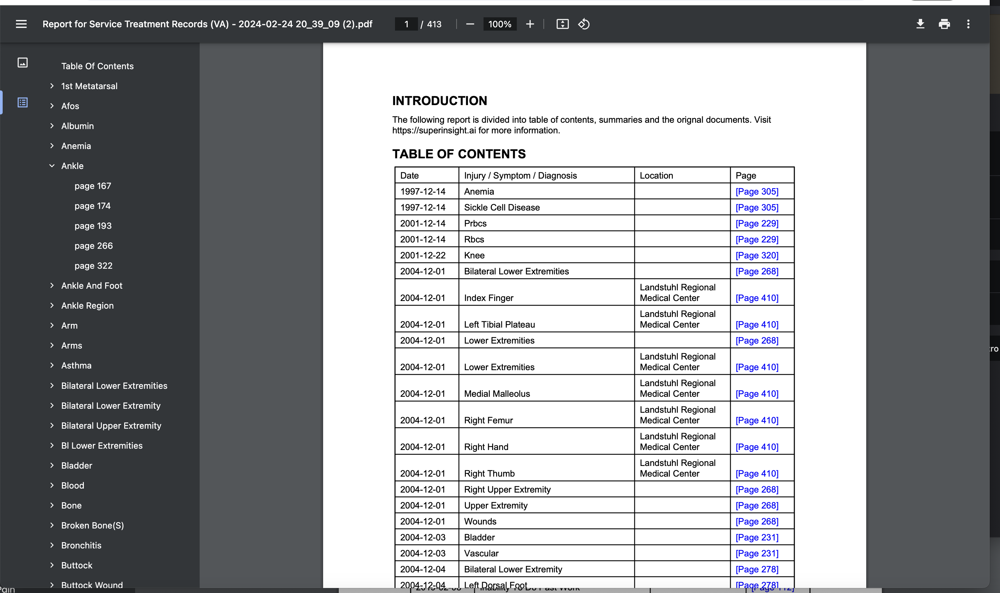

## 2. Search Reports

You may build a report with dozens of documents and it will take lots of time to find all the relevant information in a report with thousands of pages. With the search function, we can pick all the key points in seconds for you. Learn more about [Search](../guide/search.md)

## 3. Delete Reports

In the "Report Tab", you can see all the reports are listed here and every report has a "Delete Report" button.

You can easily delete any report by clicking the button and confirm.

=== "Delete Report Button"

    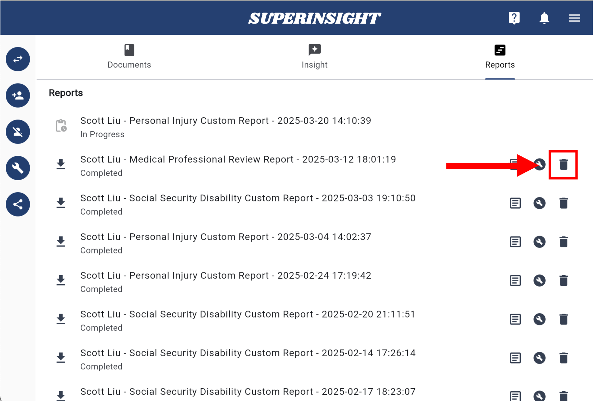

=== "Confirm Delete"

    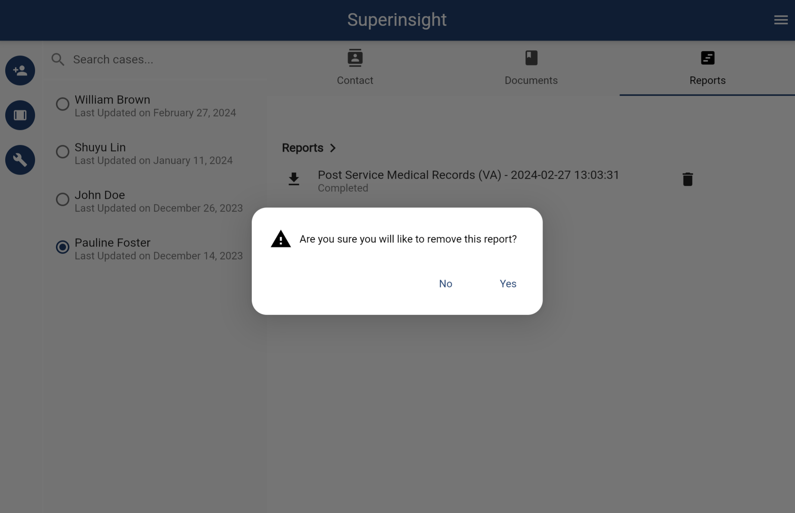