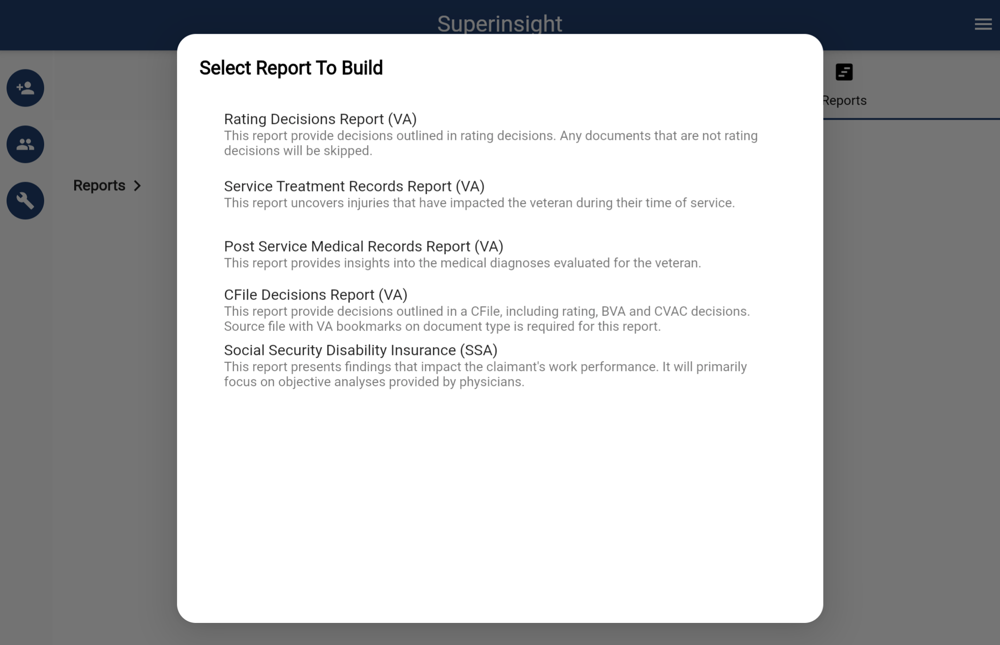

# Build a Report

Besides real-time file analysis, Superinsight allows you to select multiple files and generate a complex report that helps you significantly reduce time you spend on reading tons of paper and get your claim way more efficiently.

Simply click on the "Build Report" button on the left and select all the files you want to be included in reports Superinsight supported. Before you submit to generate, make sure your file list is correct!

=== "Click to Build"

    

=== "Select Report Type"

    

=== "Select Files"

    

=== "Confirm & Submit"

    

After files are submitted, you will see the unclickable report in the "Reports" tab building behind the scenes. Once it is complete, it will turn black with the download icon, and you can check your reports anytime you want.

If you check the report, you will see the elaborate table of contents and list of points you need.

=== "Report List"

    

=== "Table of Content"

    

You can download your report in PDF format. Superinsight will combine the report and the original files so that you can easily find the critical evidence after you click on the table of contents we provided, and we will add the bookmarks for you as well.

