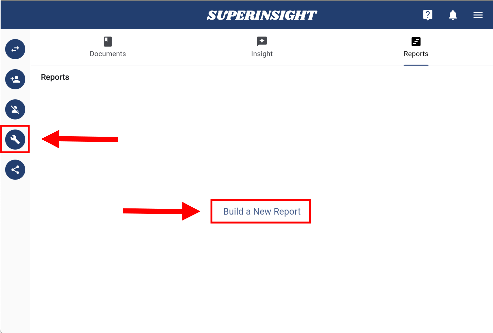
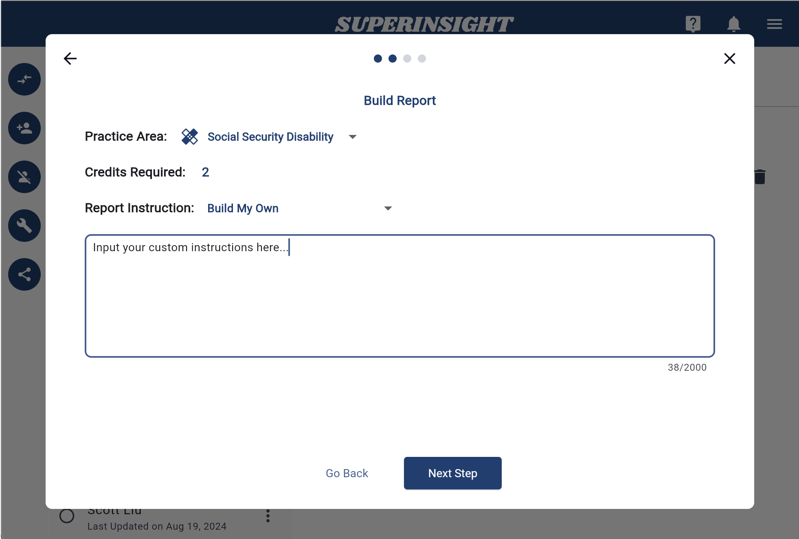

# Manage Report

## Build a Report

Superinsight allows you to select multiple files and generate a comprehensive report, significantly reducing the time spent reading numerous documents and streamlining your claims process.

Simply click the "Build Report" button on the left to start building your report.

Click "Build Report" to start the process, or select from legacy built-in templates.

Next, select the practice area for this report.

!!! TIP
    Feel free to [contact us](mailto:help@superinsight.ai) if you need any reports we do not yet support. We'd love to discuss your needs!
    
    If you need a sample report, please click [HERE](sample-report.md)

Each report costs 1-5 credits, depending on the required resources. If you need extra credits, [contact us](mailto:help@superinsight.ai) to purchase **6 credits for $250** or **18 credits for $500**.

After selecting the practice area, you can choose an instruction template from the dropdown and freely edit it and customize with your own prompts to suit your preferences or specific scenarios.

Next, select the files you want to include in the report. You can also filter files using labels to quickly find the ones you need.

=== "Select Files"
    

=== "Filter Labels"
    

Confirm all your selections before submitting to build the report.

Once submitted, the report will appear in the "Reports" tab as an unclickable entry while it is being generated. Once completed, it will turn black with a download icon, allowing you to download and review it anytime.

## Download Reports

You can download your report in PDF, DOCX, or CSV format, depending on the type of report you generated.

## Delete Reports

In the "Reports" tab, all generated reports are listed, each with a "Delete Report" button.

To delete a report, simply click the button and confirm the deletion.

=== "Delete Report Button"

    

=== "Confirm Delete"

    