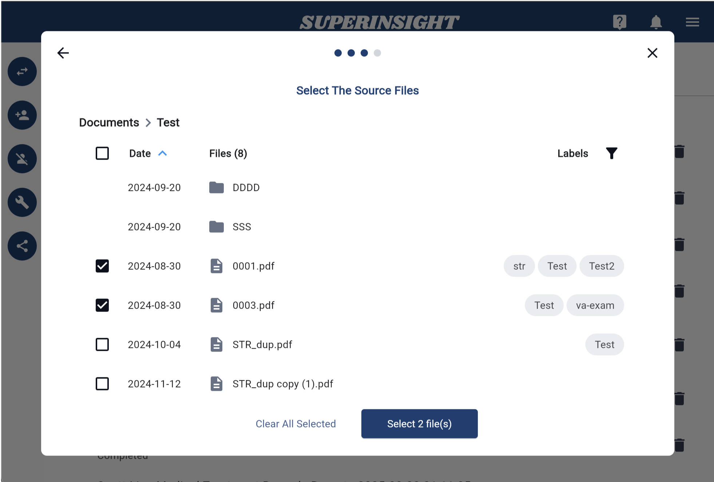

# Manage Report

## 1. Build a Report

Besides real-time file analysis, Superinsight allows you to select multiple files and generate a complex report that helps you significantly reduce time you spend on reading tons of paper and get your claim way more efficiently.

Simply click on the "Build Report" button on the left and select all the files you want to be included in reports Superinsight supported. Before you submit to generate, make sure your file list is correct!

Select the report types that you want to build. Now we offer 4 types of report, including:

* Veteran Disability
* Social Security Disability
* Mass Tort
* Personal Injury

!!! TIP
    Feel free to [contact us](mailto:help@superinsight.ai) if you need any other reports we're not supporting yet. We'd love to discuss that!
    
    If you need a sample report, please click [HERE](sample-report.md)

=== "Veteran Disability"
    CFile report covers all the information you need while helping veterans, including deep analysis of Rating Decisions, Service Treatment Records, Post Service Medical Records and more.

    

=== "Social Security Disability"
    Summary key points of claimant information according to objective analysis provided by physicians. Such as severe impairments, imaging results, medication, medical chronology, etc.

    

=== "Mass Tort"
    Uncover medical conditions that are related to Camp Lejeune & Water Contamination.

    

=== "Personal Injury"
    Reveal various medical procedures and provides corresponding ICD codes.
    
    

Select files you want to include in the report. And of course, you can filter certain labels to find the files you need more efficiently.

=== "Select Files"
    

=== "Filter Labels"
    

Confirm all your selections and submit. If you're building **Veteran Disability Report** please make sure you label all your files well.

=== "Confirm & Submit"
    

=== "VA File Type Confirm"
    

After files are submitted, you will see the unclickable report in the "Reports" tab building behind the scenes. Once it is complete, it will turn black with the download icon, then you can download and check your reports anytime you want.

You can download your report in either pdf or docx format. Superinsight will combine the report and the original files so that you can easily find the critical evidence after you click on the table of contents we provided, and we will add the bookmarks for you as well.

## 2. Delete Reports

In the "Report Tab", you can see all the reports are listed here and every report has a "Delete Report" button.

You can easily delete any report by clicking the button and confirm.

=== "Delete Report Button"

    

=== "Confirm Delete"

    