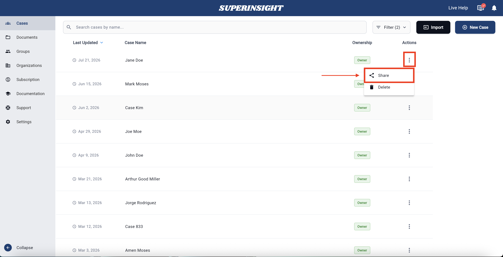
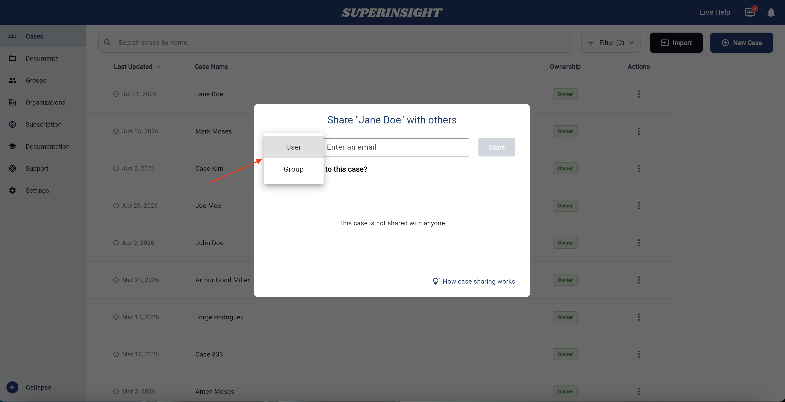
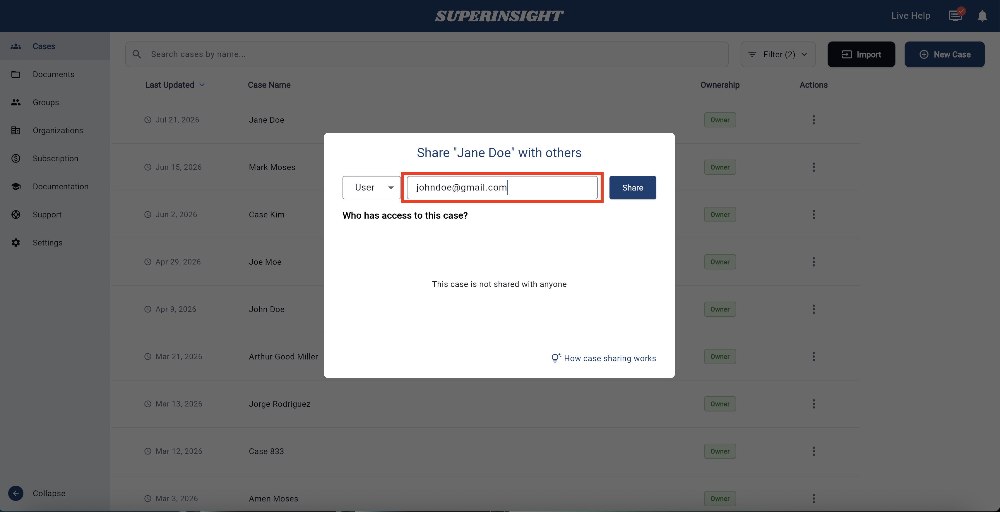
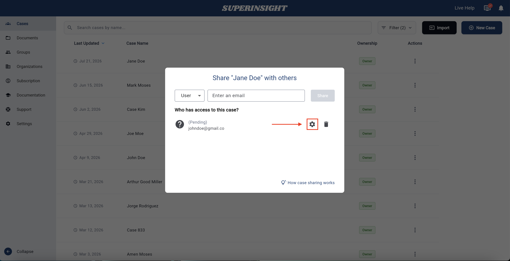
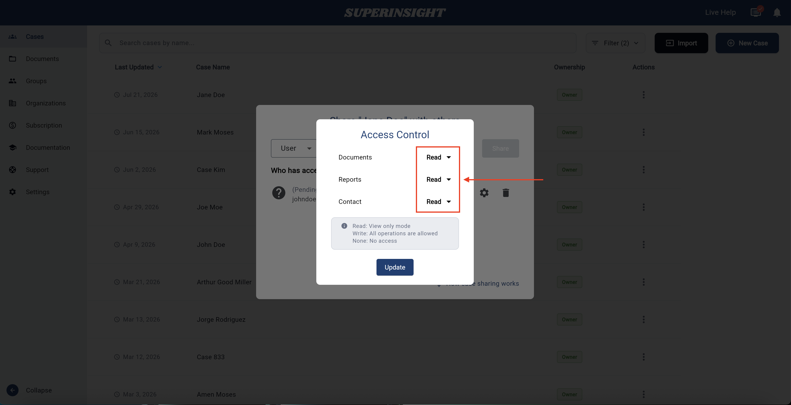
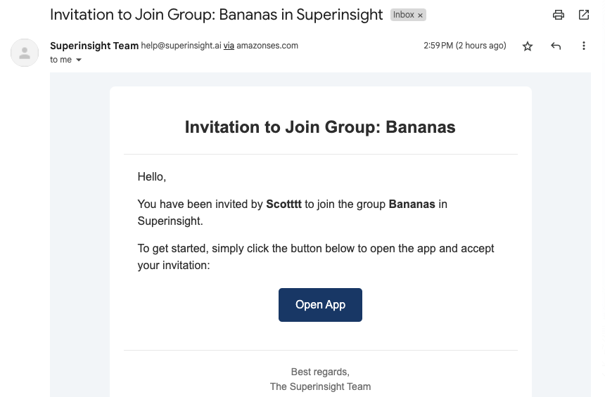
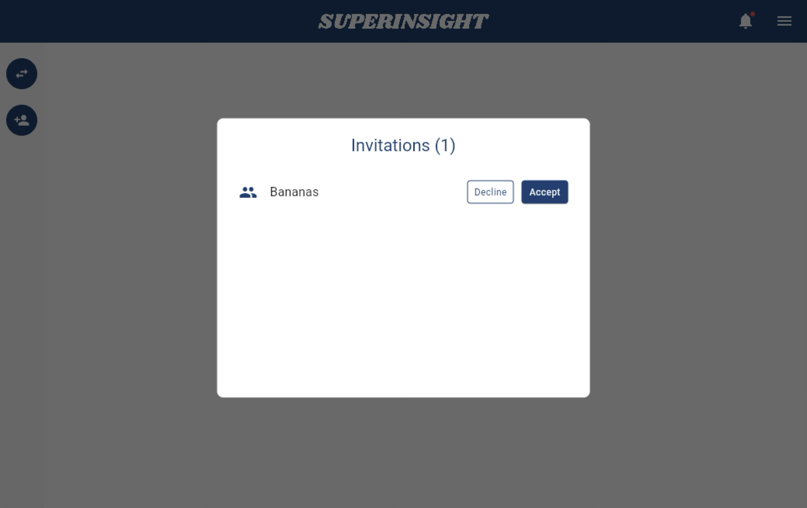
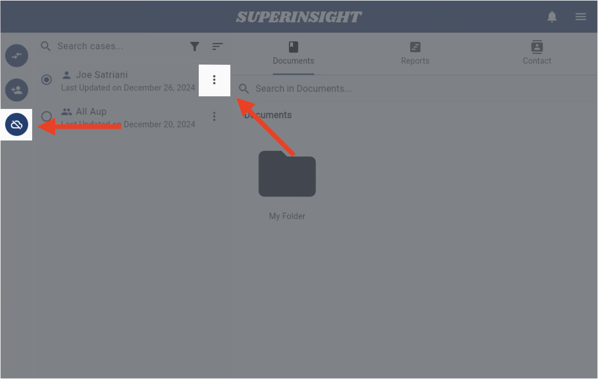
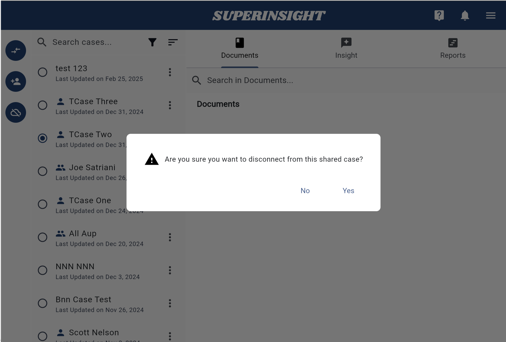

# Share a Case

Share a case so teammates or stakeholders can view documents, reports, and contact details — with the access level you choose.

<iframe width="560" height="315" 
src="https://www.youtube.com/embed/GmUYhPkIbOU?rel=0&si=ce4dFYqS2eZy8ZLn" 
title="YouTube video player" 
frameborder="0" 
allow="accelerometer; autoplay; clipboard-write; encrypted-media; gyroscope; picture-in-picture; web-share" 
referrerpolicy="strict-origin-when-cross-origin" 
allowfullscreen></iframe>

## Share with a user or group

1. Open the **Cases** list.
2. Click the three-dot menu (⋮) next to the case name.
3. Select **Share**.

    

4. Choose who to share with:
    - **User** — one person
    - **Group** — a whole team or group

    

5. If you chose **User**, enter their email address. You can add more people one at a time.

    

6. Confirm the share. Invited people appear under **Who has access to this case?**

You can also start sharing from the **Share** button in the left panel when a case is open.

## Set access permissions

Control what each person or group can do.

1. In **Who has access to this case?**, click the **gear icon** next to a person or group.

    

2. For **Documents**, **Reports**, and **Contact**, choose:
    - **Read** — view only
    - **Write** — view and edit
    - **None** — no access
3. Click **Update** to save.

    

!!! tip "Example"
    You might let a reviewer **Read** Documents but set Contact to **None**.

## Accept a shared case

If someone shares a case with you:

1. Check your email invitation and/or in-app notification.
2. Accept the invitation.
3. Open **Cases** — the shared case will appear in your list.

## Remove sharing

- **If you shared the case:** open the share list and remove the person or group.
- **If a case was shared with you:** open the case and click **Disconnect**, then confirm.

## Next steps

- [Find and open a case](case-find.md)
- [Manage groups](groups.md) — share with a whole team at once
- [Manage organizations](organizations.md)
