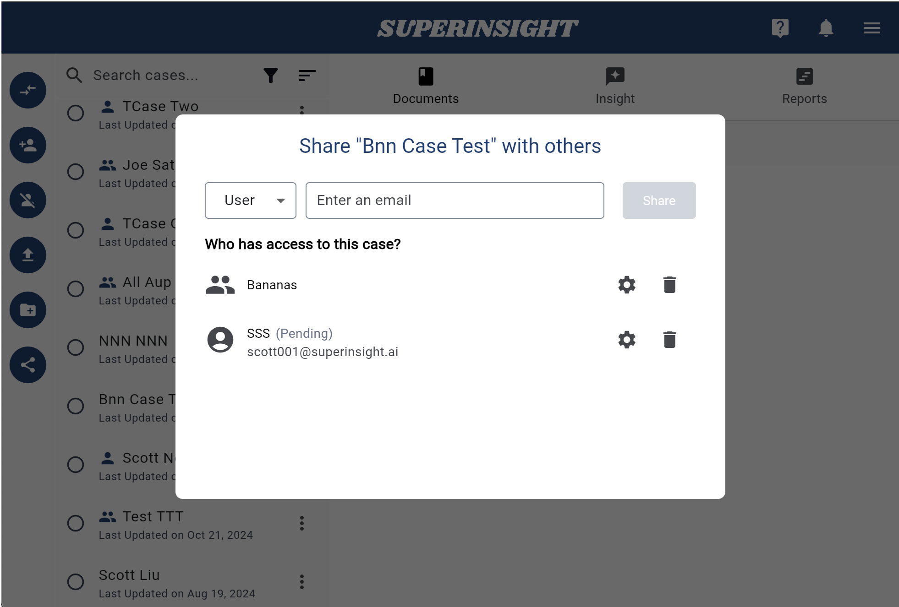

# Share Case

Sometimes, you might need to share case information with your stakeholders. For example, you might share medical chronology reports with a physician for review or STR files with your claimant if you're practicing VA.

Now, you can share your cases with any stakeholder who needs to access files and reports. You can also share cases with your co-workers, allowing them to collaborate and build reports.

## Share Your Cases

To share a case, click the "**Share**" button in the left navigation panel or the three-dot "Action" button next to the case name.

You can share your cases with an individual user via email invitation or with user groups you own or belong to.

After sharing a case, you’ll see a shared list below, showing who has access to the case.

=== "Click to Share"
    

=== "Share with User or Group"
    

=== "Share List"
    

In the sharing list, you'll find a gear icon and a delete icon next to each recipient. Use these to adjust access permissions or remove sharing.

You can set access permissions for the **Documents**, **Reports**, and **Contact** sections of the case. Each section can be configured with one of three permissions: **Write**, **Read**, or **None**.

## Accept the Sharing

When someone shares a case with you via email, you’ll receive an email invitation. Additionally, you'll get an in-app notification.

=== "Email Invitation"
    

=== "App Invitation"
    

=== "Invite Notification"
    

After accepting the invitation, the case will appear in your case list. You can distinguish between cases shared individually and cases shared with a group by the icon next to each case.

=== "Individual Shared"
    

=== "Group Shared"
    

## Disconnect the Sharing

If you no longer need access to a shared case, you can remove it by clicking the **Disconnect** button.

=== "Disconnect Button"
    

=== "Confirm Disconnect"
    