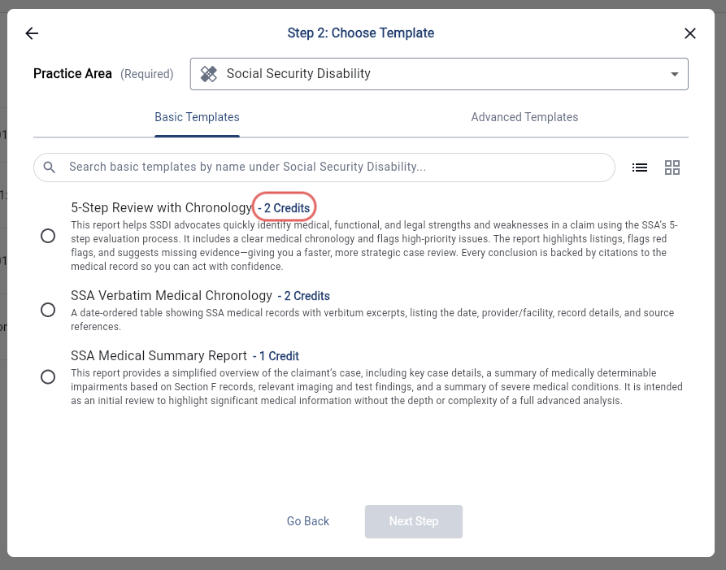
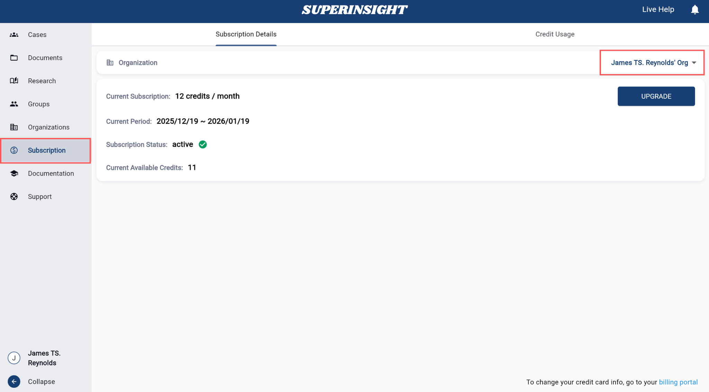
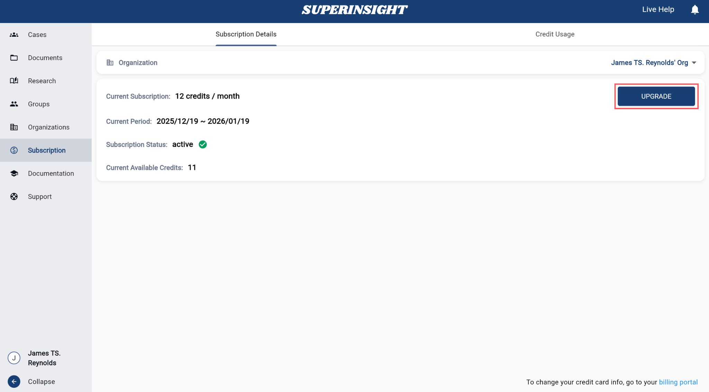

# Credits and Usage

Superinsight uses a **credit-based system** that helps you efficiently manage your usage and allocate resources where they are needed. This page provides an overview of how the credit system works, so you can easily track your subscription and make the most of our services.

## Subscription Plan
Superinsight operates on a monthly credit allocation system based on your subscription plan. Below are the available tiers:

--------------------
**Starter - Credits: 6 / $250 USD**
 Ideal for firms handling a small to medium volume of cases.
--------------------
**Pro - Credits: 18 / $500 USD**
 Perfect for firms with high-volume needs.
--------------------

Credits are added to your account on the **first day of your billing cycle** and **expire after 30 days** if not used.

## One-Time Credit Purchase

If you don't want to commit to a monthly subscription, you can purchase credits on a one-time basis:

--------------------
**One-Time - 1 Credit / $80 USD**
 Purchase individual credits as needed without a subscription commitment.
--------------------

## Credits Cost per Report

Each report requires a specific number of credits. You can view the credit cost while building your report.

## Check Your Usage

In the **Menu**, navigate to **Subscription** to check your subscription status and remaining credits for the current billing period.

You can also track credit usage, whether by yourself or your entire organization, over a specific time frame.

## Increase Your Credits

If you need additional credits, click the **"UPGRADE"** button in the credits section to either upgrade your subscription plan or purchase extra credits for reports.

**Unused credits roll over** when you upgrade your subscription.

For example, if your current subscription ends on January 31, 2025, and you have 4 remaining credits, upgrading to the Pro plan will give you a total of 22 credits (4 existing + 18 new) after payment.

For any questions about our credit system, subscription assistance, or troubleshooting, please [contact our support team.](mailto:help@superinsight.ai)