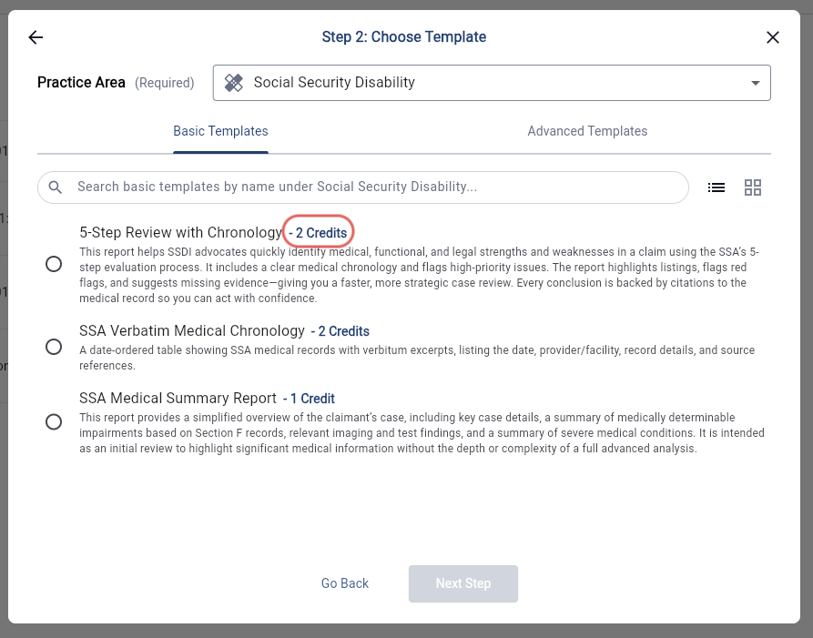
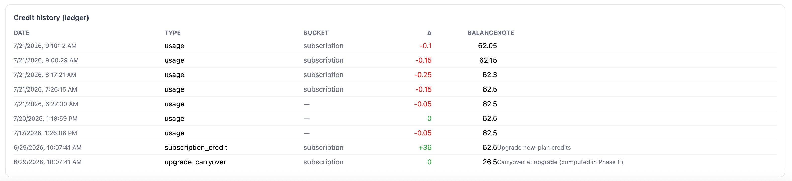

# Credits and Usage

Superinsight uses a **credit-based system** that helps you efficiently manage your usage and allocate resources where they are needed. This page provides an overview of how the credit system works, so you can easily track your subscription and make the most of our services.

## Subscription Plans

Superinsight operates on a credit allocation system based on your subscription plan. Below are the available tiers:

=== "Monthly"

    | Plan | Price | Credits | Per Credit | Best For |
    |------|-------|---------|------------|----------|
    | **One Time Credits** | $80 one-time | 1 credit minimum | $80.00/credit | Buy prepaid credits with no subscription |
    | **Starter** | $300/month | 4 credits/month | $75.00/credit | Advocates handling 1-2 cases per month |
    | **Pro** | $600/month | 12 credits/month | $50.00/credit | Solo firms handling 3-6 cases per month |
    | **Grow** | $1,500/month | 36 credits/month | $41.67/credit | Firms handling 10-20 cases per month |
    | **Scale** | $3,000/month | 80 credits/month | $37.50/credit | Growing firms handling 20-50 cases per month |
    | **Enterprise** | $6,000/month | 200 credits/month | $30.00/credit | Large firms handling 50-100+ cases per month |

=== "Yearly"

    | Plan | Price | Credits | Per Credit | Best For |
    |------|-------|---------|------------|----------|
    | **One Time Credits** | $80 one-time | 1 credit minimum | $80.00/credit | Buy prepaid credits with no subscription |
    | **Starter** | $250/month | 4 credits/month | $62.50/credit | Advocates handling 1-2 cases per month |
    | **Pro** | $500/month | 12 credits/month | $41.67/credit | Solo firms handling 3-6 cases per month |
    | **Grow** | $1,250/month | 36 credits/month | $34.72/credit | Firms handling 10-20 cases per month |
    | **Scale** | $2,500/month | 80 credits/month | $31.25/credit | Growing firms handling 20-50 cases per month |
    | **Enterprise** | $5,000/month | 200 credits/month | $25.00/credit | Large firms handling 50-100+ cases per month |

All subscription plans include:

- Auto-renewal
- Priority support
- No credit card required to get started

Credits are added to your account on the **first day of your billing cycle** and **expire after 30 days** if not used.

## Credits Cost per Report

Each report requires a specific number of credits. You can view the credit cost while building your report.

## Check Your Usage

In the **Menu**, navigate to **Subscription** to check your subscription status and remaining credits for the current billing period.

You can also track credit usage, whether by yourself or your entire organization, over a specific time frame.

## Increase Your Credits

If you need additional credits, click the **"UPGRADE"** button in the credits section to either upgrade your subscription plan or purchase extra credits for reports.

**Unused credits roll over** when you upgrade your subscription.

For any questions about our credit system, subscription assistance, or troubleshooting, please [contact our support team.](mailto:help@superinsight.ai)