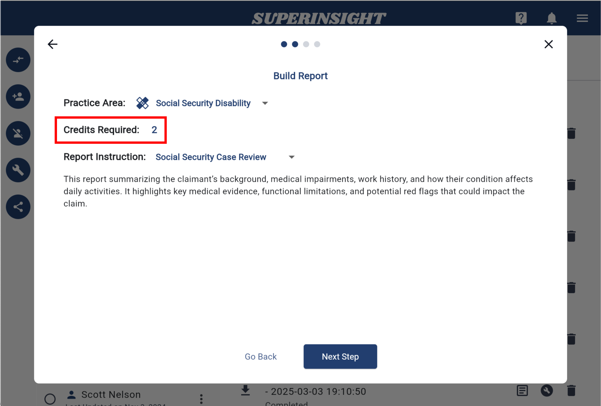

# Credits and Usage

Superinsight adopts the credit system which lets you more clearly manage your usage and distribute the resources where they are needed. This page provides a comprehensive overview of how our credit system works, ensuring you can easily manage your subscription and utilize our services efficiently.

## Subscription Plan
Superinsight operates on a credits-based system, where users receive a monthly allocation of credits as part of their subscription plan. Below are 2 tiers of our subscription:

--------------------
**Starter - Credits: 6 / $250**
 Ideal for firms that have a small to medium volume of cases.
--------------------
**Pro - Credits: 18 / $500**
 Perfect for firms with high-volume needs.
--------------------

Credits will be added to your account on the first day of your billing cycle and **expire after 30 days** if unused.

## Credits Cost per Report

Each of our reports requires a specific amount of credits. Here is the detailed breakdown:

* *Veteran Disability - 2 credits*
* *Veteran Disability(Lagacy) - 1 credit*
* *Social Security Disability - 1 credit*
* *Mass Tort - 1 credit*
* *Personal Injury - 3 credits*

You can see credit cost per report while you're building it.

## Check Your Usage

In the **Menu** you can find **Credits**. Here you can see your current subscription status and remaining credits for this subscription period.

We also show your credit usage here. You can clearly see the credits you and even the whole organization used in a certain period.

=== "Credits"
    

=== "Credit Section"
    

## Increase Your Credits

If you need more credits, you can click "**UPGRADE**" button in the credit section to upgrade your subscription plan or purchase extra credits for your reports.

If your remaining credits haven't expired, they will automatically roll over to your new subscription plan.

For example, if your current subscription ends on January 31, 2025, and you have 4 credits left, upgrading to the Pro plan will give you a total of 22 credits (4 existing + 18 new) after completing the payment.

If you have any questions about our credits system, need assistance with your subscription, or encounter issues, please [contact our support team.](mailto:help@superinsight.ai)