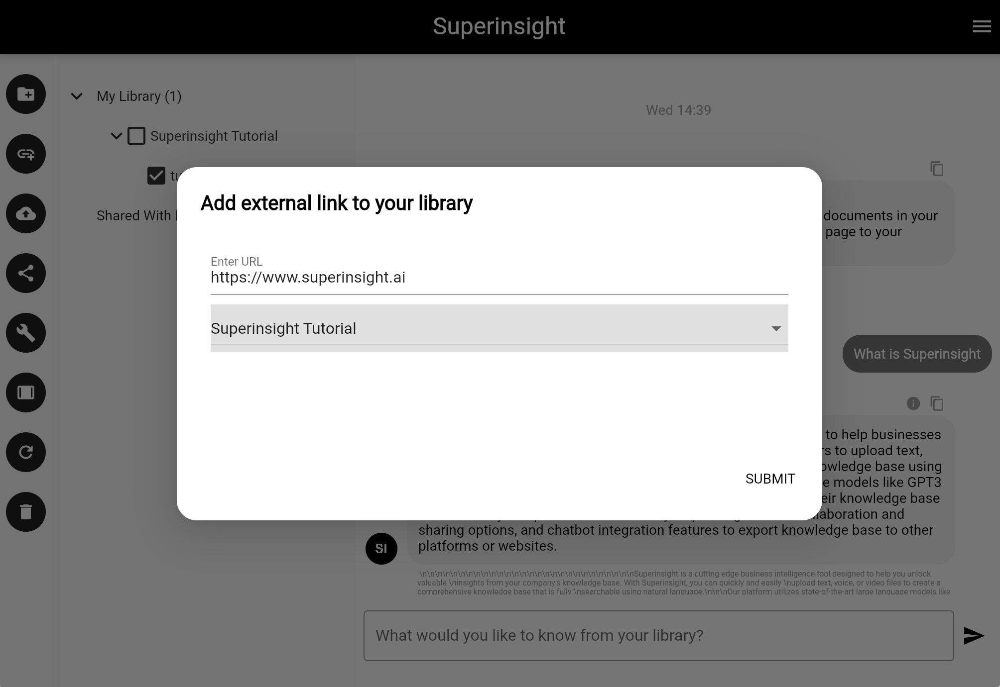
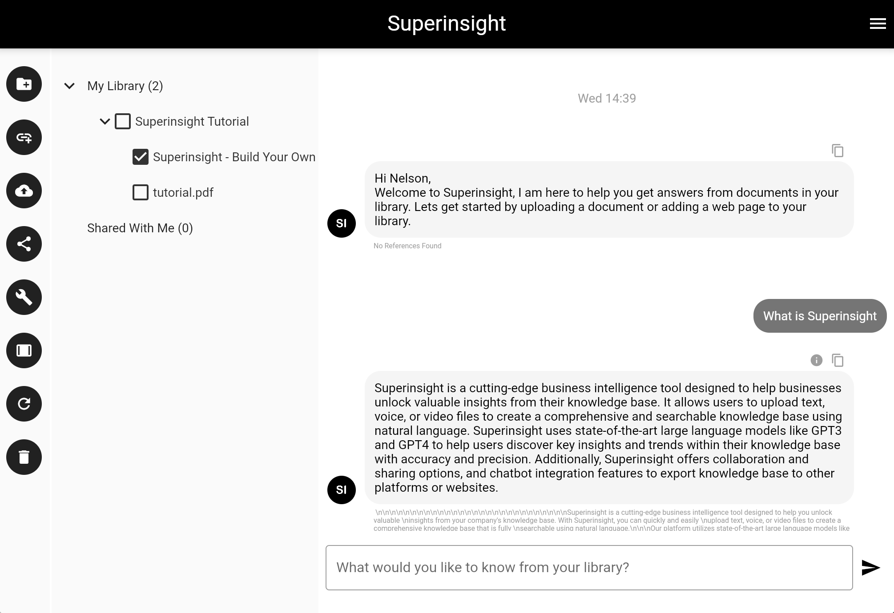

# Add Web Page

You can add a web page to your knowledge base by adding a link to your folder. Click the "Add Web Page" button on the left navigation and include the link to the web page you want to add.
In the example below, you are adding the web page https://www.superinsight.ai

!!! note "Support Format"

    Superinsight currently supports web pages and YouTube videos. Only public links are supported, links that requires login authentication are not supported at this time.

=== "Add Web Page"

    

=== "Web Page In Progress"

    

=== "Web Page Is Ready"

    
