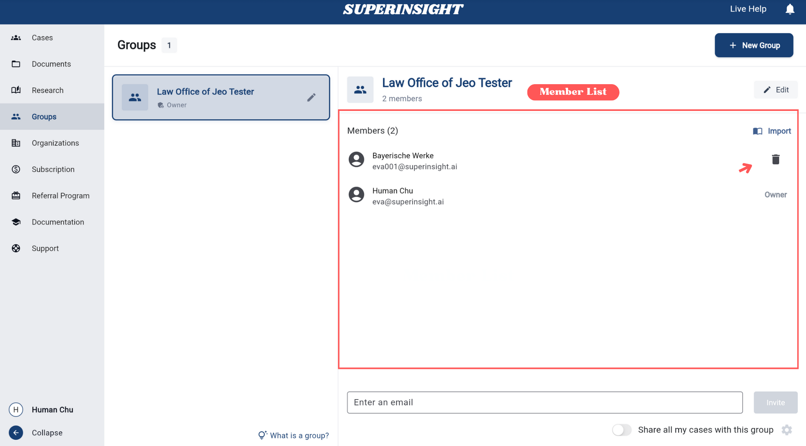

# Manage Groups

Groups enable efficient **team organization and management** for different work scenarios. **Create groups to collaborate on cases, share files, and set different access permissions** based on your specific needs.

## Create a New Group

Navigate to **Groups** from the left sidebar to access the group management workspace.

**Steps to create a new group:**

1. Click **Groups** in the left sidebar to open the Groups section
2. Click the **New Group** button in the top-right corner, or
3. Click **Create Your First Group** button in the center (if no groups exist yet)
4. Enter the group name and click **Create** to complete setup

## Invite Members to a Group

After creating a group, invite members using these methods:

=== "Invite New Member"
    Click the **Invite New Member** button and enter the member's email address to send an invitation.

    

=== "Import from Organization"
    **Import existing organization members** to your group. Invited members must accept before joining.

    

    

=== "Member List"
    View all members in the group. **Group owners can remove any member**.

    

## Share My Cases

After creating a group and adding members, you can share your cases with the entire group for collaborative work.

=== "Share All Cases"
    Enable the **"Share all my cases with this group"** toggle at the bottom of the group page to automatically share all current and future cases with group members. The access control dialog appears automatically after enabling the toggle, or you can **click the gear icon** on the right to access it anytime.

    

=== "Access Control"
    Set appropriate **access permissions** for group members to control what they can view and edit in shared cases.

    In the Access Control dialog, you can assign different access levels to individual parts of the case including **Documents**, **Reports**, and **Contact**.

    For each part, choose one of the following roles:

    - **Read** – View-only access. The user can see the content but cannot make any changes.
    - **Write** – Full access to view, edit, and update content.
    - **None** – The user has no access to this section.

    

## Example Use Cases for Groups

Groups are ideal for these scenarios:

### 1. Case Collaboration
- Create dedicated groups for specific cases
- Invite relevant lawyers, assistants, and experts
- Share case files and reports
- Set appropriate access permissions

### 2. Department Organization
- Create groups by department or specialty area
- Examples: SSD cases group, VA cases group, PI cases group
- Ensure each group only contains relevant personnel

### 3. Client Collaboration
- Create groups for specific clients
- Invite client representatives and internal team members
- Share progress and file updates

### 4. Temporary Projects
- Create groups for short-term projects
- Easily disband groups after project completion
- Flexible management of project-related access permissions

<!--
## Group Permission Management

Group owners can:

=== "Edit Group"
    Click the pencil icon to edit the group name or delete the group.

    

=== "Leave Group"
    If you are a group member, click the **Leave** button to leave the group.

    

Effective group management improves collaboration efficiency, ensures information security, and provides flexible organizational structures for various work scenarios.
--> 