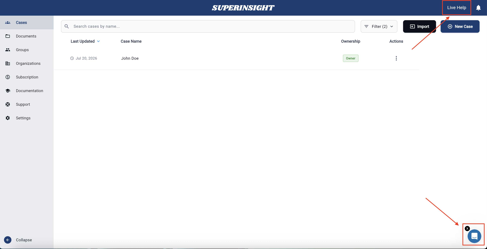

# How To Guide

Find the guide for the task you want to do.

New to Superinsight? Start with the [Quickstart Guide](../quickstart.md) first — then come back here for more detailed help.

## I want to…

| I want to… | Go here |
| --- | --- |
| Create a new case | [Create a case](case-create.md) |
| Find or open a case | [Find and open a case](case-find.md) |
| Share a case with someone | [Share a case](case-share.md) |
| Delete a case | [Delete a case](case-delete.md) |
| Update case contact information | [Update contact info](case-contact-info.md) |
| Connect Superinsight to my case system | [Case integration](case-integration.md) |
| Upload and organize documents | [Organize my files](case-folder.md) |
| Build, view, or download a report | [Manage my reports](manage-reports.md) |
| Ask questions about my documents | [Research](research.md) |
| Create or manage a team group | [Manage groups](groups.md) |
| Manage my organization and members | [Manage organizations](organizations.md) |
| Check or change my subscription | [Manage subscription](subscription.md) |
| Understand how credits work | [Credit usage](credit-usage.md) |

## Not sure where to start?

-   :material-rocket-launch:{ .lg .middle } __First time here__

    ---

    Follow a short video and simple steps to create your first case and report.

    [:octicons-arrow-right-24: Quickstart](../quickstart.md)

-   :material-help-circle:{ .lg .middle } __I have a common question__

    ---

    Check short answers to frequent issues like sign-in, uploads, and reports.

    [:octicons-arrow-right-24: FAQ](FAQ.md)

-   :material-lifebuoy:{ .lg .middle } __I need help from a person__

    ---

    Use Live Help in the app or email our support team.

    [:octicons-arrow-right-24: Contact Support](support.md)

!!! tip "Still stuck?"
    Open **Live Help** inside the Superinsight app, or visit [Contact Support](support.md) for email and troubleshooting tips.

