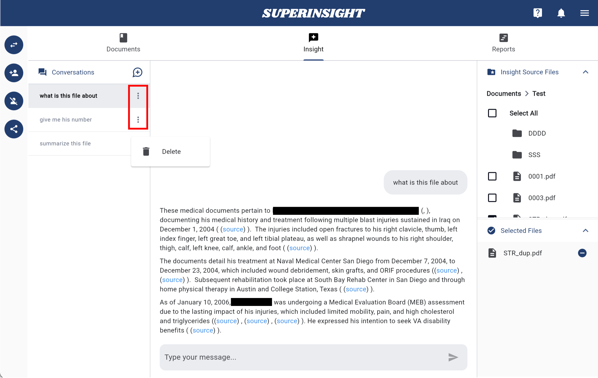
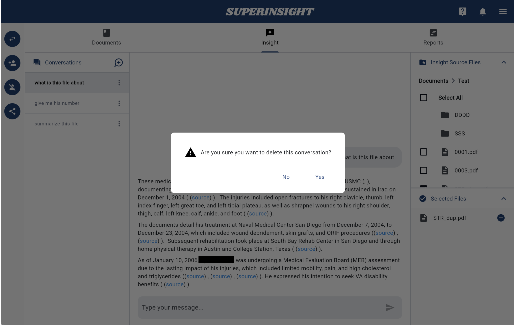

# Insight

## Overview

Superinsight makes it easy to extract valuable insights from your uploaded documents.

By chatting directly with our AI, you can quickly analyze large volumes of unorganized files and find the information you need in seconds.

## Select Source Documents

Before starting a conversation, you need to **select the source files** you want to interact with.

Use the **right-side panel** to navigate and choose your documents.

The selected files will be displayed below, and you can remove them by clicking the **Remove** button.

=== "Select Files"
    
=== "Selected Files"
    

## Start A Conversation

Once you've selected your source files, type your question in the chatbox and click **Send** icon to start the conversation.

=== "Start Conversation"
    
=== "Chatroom"
    

## References

For transparency, AI-generated answers include source references at the end of statements.

Clicking on a reference button will open a document viewer on the right side, displaying the exact page from the source document.

## Delete Conversation

All conversations are **saved automatically**, and the conversation name is based on the last question you asked.

To delete a conversation, click the **More** button on the right of the item.

=== "Delete Conversation"
    
=== "Confirm Deletion"
    