# How to Manage Reports

## Overview

The **Reports** section provides a comprehensive management system for all your generated reports. This area allows you to view, organize, and manage reports that have been created from your case documents and research activities.

<iframe width="560" height="315" 
src="https://www.youtube.com/embed/sI9clpIOlis?rel=0&si=XJezGeCH_ctuhxxm" 
title="YouTube video player" 
frameborder="0" 
allow="accelerometer; autoplay; clipboard-write; encrypted-media; gyroscope; picture-in-picture; web-share" 
referrerpolicy="strict-origin-when-cross-origin" 
allowfullscreen></iframe>

## Report List

### Navigating to Reports

To access the Reports section:

1. Click on a **Case** to enter the case workspace
2. Click on the **Reports** tab, which is located in the middle of the case navigation tabs

The Reports tab provides access to all reports generated for that specific case.

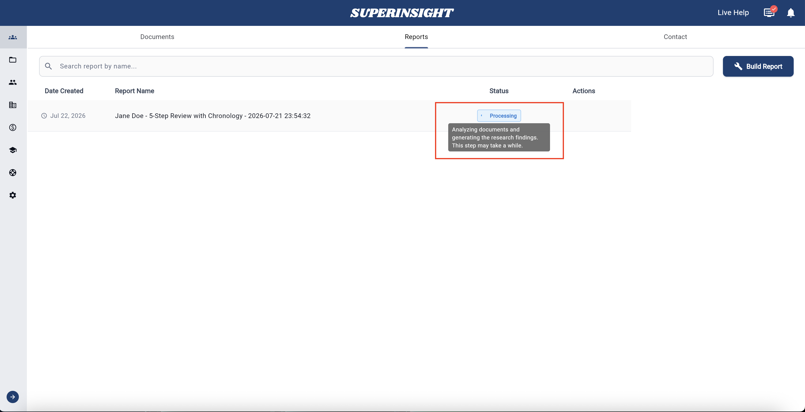

### Report Display

View all your generated reports in an organized list format. Each report displays:

- **Report Name**: The title or identifier of the report
- **Creation Date**: When the report was generated
- **Status**: Current status (Ready, In Progress, Processing, Action Required, Failed)
- **Report Type**: The type of report (Medical Chronology, Basic Summary, Advanced Mode, etc.)
- **Case Association**: Which case the report is linked to

## Report Actions

On the **Report List** page, you'll find action icons on the right side of each report row. These icons let you **export**, **edit**, **rebuild**, or **delete** individual reports:

<iframe width="560" height="315" 
src="https://www.youtube.com/embed/_vZi64D9bw4?rel=0&si=-dNQ2faQo4jFltJ9" 
title="YouTube video player" 
frameborder="0" 
allow="accelerometer; autoplay; clipboard-write; encrypted-media; gyroscope; picture-in-picture; web-share" 
referrerpolicy="strict-origin-when-cross-origin" 
allowfullscreen></iframe>

## How do I download a report?

Download or export a finished report from the report row as **PDF** or **DOCX**.

1. Open a **case** and go to the **Reports** tab.
2. On the report row, click **Export**.
3. In **Export Report**, choose a **Format**: **PDF** or **DOCX**.
4. Leave **Include all sections** on to export the whole report. From the report viewer you can turn it off and pick sections. **Include source files** adds the source documents to the export.
5. Click **Export**.

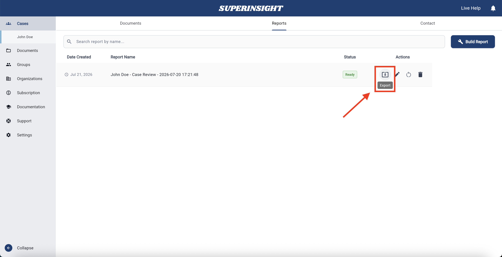

!!! success "You're done when…"
    The file downloads, or the export appears in the **Activities** panel while it finishes.

## How do I rebuild a report?

Rebuild a report when you want a new version from the same case, including after you add or change source files. A rebuild does not use credits.

1. Open a **case** and go to the **Reports** tab.
2. On the report row, click **Rebuild Report**.
3. The dialog title is **Rebuild Report (n/3)**. It asks, “Are you unsatisfied with the result? Let's try it again.”
4. Review **Source Files**. To change them, click **Edit**, update the selection in **Edit Source Files**, then click **Done**.
5. Click **Rebuild**. Click **Cancel** to close the dialog without rebuilding.

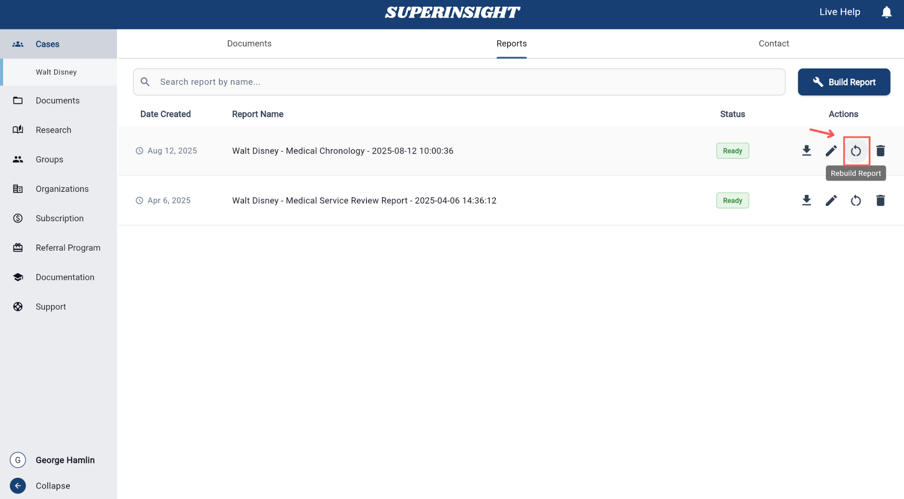

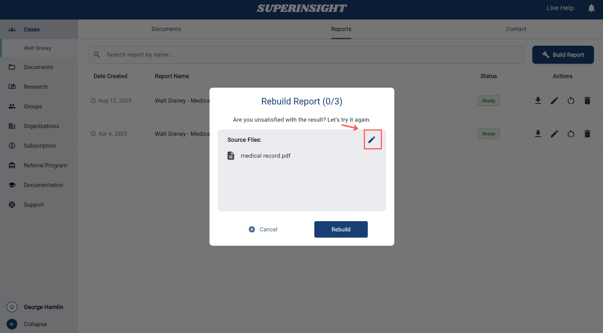

!!! success "You're done when…"
    Superinsight shows **Rebuild Requested**. The new version is ready within 10 minutes. Large source files can take longer.

!!! warning "Rebuild limit"
    Each report can be rebuilt 3 times. After that, the dialog title is **Rebuild Limit Reached** and the message is “You have used all your available chances to rebuild reports. Please contact us for further support.” Click **Message Us** to reach Live Help.

## How do I edit a report?

Click **Edit Report** on a report row to open the report viewer. From there you can move through sections, search the report, and view referenced documents.

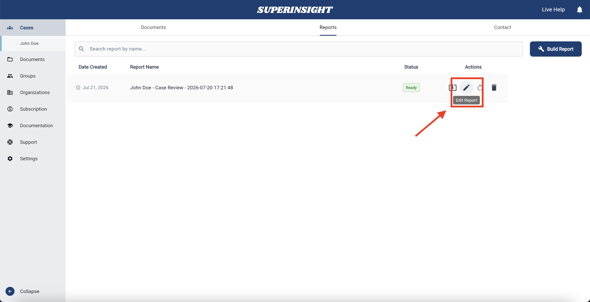

### Open a section for editing

1. Open the report with **Edit Report**.
2. Click the **Edit** (pencil) icon next to a section in the left sidebar.

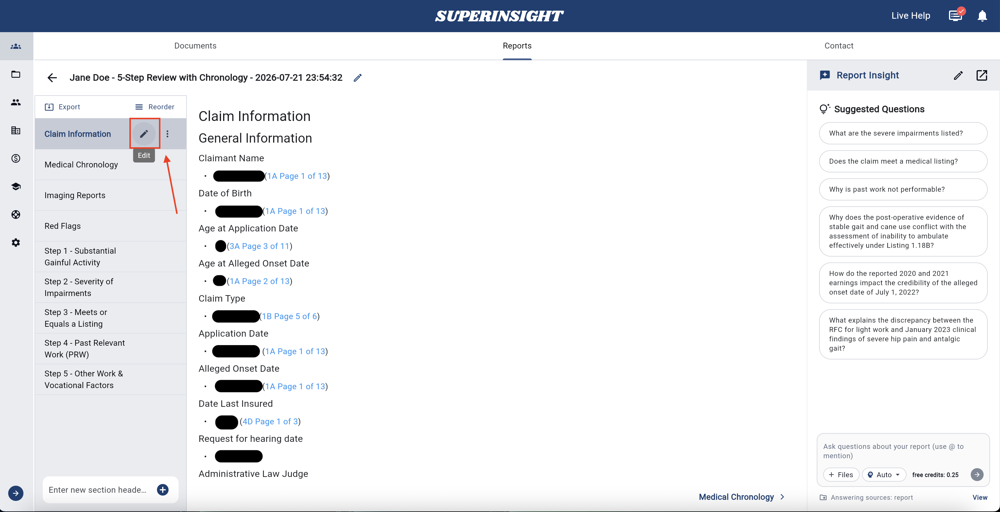

### Change the text

The editor includes bold, italic, underline, font size, alignment, and spacing. You can rename a heading, such as changing “Personal Information” to “Case Information.”

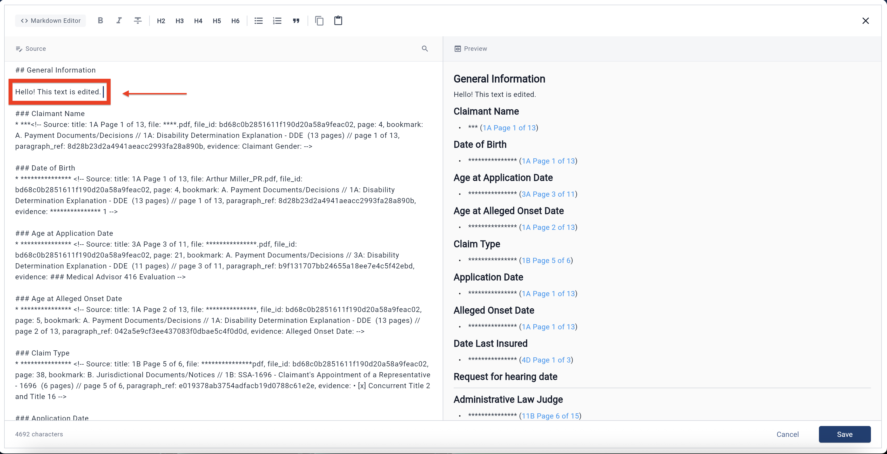

### Change the sections

Add a section, drag sections to reorder them, or remove a section or paragraph you do not need.

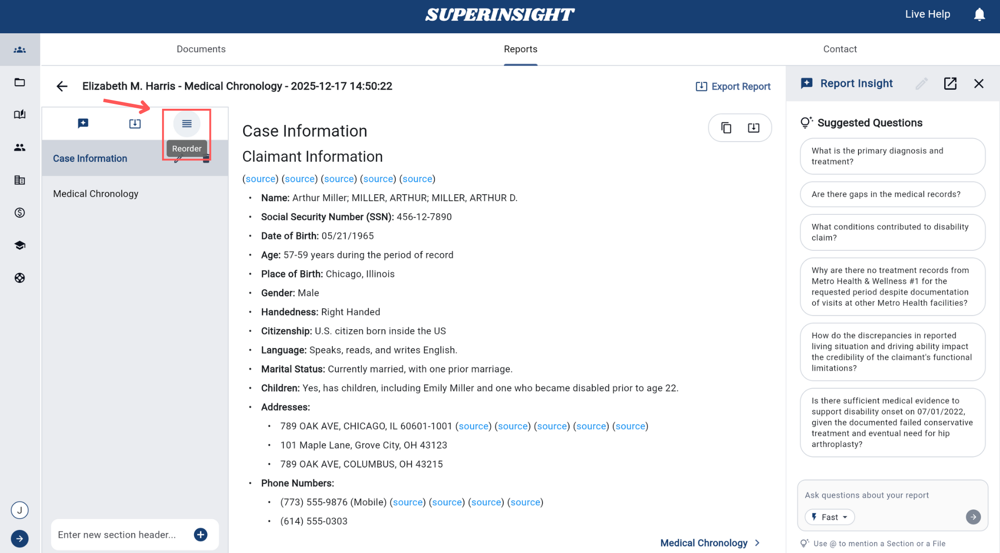

### Ask a question about the report

Use the **Report Insight** panel on the right. Research Insight chooses the AI agent for the question.

Examples:

- Does the medical evidence clearly link the injury to the incident in question?
- What treatments were provided, and were there any unexplained gaps in care?
- What is the patient's prognosis, and are future treatments or surgeries anticipated?
- Are there any inconsistencies between medical records, witness statements, and other evidence?
- What are the key points?

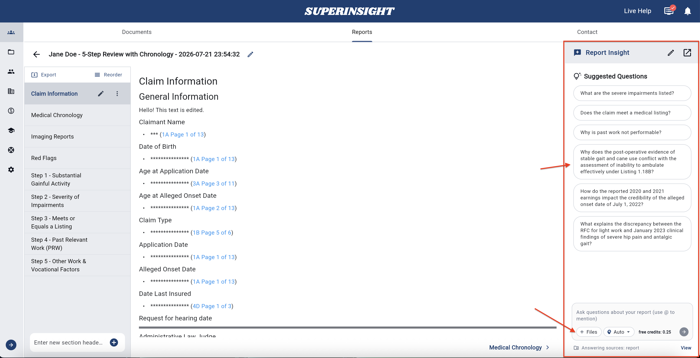

Need a new report or a different template? See [Build a report](build-reports.md).

## How do I delete a report?

Delete a report you no longer need. A deleted report cannot be recovered.

1. Open a **case** and go to the **Reports** tab.
2. On the report row, click **Delete Report**.
3. In **Delete Report**, read “Are you sure you want to delete this report?”
4. Click **Delete**.

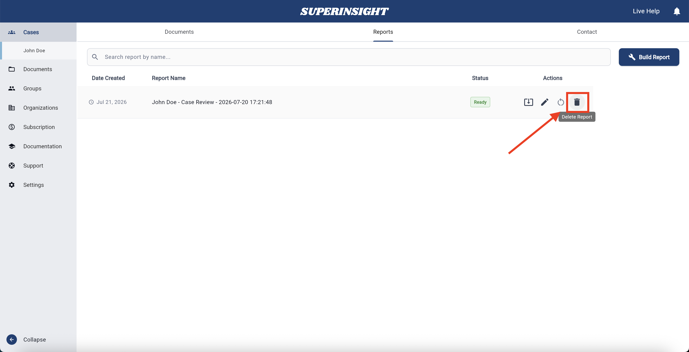

## My report says Action Required

A report with status **Action Required** is waiting on you before it can finish. Click the **Action Required** status.

- **Protected files.** The hint says “Click Action Required to unlock the protected files.” Enter the password for each protected file, then submit. The report continues after the passwords are accepted.
- **Pages that could not be read.** The hint says “Click Action Required to retry the failed pages.” Retry those pages. The report resumes after the retry is accepted.
- **Something else is needed.** The hint says “Click Action Required to see what's needed.” Follow the prompt in the dialog.

If the report stays on **In Progress** or **Processing** for a long time and is not **Action Required**, wait for processing to finish, then check the status again.

<!--
## Filter and Search

Quickly find specific reports using the filtering and search capabilities:

### Filter by Status
- **All Reports**: Show all reports regardless of status
- **Completed**: Show only successfully generated reports
- **In Progress**: Show reports currently being processed
- **Failed**: Show reports that encountered errors

### Filter by Report Type
- **Medical Chronology**: Timeline-based medical reports
- **Basic Summary**: Condensed overview reports
- **Advanced Mode**: Detailed analytical reports
-->

### Search Reports

The search functionality allows you to quickly locate specific reports from your complete report library. The search bar is located at the top of the Reports list and provides intelligent filtering across multiple report attributes.

Use the search bar to find reports by:

- **Case Name**: Search by the name of the associated case or client
- **Creation Date**: Find reports generated on specific dates or date ranges. Use formats like "2024-01-15"
- **Report Type**: Filter by report categories (Medical Chronology, Basic Summary, Advanced Mode, etc.)

=== "By Case Name"
    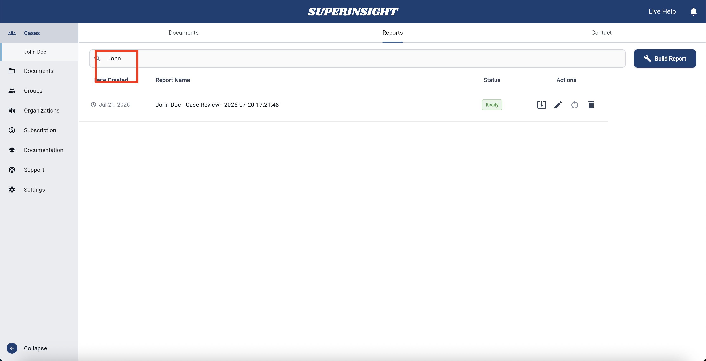

=== "By Creation Date"
    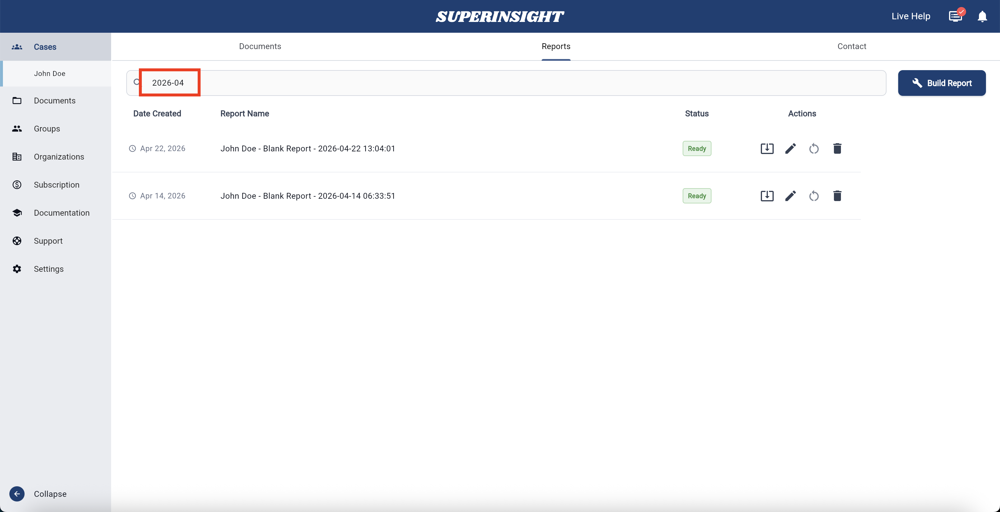

=== "By Report Type"
    

## Report Details

Each report includes detailed information about:

### Content Overview
- **Source Files**: Which documents were used to create the report
- **Case Information**: Details about the associated case
- **Personal Information**: Client and contact details
- **Case Summary**: Overview of the case background and key points
- **Section Breakdown**: Overview of report sections and content
- **Copy Feature**: Easily copy report content, sections, or entire reports for reuse in other cases or documents

<!--
## Batch Operations

Manage multiple reports simultaneously:

=== "Select Multiple"
    Use checkboxes to select multiple reports for batch operations:
    
    - Bulk download
    - Batch delete
    - Export to external systems
    
    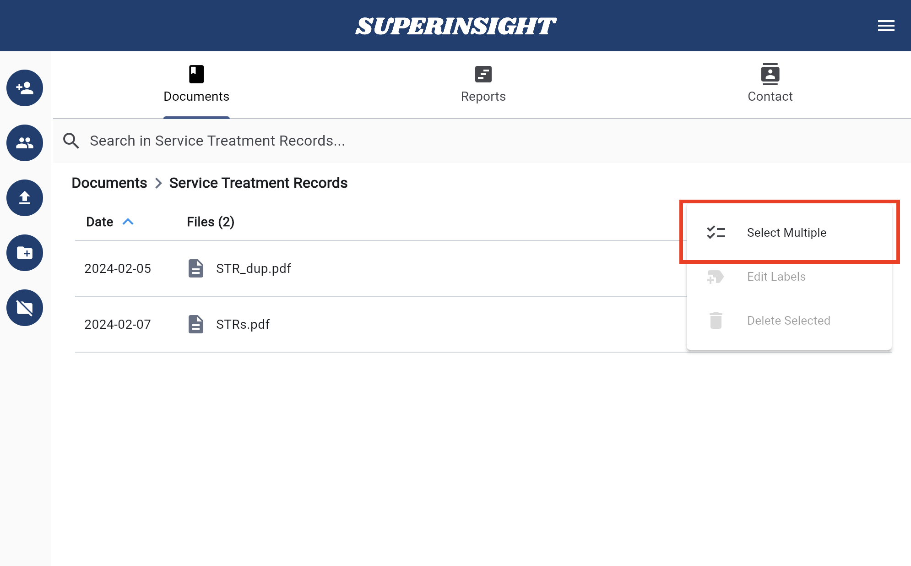

=== "Export Options"
    Export selected reports in various formats for external use or archival purposes.
-->
