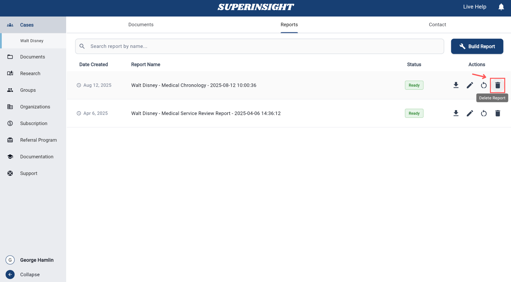

# How to Manage Reports

## Overview

The **Reports** section provides a comprehensive management system for all your generated reports. This area allows you to view, organize, and manage reports that have been created from your case documents and research activities.

<iframe width="560" height="315" src="https://www.youtube.com/embed/sI9clpIOlis?si=L3rU28mEQaVyap6F" title="YouTube video player" frameborder="0" allow="accelerometer; autoplay; clipboard-write; encrypted-media; gyroscope; picture-in-picture; web-share" referrerpolicy="strict-origin-when-cross-origin" allowfullscreen></iframe>

## Report List

### Navigating to Reports

To access the Reports section:

1. Click on a **Case** to enter the case workspace
2. Click on the **Reports** tab, which is located in the middle of the case navigation tabs

The Reports tab provides access to all reports generated for that specific case.

### Report Display

View all your generated reports in an organized list format. Each report displays:

- **Report Name**: The title or identifier of the report
- **Creation Date**: When the report was generated
- **Status**: Current status (Completed, In Progress, Failed)
- **Report Type**: The type of report (Medical Chronology, Basic Summary, Advanced Mode, etc.)
- **Case Association**: Which case the report is linked to

## Report Actions

On the **Report List** page, you'll find Actions icons on the right side of each report row. These icons provide 4 different action buttons that offer various management options for your reports. These action buttons allow you to **download**, **edit**, **rebuild**, or **delete** individual reports as needed:

<iframe width="560" height="315" src="https://www.youtube.com/embed/_vZi64D9bw4?si=7eIdId1b-NT_3-u4" title="YouTube video player" frameborder="0" allow="accelerometer; autoplay; clipboard-write; encrypted-media; gyroscope; picture-in-picture; web-share" referrerpolicy="strict-origin-when-cross-origin" allowfullscreen></iframe>

=== "Download Report"
    Download reports in various formats:
    
    - **PDF Format**: For offline viewing and sharing
    - **Docx Format**: For document editing and sharing
    
    

=== "Edit Report"
    Click on any report to open and view its contents. This provides a full-screen reading experience with options to:
    
    - Navigate through different sections
    - Search within the report content
    - View referenced documents
    
    

=== "Rebuild Report"
    Regenerate a report with updated file:
    
    1. Click **Rebuild** button
    2. **Select** updated source file
    3. Click **Rebuild** to start the regeneration process
    
    The rebuilt report will replace the original version while maintaining the same report ID and creation date reference.
    
    
    
    
    
    !!! Warning "Rebuild Limit"
        You can only rebuild each report three times. This limitation helps maintain system stability and ensures optimal performance. Once you reach the rebuild limit, you'll need to create a new report if further changes are required. The rebuild feature is free and does not consume any credits.

=== "Delete Report"
    Remove reports that are no longer needed:
    
    1. **Click** the delete icon
    2. **Confirm** the deletion in the dialog
    
    !!! Warning "Permanent Deletion"
        **Deleted reports cannot be recovered.** Once deleted, the report is permanently removed from the system.
    
    

<!--
## Filter and Search

Quickly find specific reports using the filtering and search capabilities:

### Filter by Status
- **All Reports**: Show all reports regardless of status
- **Completed**: Show only successfully generated reports
- **In Progress**: Show reports currently being processed
- **Failed**: Show reports that encountered errors

### Filter by Report Type
- **Medical Chronology**: Timeline-based medical reports
- **Basic Summary**: Condensed overview reports
- **Advanced Mode**: Detailed analytical reports
-->

### Search Reports

The search functionality allows you to quickly locate specific reports from your complete report library. The search bar is located at the top of the Reports list and provides intelligent filtering across multiple report attributes.

Use the search bar to find reports by:

- **Case Name**: Search by the name of the associated case or client
- **Creation Date**: Find reports generated on specific dates or date ranges. Use formats like "2024-01-15"
- **Report Type**: Filter by report categories (Medical Chronology, Basic Summary, Advanced Mode, etc.)

=== "By Case Name"
    

=== "By Creation Date"
    

=== "By Report Type"
    

## Report Details

Each report includes detailed information about:

### Content Overview
- **Source Files**: Which documents were used to create the report
- **Case Information**: Details about the associated case
- **Personal Information**: Client and contact details
- **Case Summary**: Overview of the case background and key points
- **Section Breakdown**: Overview of report sections and content
- **Copy Feature**: Easily copy report content, sections, or entire reports for reuse in other cases or documents

## Edit Report

Modify the content and structure of existing reports to meet your specific needs. The editing feature provides comprehensive tools for customizing report content while maintaining professional formatting.

### Accessing the Editor

To edit an existing report:

1. Navigate to the Reports section and locate the report you want to modify
2. Click on the report name to open the report viewer
3. Click the **Edit** button in the report toolbar to enter editing mode

### Editing Features

The report editor provides powerful tools for content modification:

=== "Text Editing"
    Make direct changes to report content:
    
    - **Rich text editor** with formatting options (bold, italic, underline)
    - **Font size adjustments** for different text elements
    - **Text alignment** and spacing controls
    
    For example, you can change section headings like "Personal Information" to "Case Information" to better reflect your content structure.
    
    

=== "Section Management"
    Organize and restructure report content:
    
    - **Add sections** with custom headings and content
    - **Reorder sections** using drag-and-drop
    - **Remove unwanted sections** or paragraphs
    
    

=== "Report Insight"
    Generate intelligent insights and analysis for your report:
    
    - **AI-powered suggestions** for content improvement
    - **Summary generation** for key findings
    
    **Example questions you can ask:**
    
    - Does the medical evidence clearly link the injury to the incident in question?
    
    - What treatments were provided, and were there any unexplained gaps in care?
    
    - What is the patient's prognosis, and are future treatments or surgeries anticipated?
    
    - Are there any inconsistencies between medical records, witness statements, and other evidence?
    
    - What are the key points?
    
    

<!--
## Batch Operations

Manage multiple reports simultaneously:

=== "Select Multiple"
    Use checkboxes to select multiple reports for batch operations:
    
    - Bulk download
    - Batch delete
    - Export to external systems
    
    

=== "Export Options"
    Export selected reports in various formats for external use or archival purposes.

## Report Templates

Access and manage report templates for consistent formatting:

- **Standard Templates**: Pre-built templates for common report types
- **Custom Templates**: Create and save your own report formats
- **Template Settings**: Customize headers, footers, and styling options

-->
