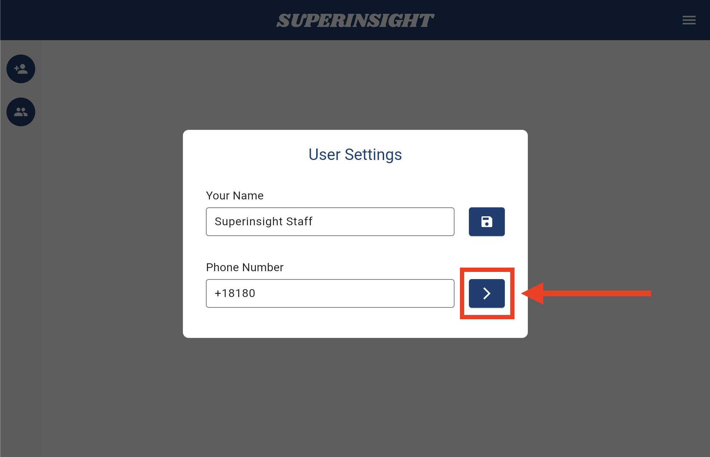

# Menu

You can find the burger menu in the right-up corner of the app UI. Here you can set up your account info, check on your subscription billing, and of course, find our tutorial and support!

=== "Menu"
    

=== "Click on Menu"
    

## Change Mobile Number

In some cases, you might need to change your mobile phone number, which may affect your login. For security, Superinsight will verify your new mobile number before actually using it as your new login number. To change your login number, please follow the steps below.

=== "User Settings"
    Click on the **Settings** in the Menu.

    

=== "Change Number"
    Click on the "**>**" button to change your mobile number.

    

=== "Enter New Number"
    Enter your new mobile number and click the **Send Code**, and you will receive an SMS code a few seconds later.

    

=== "Verify New Number"
    Enter the SMS code you received and verify your new mobile number.

    

Your login number will be changed after verified successfully. Please use your new number to login to Superinsight afterward.