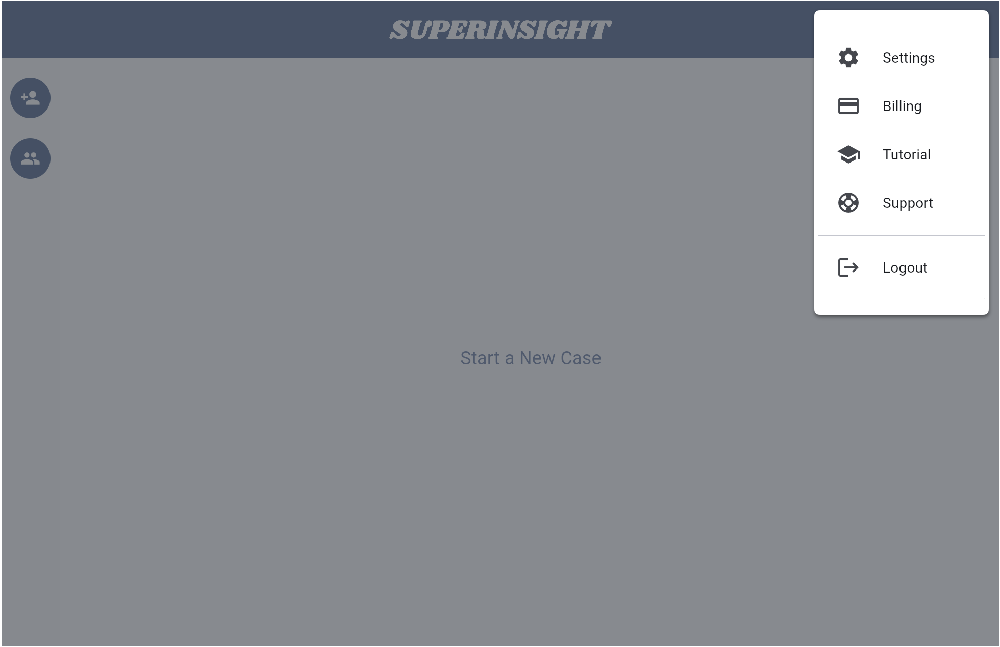
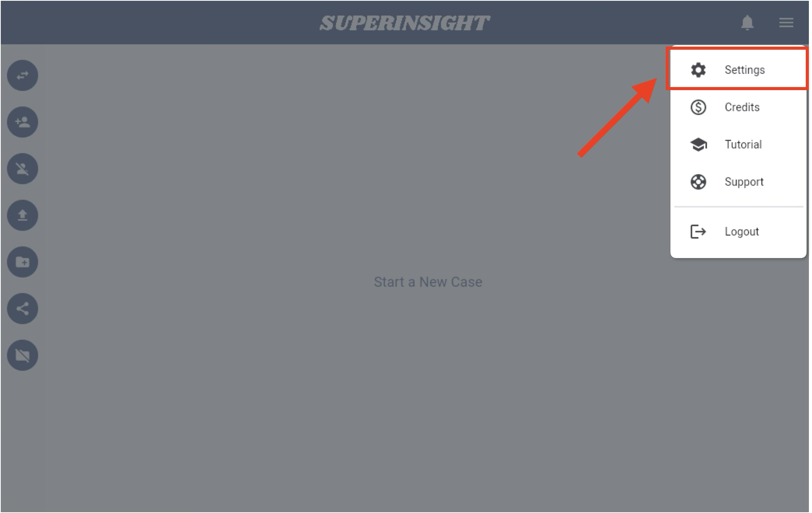
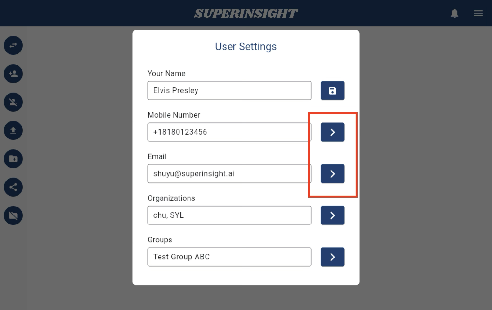
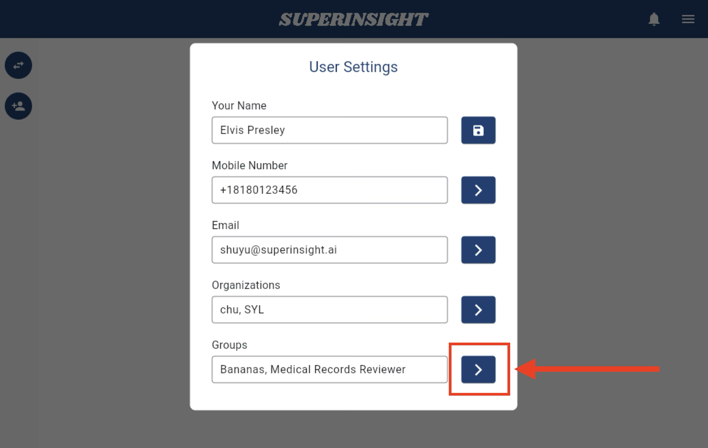
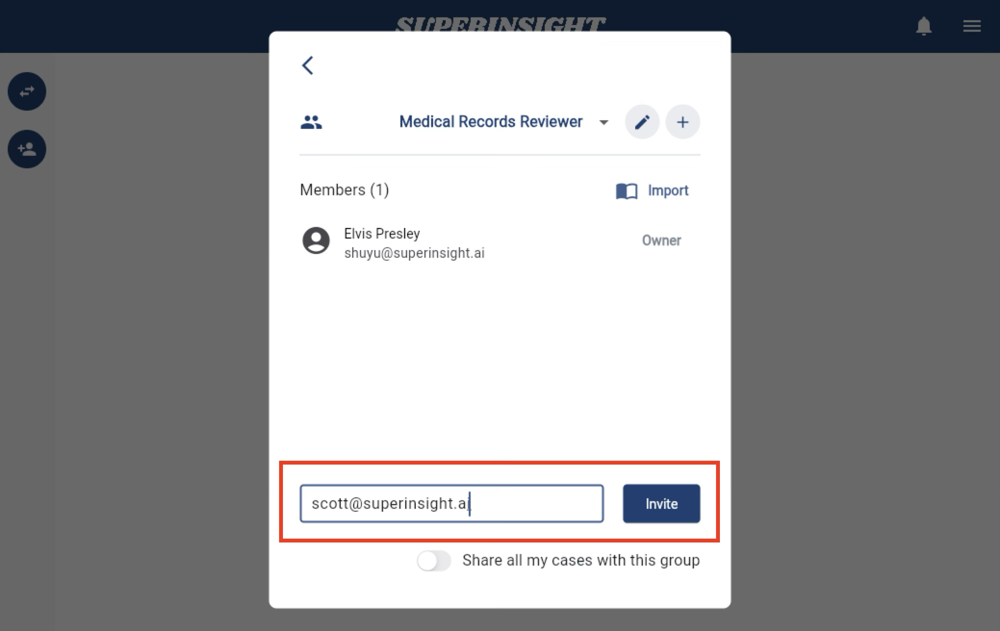
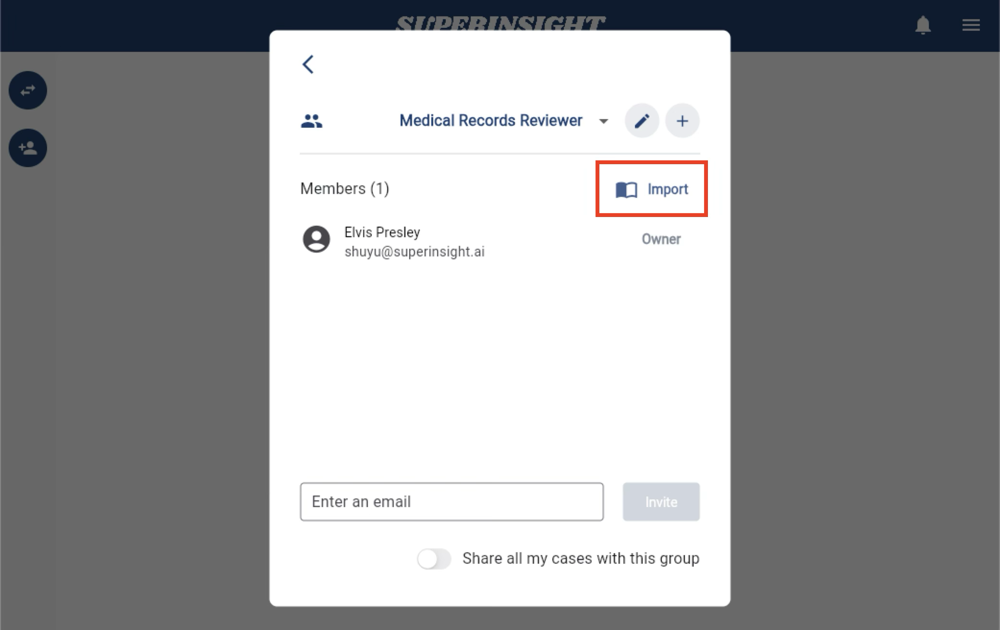
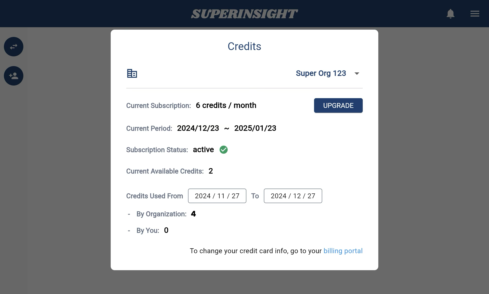

# Menu

You can find the burger menu in the right-up corner of the app UI. Here you can set up your account info, check on your subscription, and of course, find our tutorial and support!

=== "Menu"
    

=== "Click on Menu"
    

## Change Contact Info

In some cases, you might need to change your contact information like mobile phone number and email address, which may affect your login. For security, Superinsight will verify your new mobile or email before actually using it to interact with the system. To change your contact information, please follow the steps below.

=== "User Settings"
    Click on the **Settings** in the Menu.

    

=== "Change Number or Email"
    Click on the "**>**" button to change your mobile number or email address.

    

=== "Enter New Number"
    Enter your new mobile number / email address and click the **Send Code**, and Superinsight will send you a verification code in a few seconds.

    

=== "Verify New Number"
    Enter the verification code you received and verify your new contact info.

    

If you change your mobile number, your login number will also be changed after verified successfully. Please use your new number to login to Superinsight afterward.

## Manage Organization

The subscription for Superinsight is billed per organization, and payment is handled by the organization owner. Users are allowed to join multiple organizations but can only be the owner of one organization. If you want to manage your organization or view the information of the organizations you belong to, click on **Settings** in the Menu.

Click on the "**>**" button to manage or check your organization information.

If you are the owner of the organization, you can:

=== "Member List"
    See all members in the organization and remove any of them by clicking on the delete icon.
    

=== "Change Organization Name"
    Change the name of your organization.
    

=== "Invite New Member"
    Invite new members by sending them an Email invitation.
    

If you are a member of the organization, you can:

=== "Member List"
    See all members in the organization; of course, you can not remove any member from here.
    

=== "Leave Organization"
    You can leave this organization by clicking the "**Leave**" button if you no longer belong to it.
    

## Manage Group

You can create multiple groups according to your working scenarios and needs. You can also be invited into multiple groups. If you need to manage your groups, click on **Settings** in the Menu.

Click on the "**>**" button to manage or check your group information.

If you are the owner of the group, you can:

=== "Member List"
    See all members in the group and remove any of them by clicking on the delete icon.
    

=== "Edit Group"
    Clicking on the pencil icon, you can edit the name of your group or delete this group.
    

=== "Invite New Member"
    Invite new members by sending them an Wmil invitation.
    

=== "Import from Organization"
    Another way to add new members to your group is to import them from your organization. In this way, members still receive the invite and accept it before joining the group.
    

=== "Share with Group"
    Since you add members to the group, you can share all your cases with the group and set up the permissions for members to see your cases.
    

If you are a member of the group, you can:

=== "Member List"
    See all members in the group; of course, you can not remove any member from here.
    

=== "Leave Group"
    You can leave this group by clicking the "**Leave**" button.
    

## Check Your Current Credits

In the **Credits**, you can see your current subscription status and remaining credits for this subscription period. 

We also show your credit usage here. You can clearly see the credits you and even the whole organization used.

=== "Credits"
    

=== "Credit Section"
    

If you need more credits, you can click "**UPGRADE**" button to upgrade your subscription plan or purchase extra credits for your reports.

