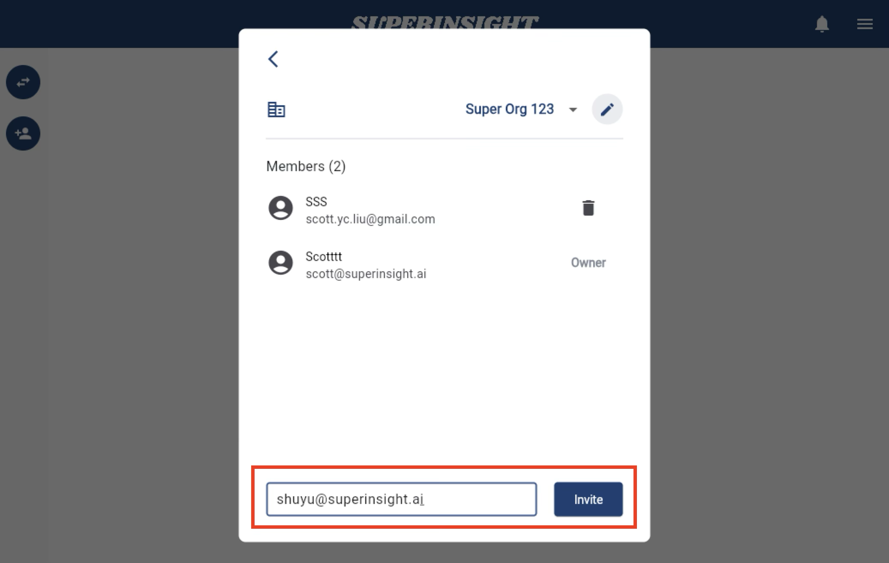
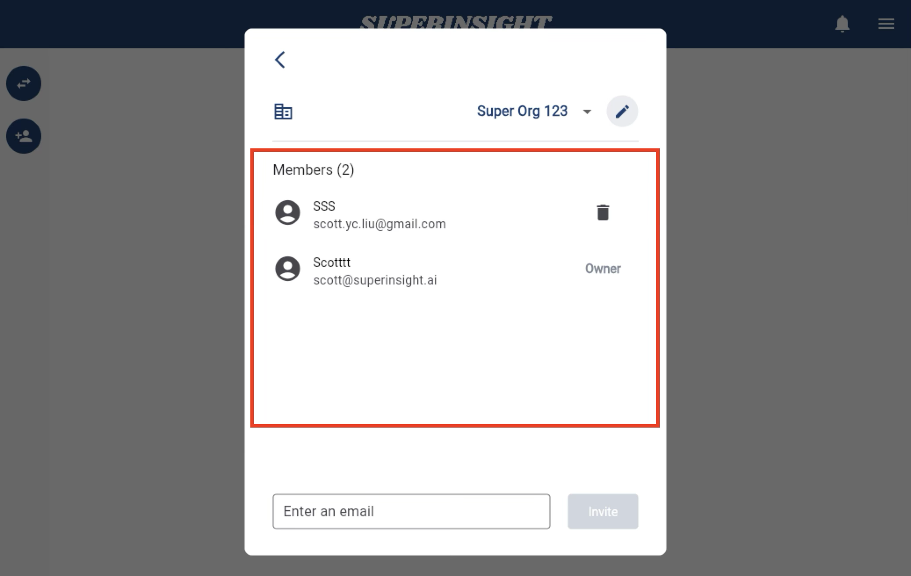
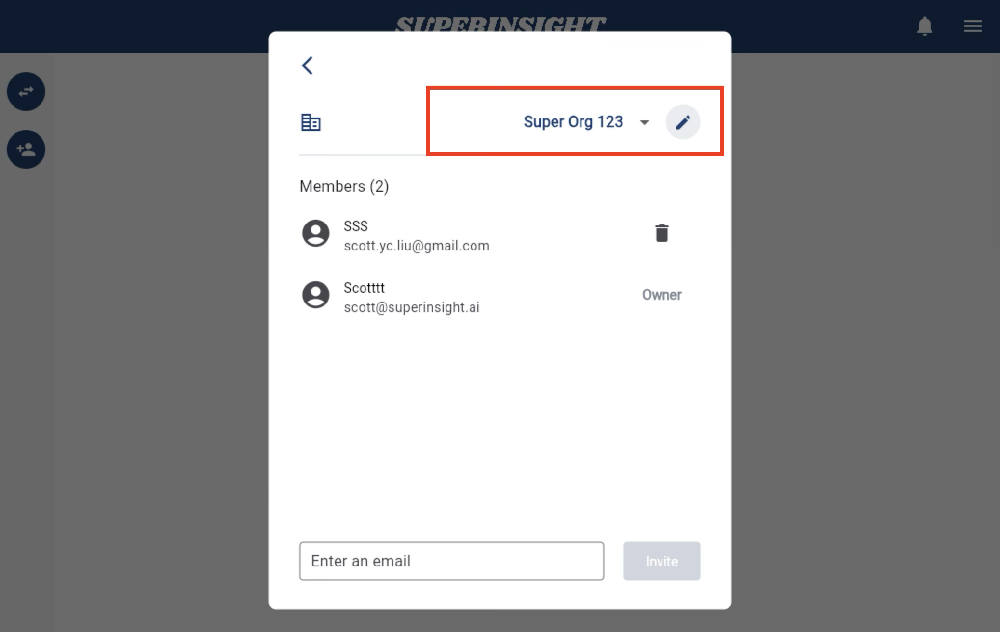
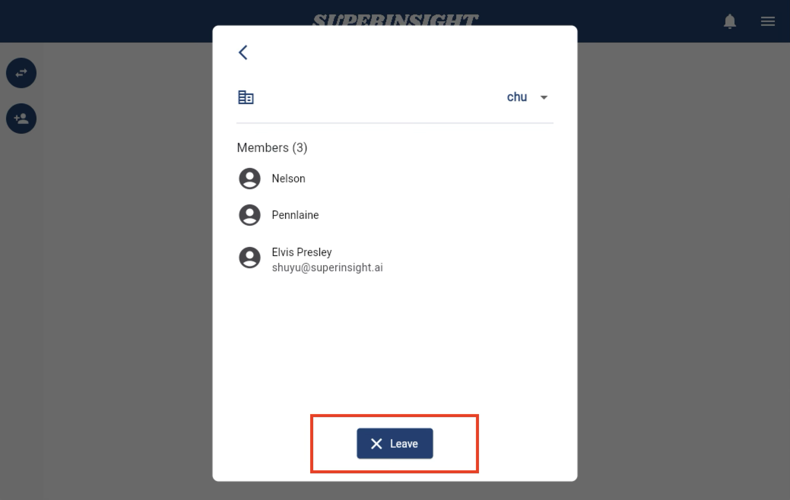

# Manage Organization

## Overview

Organizations in Superinsight allow you to manage teams, share resources, and collaborate on cases with multiple users. You can create organizations to group related cases and manage access permissions for team members.

## Create Organization

To create a new organization, navigate to the settings menu and select the organization management option. You can create multiple organizations to separate different practice areas or client groups.

=== "Manage Organization"

    

=== "Organization Members"

    

## Invite Members

You can invite team members to your organization by sending them an invitation email. Once they accept the invitation, they'll have access to cases and resources shared within the organization.

=== "Invite to Organization"

    

=== "Organization Owners"

    

## Organization Settings

Manage your organization's name, settings, and member permissions. Organization owners can modify these settings and manage member access levels.

=== "Change Organization Name"

    

## Leave Organization

If you need to leave an organization, you can do so from the organization settings. Note that if you're the only owner, you'll need to transfer ownership to another member before leaving.

=== "Leave Organization"

     