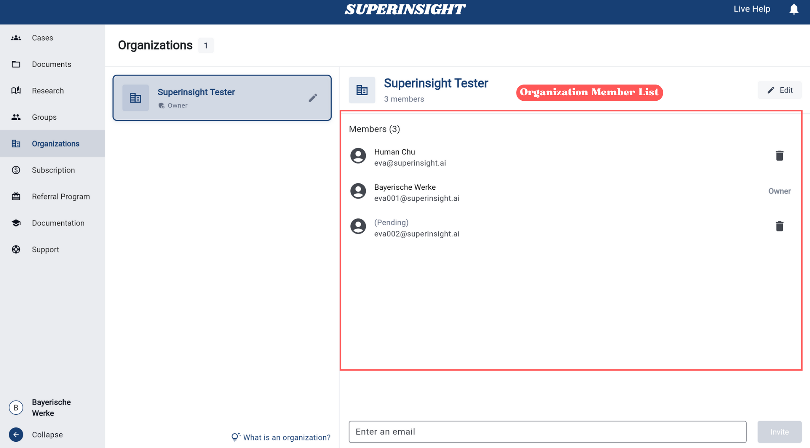

# Manage Organizations

## Overview

Organizations in Superinsight enable teams to collaborate effectively by providing **centralized member management**. As an organization owner, you have full administrative control to **invite members** and **configure organizational settings**. As a member, you can **view organization information** and **leave organizations** when needed.

You can create multiple organizations for different projects or teams, and participate in organizations created by others through invitations. Each organization maintains its own member list and collaborative workspace.

## Accessing Organization

Navigate to **Organizations** from the left sidebar menu to access organization management features.

You can create a new organization by clicking the "**+ New Organization**" button in the top right corner.

## Organization Panel

When you select an organization from the left sidebar, the organization panel displays different information and options based on your role within that organization.

### Organization Information

The organization panel shows:

- **Organization name** and member count
- **Complete member list** with their roles and status
- **Member status indicators**: Active members and pending invitations
- **Your role** within the organization (Owner or Member)

### Role-Based Access

**If you are an Organization Owner:**

- You have full administrative control over the organization
- Access to all management functions including member management, invitations, and organization settings
- Ability to edit organization details and remove members

**If you are an Organization Member:**

- You can view all organization information and member lists
- As a member, you can choose to leave the organization at any time if you no longer wish to be part of it

## Owner Permissions

If you are the owner of the organization, you can:

=== "Invite New Member"
    To invite new members to your organization:
    
    1. Enter the email address of the person you want to invite in the text field at the bottom
    2. Click the "**Invite**" button to send the invitation
    
    The invited person will receive an email invitation to join your organization. Their status will show as "**Pending**" in the member list until they accept the invitation.
    
    

=== "Member List"
    View all members in the organization and check their status. You can:
    
    - **Check member status**: See active members and pending invitations
    - **Monitor invitation status**: Track which invitations are still pending acceptance
    - **Remove members**: Delete any member by clicking the delete (trash) icon
    - **Manage pending invitations**: Cancel pending invitations if needed
    
    

=== "Change Organization Name"
    You have two ways to access the edit function:
    
    **Method 1**: Click the pencil (edit) icon within the organization card on the left side.
    
    **Method 2**: Click the "**Edit**" button in the top right corner of the organization details panel.
    
    

## Member Permissions

If you are a member of the organization, you can:

=== "Member List"
    View all members in the organization and check their status. As a member, you can:
    
    - **Check member status**: See active members and pending invitations
    - **Monitor invitation status**: Track which invitations are still pending acceptance
    
    **Note**: As a regular member, you cannot remove other members or cancel pending invitations.
    
    

=== "Leave Organization"
    If you no longer wish to be part of this organization, you can leave at any time.
    
    Click the "**Leave**" button to remove yourself from the organization. Once you leave, you will lose access to all organization resources and will need to be re-invited if you want to rejoin.
    
    

## Share Cases with Organization

!!! info "Create a Group First"
    To collaborate on cases with your organization members, you **need to create a group first** and then invite your organization members to that group.

How to Share Cases with Organization Members

1. **Create a Group**: Navigate to the Groups section and create a new group for your case collaboration
2. **Import Organization Members**: Use the "Import from Organization" feature to invite your entire organization or specific members to the group
3. **Share Cases**: Navigate to the Cases and enable case sharing within the group to collaborate on documents, reports, and contacts
4. **Set Access Permissions**: Control what organization members can view and edit in shared cases

Groups provide the collaborative workspace where organization members can work together on cases with appropriate access controls and permissions.

For detailed instructions on creating groups and managing case sharing, please refer to our [Manage Groups guide](https://docs.superinsight.me/guide/groups/#__tabbed_1_2).

 