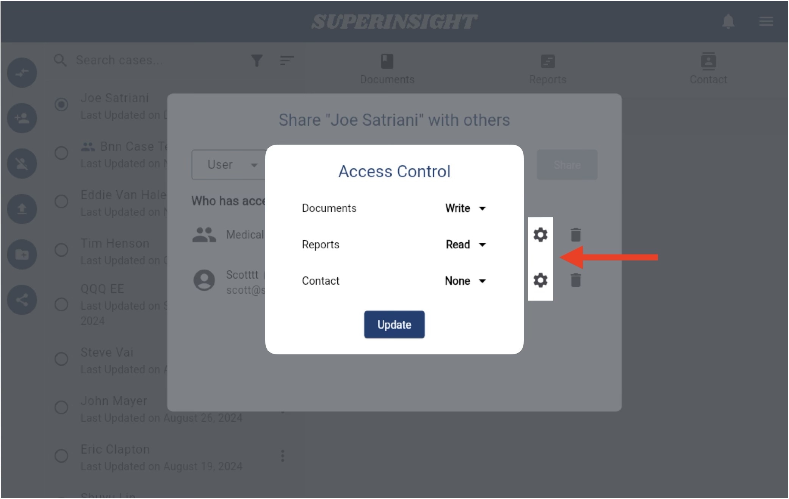
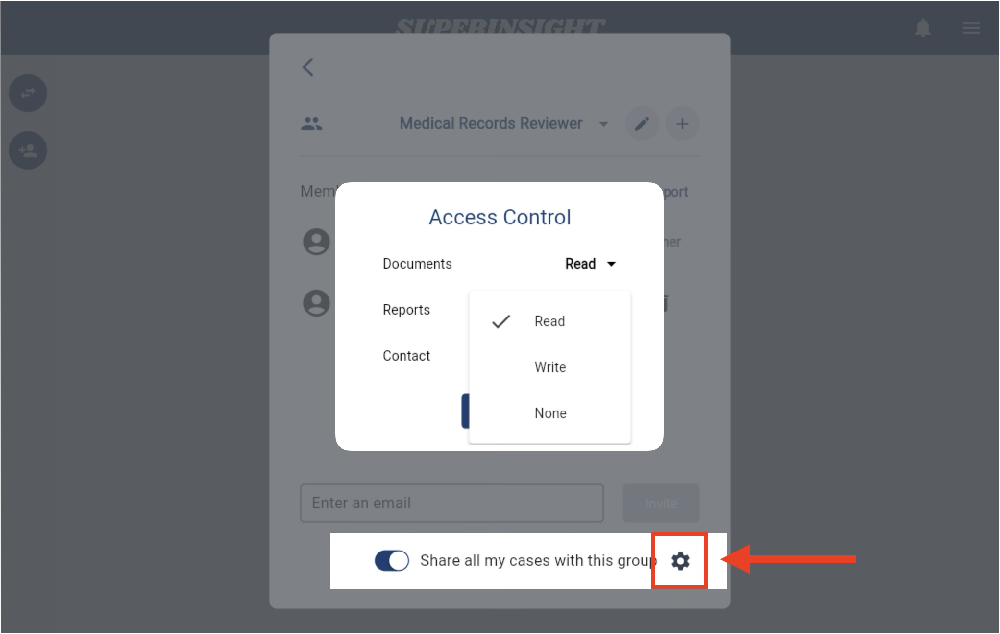

# Access Permission Settings

When [sharing your cases](/guide/case-share), you may not want to disclose all their information. Superinsight offers flexible options to set access permissions for each case. Each case has three permission categories: **Documents**, **Reports**, and **Contact**. You can manage access permissions for your cases in two different locations.

## Single Case Access Permissions

In the sharing list, you'll see a gear icon next to each recipient's name. Click this icon to adjust the access permissions for the case.

You can set access permissions for the Documents, Reports, and Contact sections of this case. Each section can be configured with one of three permissions: **Write**, **Read**, or **None**.

## Group Access Permissions

In your [Group Settings](/guide/menu#3-manage-group), you can share all your cases with the group members if you own the group. Here, you can also set up the access permissions for all your group members.

