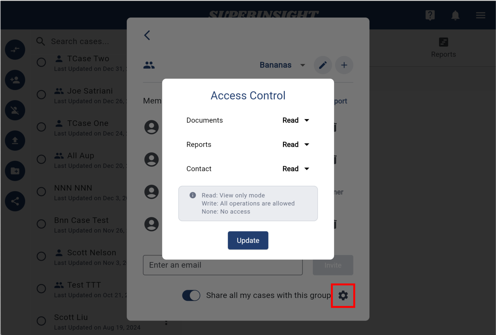

# Access Permission Settings

When you [share your cases](/guide/case-share), you might not want to share all the information about them. Superinsight provides flexibility in setting up access permissions for every single case. All the case has 3 parts of permission: **Documents**, **Reports**, and **Contact**. There are 2 places to set up your cases' access permission.

## Single Case Access Permissions

In the sharing list, you can find a gear icon next to each sharing recipient. You can use this icon to adjust the recipient's access permissions for this case.

You can set access permissions for the Documents, Reports, and Contact sections of this case. Each section can be configured with one of three permissions: **Write**, **Read**, or **None**.

## Group Access Permissions

In your [Group Settings](/guide/menu#3-manage-group), you can share all your cases with the group members if you own the group. Here, you can also set up the access permissions for all your group members.

