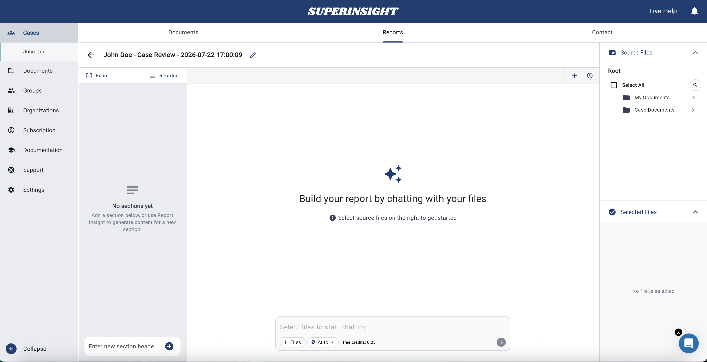
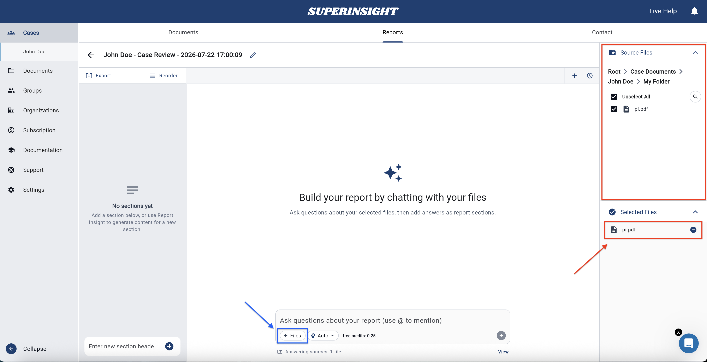
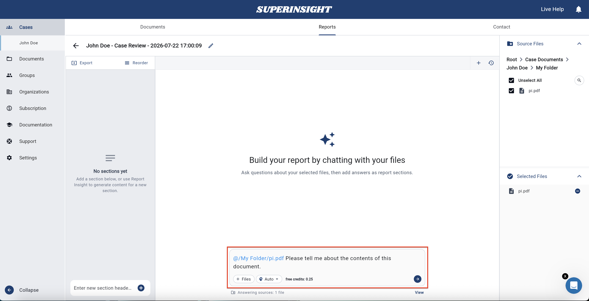
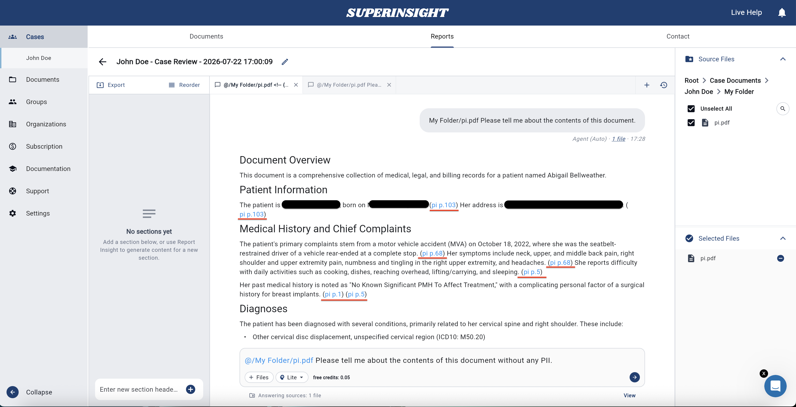

# Research Insight

Research Insight lets you ask questions about your case documents directly inside a report. Instead of reading every page yourself, you chat with Superinsight and get answers backed by source citations from your files.

Use it to summarize records, find specific facts, compare documents, or draft brief notes — all from the report you already have open.

!!! info "Replacing the old Research section"
    The standalone **Research** section in the sidebar is being retired. **Research Insight** is the new way to ask questions — open a report from your case and start chatting there.

## Open Research Insight

1. Open a **case** from your case list.
2. Go to the **Reports** tab.
3. Open an existing report, start a **Standard Report**, or start a **Case Review** if you want a flexible workspace to explore files without a pre-built template.

    

4. You land on the **Research Insight** workspace for that report — this is where you ask questions and review answers. On standard reports, the chat panel appears on the right as **Report Insight**.

## How it works

Research Insight **chooses the best AI agent for your question** — you do not need to pick an agent mode yourself. Just type what you need and send.

Behind the scenes, Research Insight may run a quick lookup, a deeper analysis, or ask you to clarify an ambiguous request before answering.

## Ask a question

### Select source files

Before you ask, choose which documents Research Insight should read. Use the **Source Files** and **Selected Files** panels on the right to pick files from your case.

- Browse folders in **Source Files** and check the files you want included.
- Selected files appear in **Selected Files** — remove any file with the **−** button if you no longer want it included.
- Your file selection is saved as you work — you do not have to re-pick files every time you return to the report.

    

### Type and send

1. Type your question in the chat input — write naturally, as you would ask a colleague.
2. Press **Enter** or click the **Send** arrow to submit.
3. Wait while Research Insight generates your answer. You may see progress updates while it works.
4. Click **Stop** anytime to cancel an in-progress answer.

**Ways to focus on specific files**

- Type **`@`** and pick a file from the suggestion list to target that document.
- Use the **+ Files** button in the chat input to attach or reference files quickly.
- Use the **Up** / **Down** arrow keys to move through `@` suggestions; press **Tab** or **Enter** to select.

**Example questions**

- “Summarize the key medical findings in these records.”
- “What treatments were provided between January and March 2024?”
- “@Medical-Records-2023.pdf What diagnoses are listed?”
- “Compare the treatment timeline across the selected files.”
- “Are there gaps in care that stand out?”

    

### Clarifying questions

If your request is unclear — for example, when similar files could apply — **Research Insight may ask a short clarifying question** before answering. Pick one of the suggested options or type your own reply. You are not charged for the clarify step itself; credits apply when your answer is completed.

## Read and verify answers

Answers appear in the conversation thread. For transparency, Superinsight includes **source references** tied to your documents.

- Click a **reference link** in an answer (for example, `(pi p.103)`) to open the source file in the preview panel.
- The preview jumps to the **page and location** where the information was found so you can verify the AI’s response against the original record.

    

## Manage conversations

Research Insight saves your work automatically.

| Action | How |
| --- | --- |
| **Start fresh** | Click **+ New Chat** to begin a new conversation on the same report. |
| **Switch threads** | Open the conversation history list and select a previous chat. |
| **Follow up** | Keep asking in the same conversation — Research Insight remembers earlier messages in that thread. |
| **Delete** | Open the **More** menu (⋮) on a conversation, choose **Delete**, and confirm. Deleted conversations cannot be recovered. |

You can also run **multiple conversations on the same report** — each keeps its own history and file context.

## Credits

Each question in Research Insight uses credits from your account. The cost depends on how much work the answer requires:

| Usage | Typical cost |
| --- | --- |
| Short, focused answers | from **0.05 credits** |
| Longer, in-depth analysis | up to **0.25 credits** per question |

Credits are **reserved when you send a question** and **charged when the answer completes successfully**. If you stop a question or it fails, reserved credits are released back to your balance.

For subscription details, balances, and usage history, see [Credits and Usage](credit-usage.md).

## Tips for better results

- **Be specific** — include dates, names, or topics when they matter.
- **Select relevant files** — fewer, targeted files often produce faster and clearer answers.
- **Use follow-ups** — ask Research Insight to expand, summarize, or reformat based on its previous reply.
- **Check citations** — always spot-check important facts against the linked source pages.

## Next steps

- [Manage my reports](manage-reports.md) — create, edit, export, and download reports
- [Organize my files](case-folder.md) — upload and label the documents Research Insight reads
- [Credits and Usage](credit-usage.md) — understand your plan and question costs
- [Contact Support](support.md) — get help from the Superinsight team
