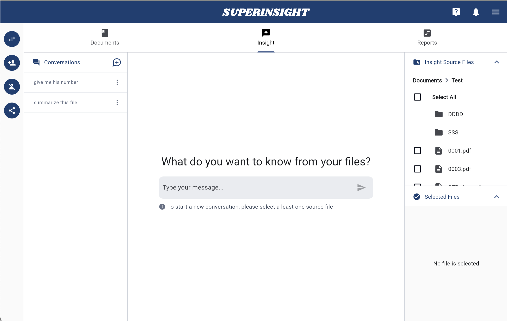
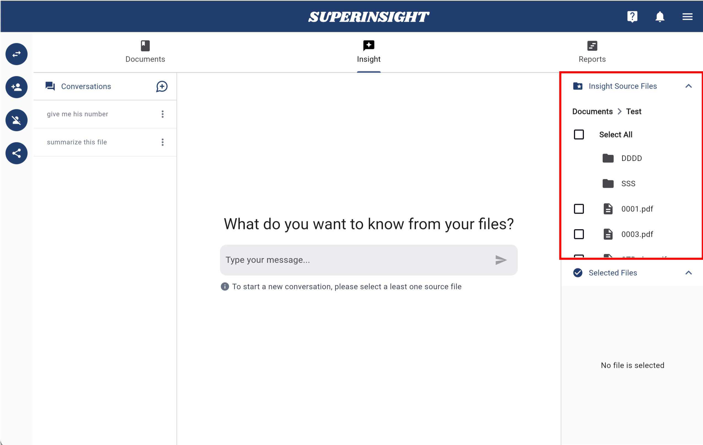
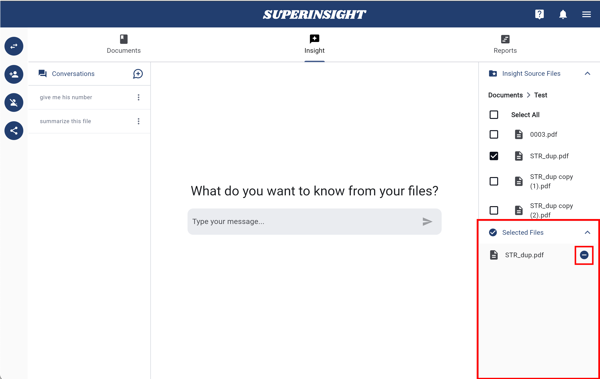
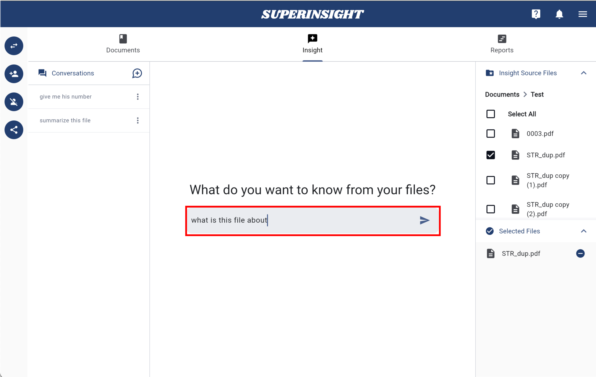
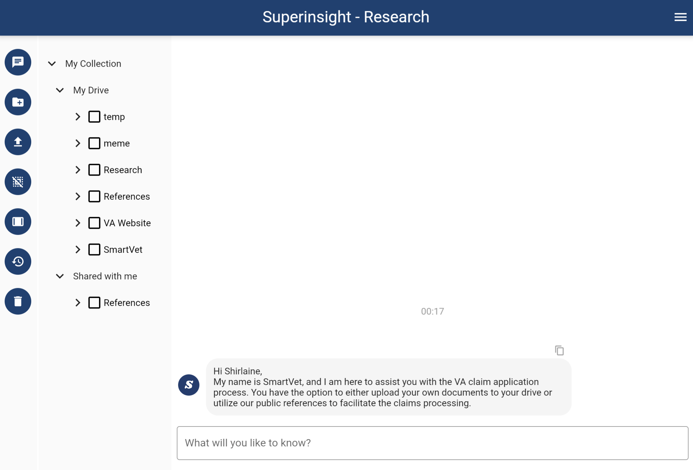
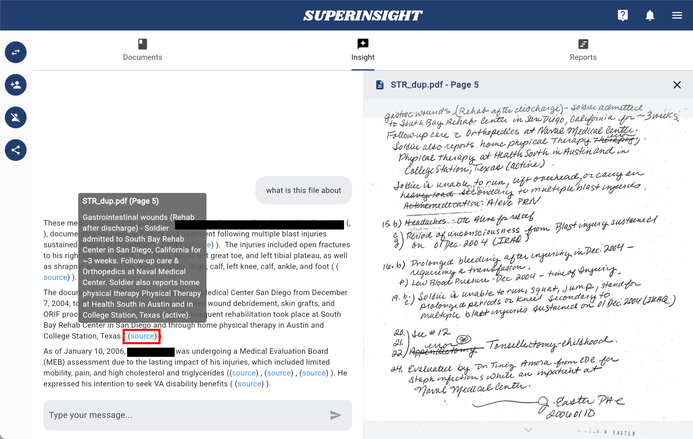
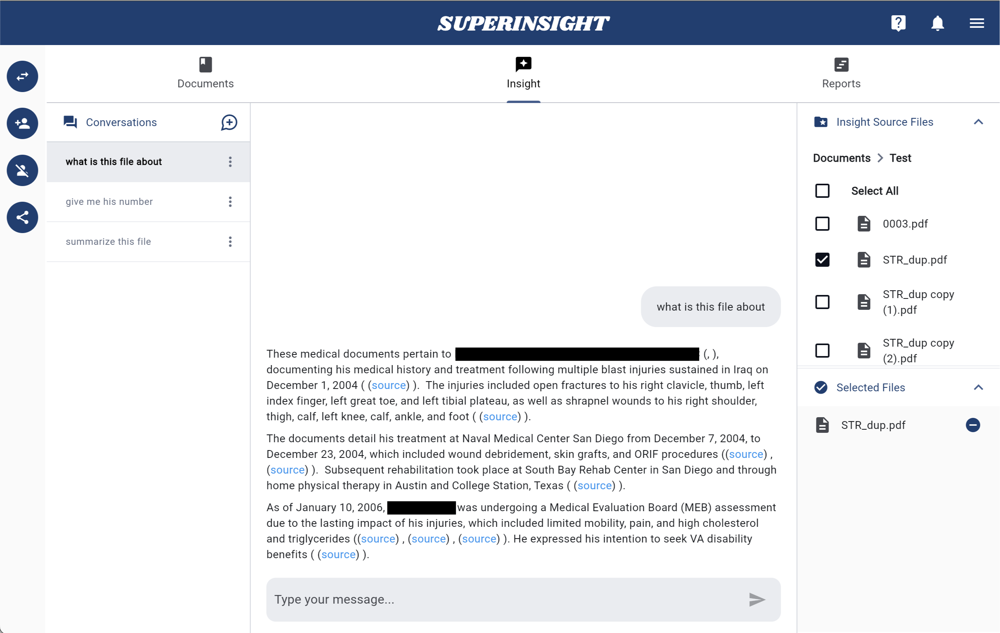
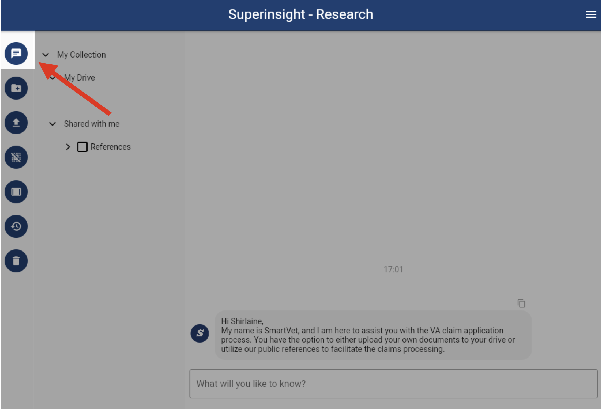

# Manage Research

## Overview

The **Research** feature is a powerful AI-powered tool that allows you to query your uploaded documents using natural language. This feature enables you to extract insights, find specific information, and get contextual answers from your document collection without manually searching through files.

You can ask questions such as:

- "Summarize this file"
- "What are the key points in this report?"
- "What happened on this date?"
- "Find all mentions of specific medical conditions"
- "Compare the findings between these documents"

The Research feature provides intelligent, context-aware responses based on the content of your selected documents.

## How to Use

### Accessing Research

Navigate to the **Research** section from the left sidebar. The Research tab provides a dedicated workspace for document querying and analysis.

=== "Research Section"
    

### Selecting Source Files

Before you can start asking questions, you need to select one or more source files:

=== "Source Files Panel"
    Use the right-hand **Source Files** panel to select documents from either **My Documents** or **Case Documents**.

    

=== "File Selection"
    Click on files to select them. You can select multiple files for comprehensive analysis across multiple documents.

    

### Starting a Conversation

Once you have selected at least one file, the message input field becomes active:

=== "Message Input"
    Type your natural-language question in the input field at the bottom of the screen.

    

=== "Send Question"
    Press **Enter** or click the arrow icon to send your question and start the conversation.

    

### Getting Responses

The Research feature will analyze your selected documents and provide contextual answers:

=== "AI Response"
    The system processes your question and returns relevant information from your documents.

    

=== "References"
    Responses include references to specific parts of your documents for verification.

    

## Conversations Panel

The **Conversations** panel on the left side of the Research interface maintains a history of your research sessions:

=== "Conversations History"
    Previous questions and answers are automatically saved in the Conversations panel.

    

### Conversation Management

- **Document Association**: Each conversation is tied to the specific documents you selected when asking the question
- **Session Continuity**: You can continue conversations by asking follow-up questions
- **Historical Access**: Access previous research sessions and their results
- **Context Preservation**: The system maintains context across related questions

### Starting New Conversations

To start a new research session:

=== "New Conversation"
    Click the **New Conversation** button to begin a fresh research session.

    

=== "Select Different Files"
    Choose different source files for your new research query.

    

## Best Practices

### Effective Questioning
- **Be Specific**: Ask targeted questions for more precise answers
- **Use Natural Language**: Write questions as you would ask a colleague
- **Reference Context**: Mention specific dates, names, or events when relevant
- **Follow Up**: Use previous answers to ask more detailed follow-up questions

### File Selection
- **Relevant Documents**: Select only the documents relevant to your research question
- **Multiple Sources**: Include multiple files for comprehensive analysis
- **Case Context**: Use case-specific documents for case-related research
- **Personal Files**: Include personal documents for broader context when needed

The Research feature transforms your document collection into an intelligent knowledge base, enabling you to quickly find information, extract insights, and make informed decisions based on your uploaded content. 