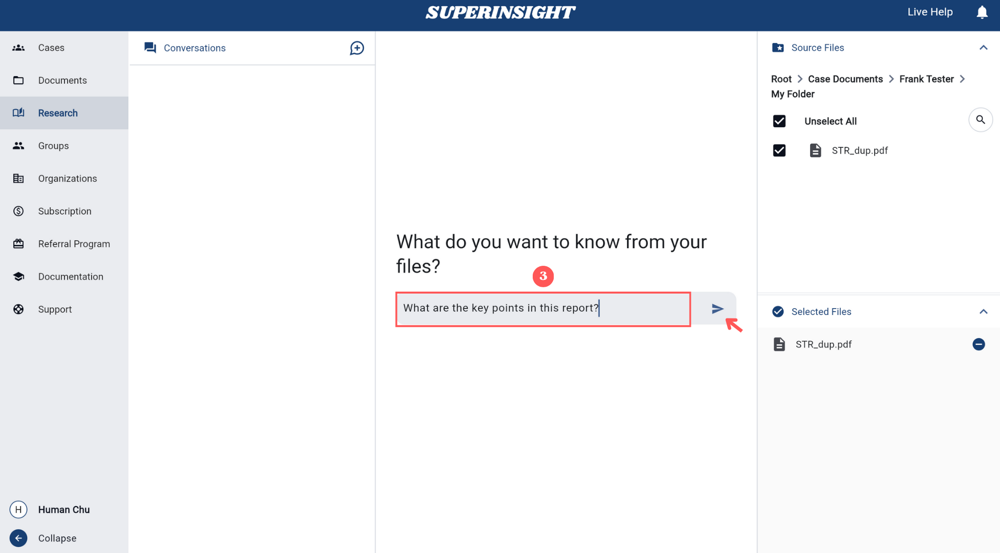
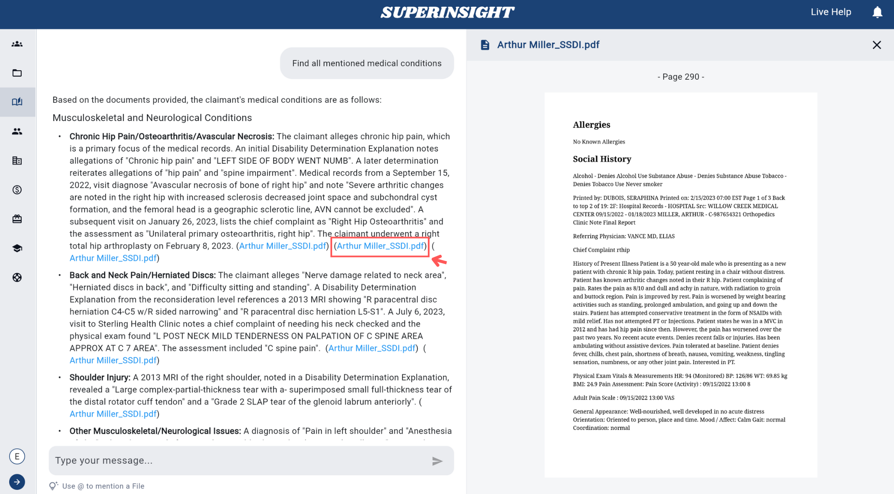
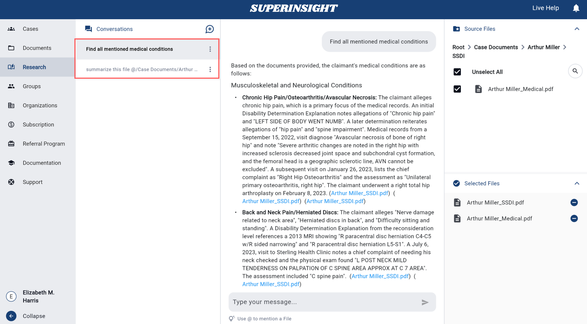

# Manage Research

## Overview

The **Research** feature is a powerful AI-powered tool that allows you to query your uploaded documents using natural language. This feature enables you to extract insights, find specific information, and get contextual answers from your document collection without manually searching through files.

You can ask questions such as:

- "Summarize this file"
- "What are the key points in this report?"
- "What happened on this date?"
- "Find all mentions of specific medical conditions"
- "Compare the findings between these documents"

The Research feature provides intelligent, context-aware responses based on the content of your selected documents.

## How to Use

### Quick Start Summary

To use the Research feature effectively, follow these key steps:

1. **Access Research**: Navigate to the Research section from the left sidebar
2. **Select Files**: Choose at least one document from the Source Files panel
3. **Ask Questions**: Type your question and press Enter to submit
4. **Review Results**: Read AI responses and click source links to view references
5. **Manage Conversations**: Start new conversations or delete old ones as needed

### Accessing Research

Navigate to the **Research** section from the left sidebar. The Research tab provides a dedicated workspace for document querying and analysis.

=== "Research Section"
    

### Selecting Source Files

!!! warning "Required Step"
    **You must select at least one source file before you can start asking questions.** The Research feature cannot function without document access.

Before you can start asking questions, you need to select one or more source files from your document collection. Without file selection, the message input field will remain disabled and you cannot proceed with your research queries:

=== "Source Files Panel"
    Use the right-hand **Source Files** panel to select documents from either **My Documents** or **Case Documents**.

    

=== "File Selection"
    Click on files to select them. **At least one file must be selected** to enable the Research feature. You can select multiple files for comprehensive analysis across multiple documents.

    

### Starting a Conversation

!!! info "Ready to Research"
    Once you have selected at least one file, the message input field becomes active and you can begin asking questions:

**Basic Steps:**

1. Type your question in the message input field
2. Write naturally - ask as you would speak to a colleague  
3. Press **Enter** or click the **send arrow (→)** to submit

**Advanced: Target Specific Files**

1. Type **"@"** to open file dropdown
2. Select specific documents for focused analysis
3. Example: "@document.pdf What medical conditions are mentioned?"

**Question Types & Examples:**

- **General Analysis**: "What are the key points in this report?"
- **Summaries**: "Summarize the main findings"
- **File-Specific**: "@filename.pdf What does this document say about...?"
- **Comparisons**: "Compare the recommendations between @file.name1 and @file.name2"

=== "Send Question"
    

### Getting Responses

The Research feature will analyze your selected documents and provide contextual answers. Please note that processing may take up to one minute as the AI thoroughly analyzes your documents to provide accurate and comprehensive responses:

=== "AI Response"
    The system processes your question and returns relevant information from your documents.

    

=== "References"
    Responses include references to specific parts of your documents for verification. When you **click on a source link** in the AI response, the referenced document **opens in a panel** on the right side, showing the exact page and location where the information was found. This allows you to **verify the AI's answers** against the original source material.

    

## Conversations Panel

The **Conversations** panel on the left side of the Research interface provides comprehensive conversation management with three main capabilities:

### Conversation Management

=== "Start New Conversation"
    1. Click the **New Conversation** button to clear previous context
    2. Select new source files from the **Source Files** panel
    3. Begin asking questions about your newly selected documents

    

=== "Delete Conversation"
    Remove unwanted conversations from your history to keep your workspace organized.

    **How to Delete:**

    1. **Locate Conversation**: Find the conversation in the Conversations panel
    2. **Open Menu**: Click the **three dots (⋮)** next to the conversation
    3. **Select Delete**: Choose **Delete** from the dropdown menu
    4. **Confirm**: Click **Yes** in the confirmation dialog

    

    !!! warning "Permanent Action"
        Deleted conversations cannot be recovered.

### View Conversation History

=== "Conversations History"
    All previous questions and answers are automatically saved and displayed in the Conversations panel. Each conversation is tied to the specific documents you selected when asking the question.

    

**Key Features:**

- **Access Previous Conversations**: Click on any conversation to view its complete question and answer history
- **Document Tracking**: Each conversation displays which specific documents were analyzed
- **Continue Discussions**: Resume existing conversations by adding follow-up questions
- **Smart Context**: The system remembers previous exchanges within the same conversation

## Best Practices

### Effective Questioning
- **Be Specific**: Ask targeted questions for more precise answers
- **Use Natural Language**: Write questions as you would ask a colleague
- **Reference Context**: Mention specific dates, names, or events when relevant
- **Follow Up**: Use previous answers to ask more detailed follow-up questions

### File Selection
- **Relevant Documents**: Select only the documents relevant to your research question
- **Multiple Sources**: Include multiple files for comprehensive analysis
- **Case Context**: Use case-specific documents for case-related research
- **Personal Files**: Include personal documents for broader context when needed

The Research feature transforms your document collection into an intelligent knowledge base, enabling you to quickly find information, extract insights, and make informed decisions based on your uploaded content. 