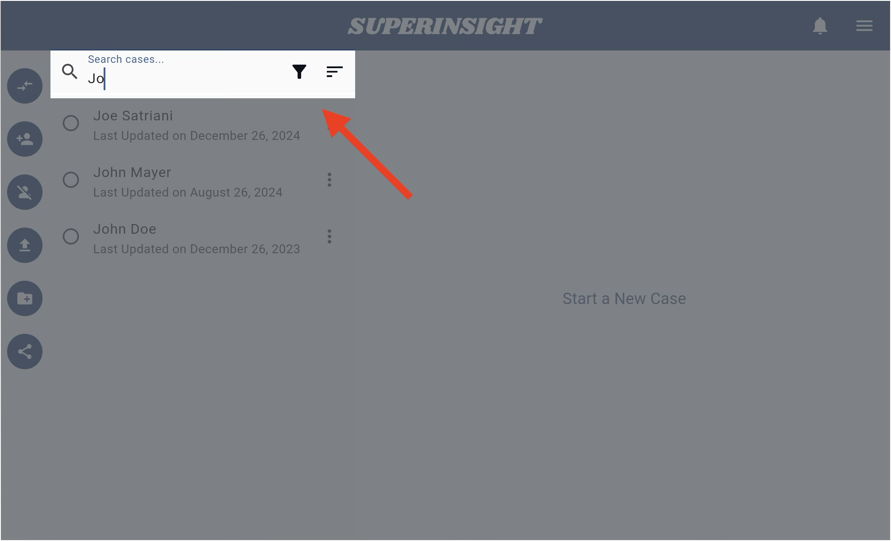
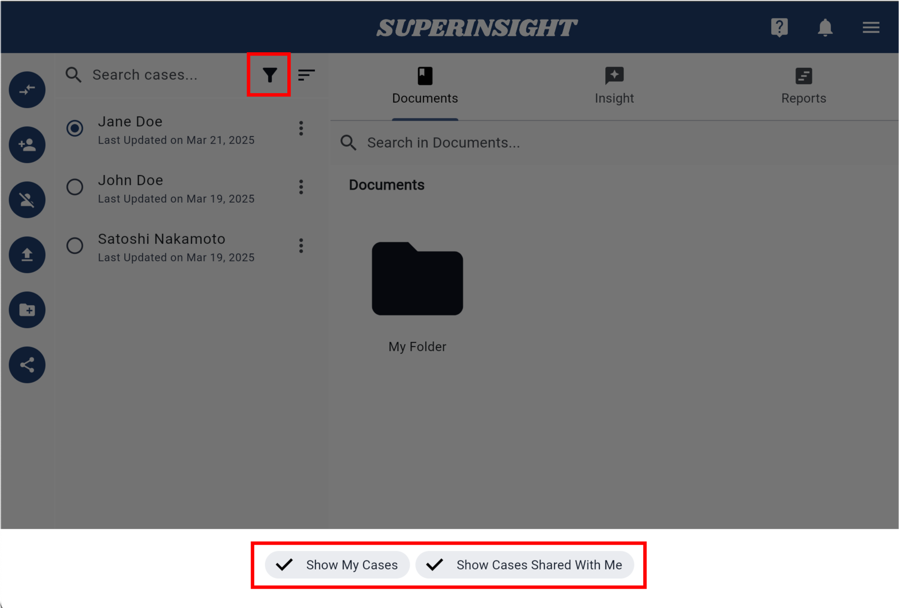
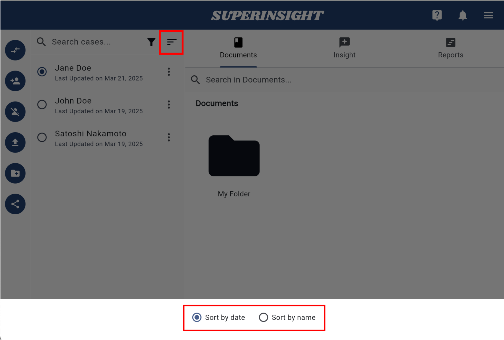
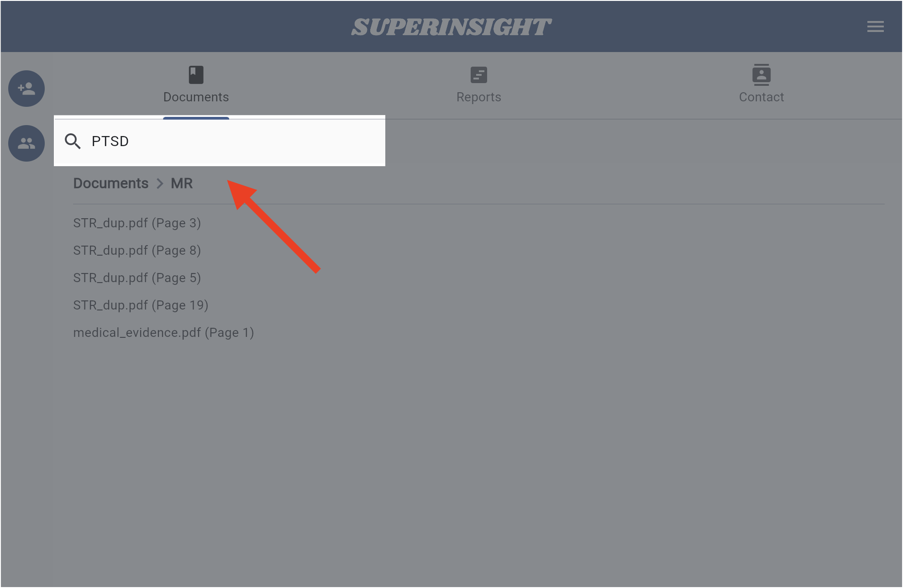
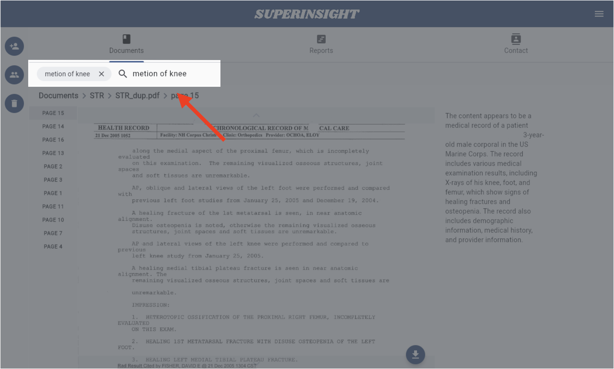
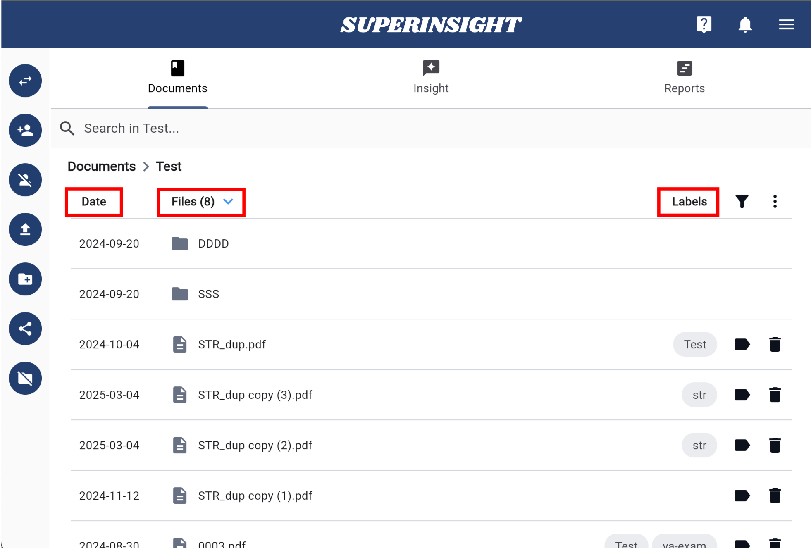

# Search For All

Superinsight offers a powerful search feature for different demands. Let's dive into this useful feature and get your work done more efficiently.

## 1. Search Cases

You can find the search bar at the top of the case contacts list. Type in the name of the contact you are looking for, and Superinsight will find him/her immediately.

If you have cases shared by your co-worker, you can quickly find the contact with the filter as well. You can also sort cases by contact name or update date to let you find your cases more efficiently

=== "Search Cases"
    

=== "Filter Cases"
    

=== "Sort Cases"
    

## 2. Search Documents

In the Documents tab, you can also find the search bar. Like Google Search, type in the terms or keywords you're looking for, and then Superinsight will locate all the relevant information from thousands of your files in seconds. Even precisely tell you which page of the files.

You can even search in one particular file and let Superinsight find all the pages that are relevant to your terms and keywords at once.

Your files are sorted by update date by default. You can also sort them by file name, or label by clicking the column. If you need to find them descending, just click the column again.

=== "Search in Folder"
    

=== "Search in File"
    

=== "Sort Files"
    