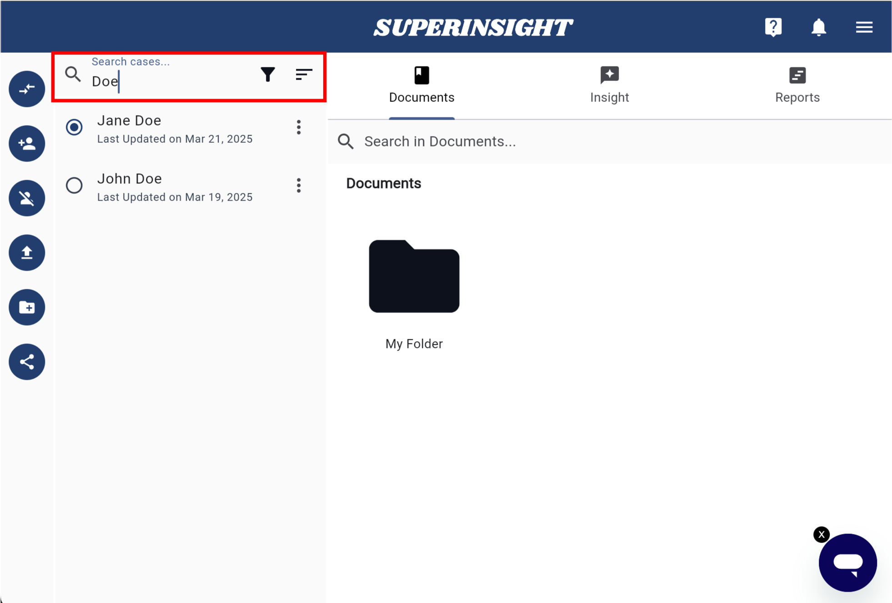
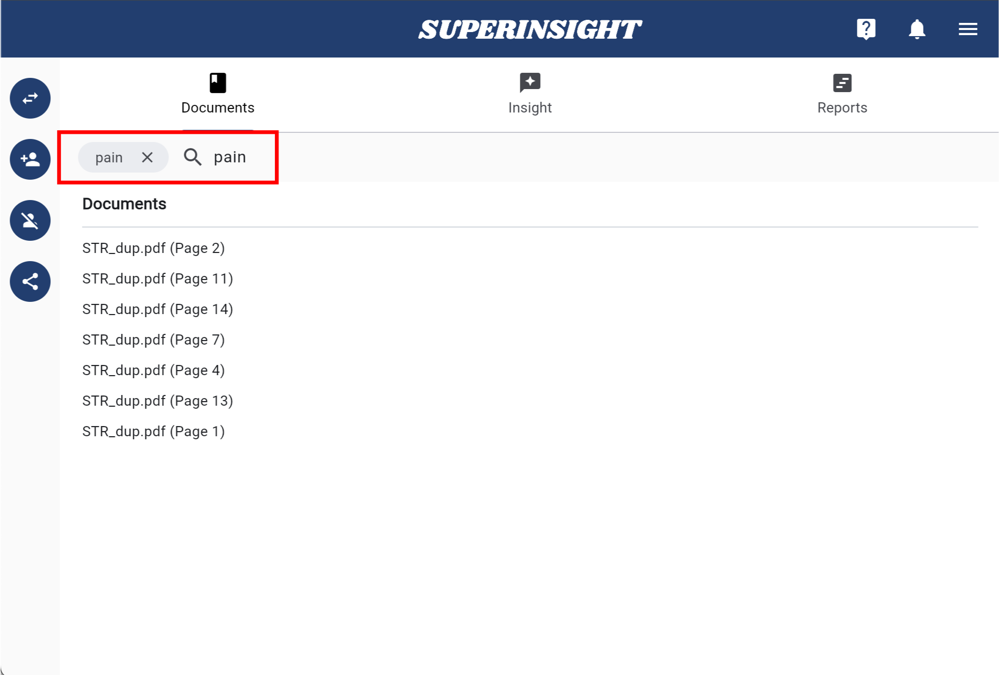
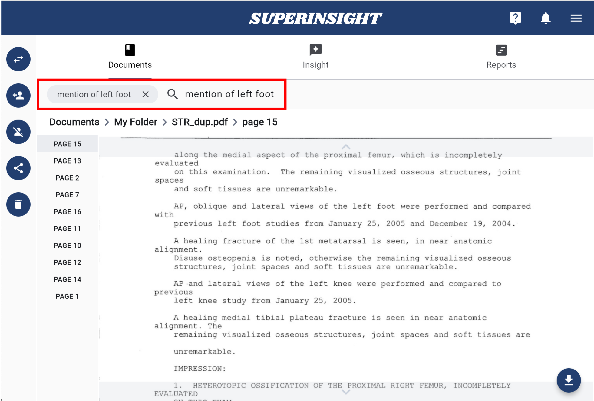

# Search For All

Superinsight offers a powerful search feature to meet various needs. Let's explore this useful feature to help you work more efficiently.

## Search Cases

You can find the search bar at the top of the case contacts list. Type in the name of the contact you are looking for, and Superinsight will locate them instantly.

If you have cases shared by your co-worker, you can quickly find the contact using the filter as well. You can also sort cases by contact name or update date to locate your cases more efficiently.

=== "Search Cases"
    

=== "Filter Cases"
    

=== "Sort Cases"
    

## Search Documents

In the Documents tab, you can also find the search bar. Just like Google Search, type in the terms or keywords you're looking for, and Superinsight will locate all relevant information from thousands of your files in seconds. It will even pinpoint the exact pages within the files.

You can also search within a specific file, allowing Superinsight to find all the pages relevant to your terms and keywords at once.

By default, your files are sorted by update date. You can also sort them by file name or label by clicking the column. To switch between ascending and descending order, simply click the column again.

=== "Search in Folder"
    

=== "Search in File"
    

=== "Sort Files"
    