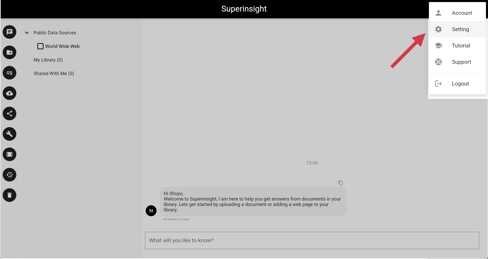
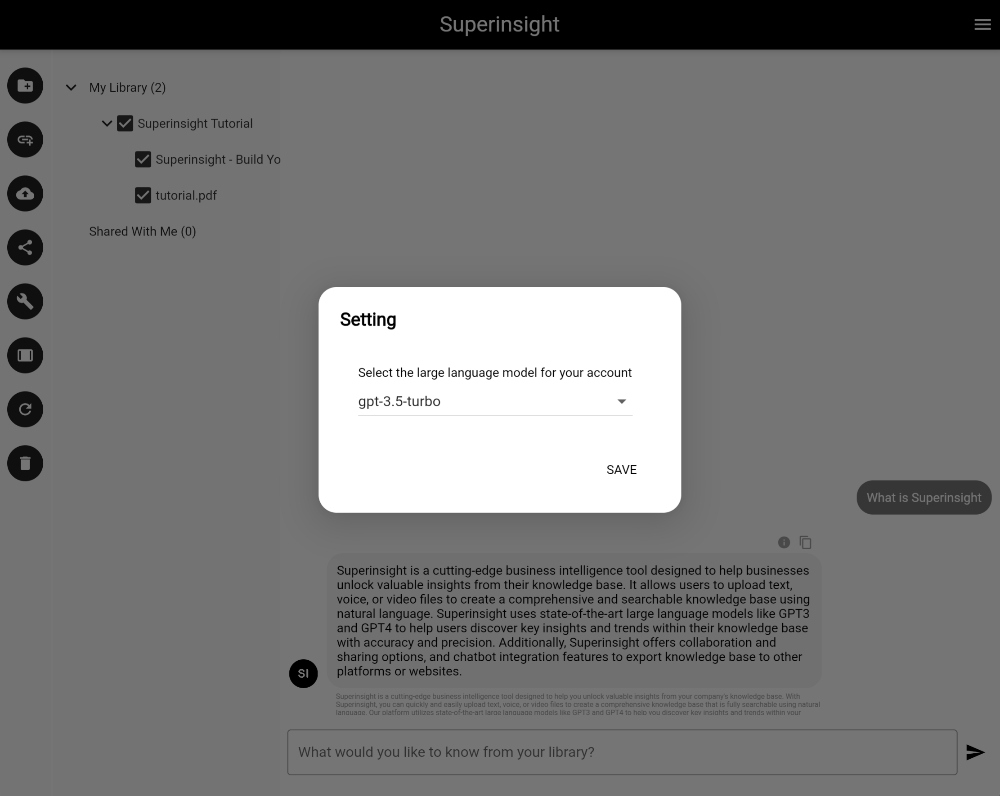

# Manage Setting

Superinsight allows you to configure different models you want to use for your account. Click on the top right navigation and select settings to configure your large language model.

## Configure Large Language Model

Superinsight currently supported Models:

* GPT3.5
* GPT4
* Falcon lite
* Llama2

