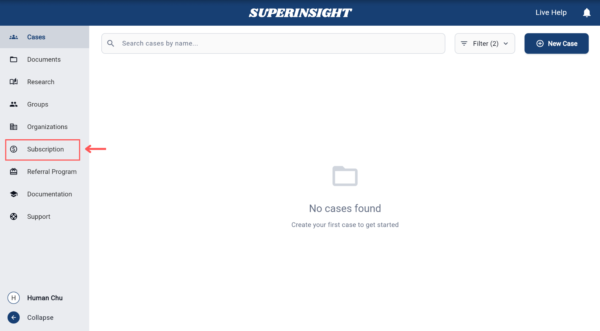
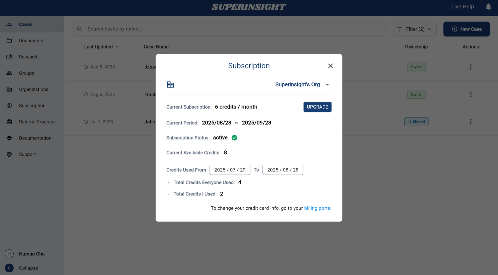
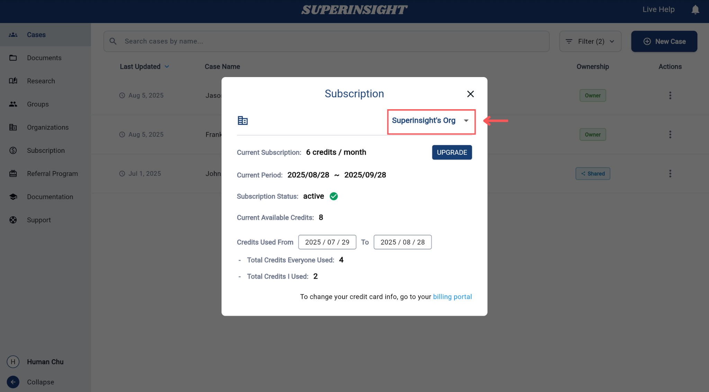
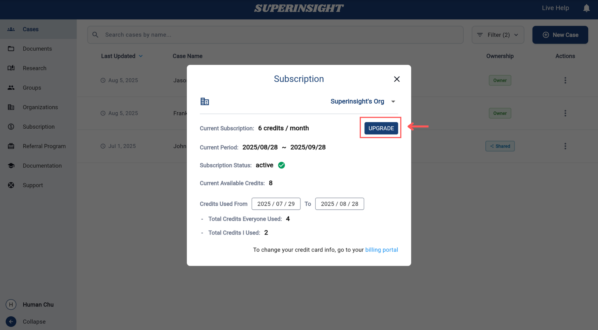
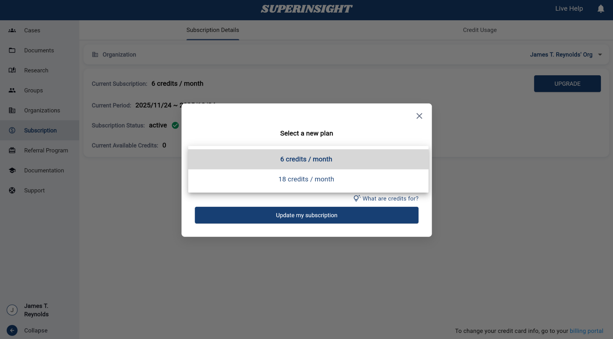
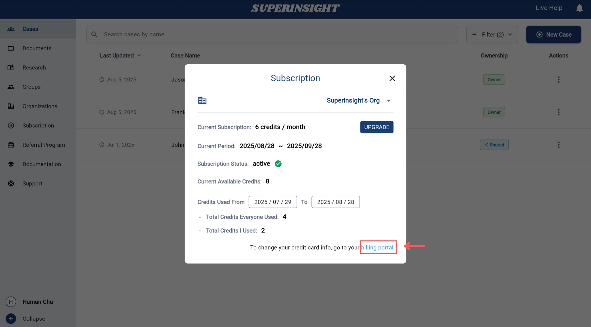

# Manage Subscription

## Overview

Manage your subscription to **view current plan details**, **upgrade to higher plans**, **monitor credit usage**, and **access billing portal** for your organization.

## Accessing Subscription

Navigate to **Subscription** from the left sidebar menu to access subscription management features.

## Subscription Panel

The subscription panel displays your current subscription status and available options.

### Subscription Information

The subscription panel shows:

- **Organization selector** to switch between organizations
- **Current subscription** plan and credit allocation
- **Current period** with billing cycle dates
- **Subscription status** (active/inactive)
- **Current available credits** remaining in your account
- **Credits usage tracking** with date range selection
- **Total credits used** by everyone and individual usage
- **Upgrade button** to change your plan

## Plan Management

Manage your subscription plans and upgrade options through the subscription interface.

### Selecting Organization

Before managing plans, you can select which organization's subscription you want to manage using the organization dropdown.

### Upgrading Your Plan

To upgrade your subscription plan:

1. **Click Upgrade**: Click the "**UPGRADE**" button in the subscription panel
2. **Select New Plan**: Choose from available plan options in the upgrade modal
3. **Review Selection**: Confirm your new plan selection and credit allocation
4. **Update Subscription**: Click "**Update my subscription**" to complete the upgrade

### Available Plan Options

The plan selection interface shows different credit allocation options:

- **6 credits / month**: Standard plan for regular usage
- **18 credits / month**: Enhanced plan for higher usage needs

!!! info "About Credits"
    Credits are tied to your organization. They're used each time someone builds a report in a case under your organization.

## Billing Portal

To manage your payment information and billing details, you can access the external billing portal.

### Changing Credit Card Information

To update your credit card information:

1. **Access Billing Portal**: Click the "**billing portal**" link at the bottom of the subscription panel
2. **External Portal**: You will be redirected to the secure billing portal where you can manage your payment methods
3. **Update Payment Details**: Add new credit cards, update existing payment information, or change your default payment method

The billing portal provides a secure environment to manage all payment-related aspects of your subscription, including credit card updates, billing address changes, and invoice management. 