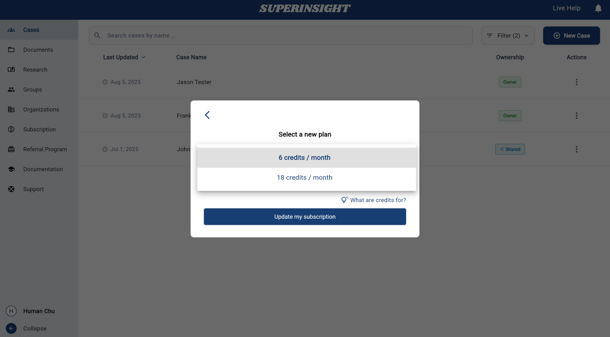

# Manage Subscription

## Overview

Manage your subscription to **view current plan details**, **upgrade to higher plans**, **monitor credit usage**, and **access billing portal** for your organization. The subscription management system provides comprehensive tools for tracking your credit usage, updating plans, and managing billing information.

## Subscription Dashboard

Navigate to **Subscription** from the left sidebar menu to access subscription management features. The main subscription page contains two primary tabs for managing different aspects of your subscription.

The subscription dashboard is organized into two main sections:

- **Subscription Details**: View and manage your current plan, billing cycle, and upgrade options
- **Credit Usage**: Monitor credit consumption, view usage history, and download usage reports

## Subscription Details

The Subscription Details tab displays your current subscription status and provides access to plan management options.

### Selecting Organization

Before managing subscription details, you can select which organization's subscription you want to manage using the organization dropdown in the top-right corner.

This allows you to switch between different organizations you belong to and manage their respective subscriptions independently.

### Subscription Information

The subscription details panel shows:

- **Organization selector** to switch between organizations
- **Current subscription** plan and credit allocation
- **Current period** with billing cycle dates
- **Subscription status** (active/inactive)  
- **Current available credits** remaining in your account
- **Upgrade button** to access plan management options

### Upgrading Your Plan

To upgrade your subscription plan:

1. **Click Upgrade**: Click the "**UPGRADE**" button in the subscription panel to open the plan selection modal

**Select New Plan**: Choose from available plan options in the upgrade modal

#### Available Plan Options

The plan selection interface shows different credit allocation options to meet your organization's needs:

- **6 credits / month**: Standard plan for regular usage
- **18 credits / month**: Enhanced plan for higher usage needs

!!! info "About Credits"
    Credits are tied to your organization. They're used each time someone builds a report in a case under this organization.

### Billing Portal Access

To manage your payment information and billing details, you can access the external billing portal directly from the subscription page.

#### Changing Credit Card Information

To update your credit card information:

1. **Access Billing Portal**: Click the "**billing portal**" link at the bottom of the subscription panel
2. **External Portal**: You will be redirected to the secure billing portal where you can manage your payment methods  
3. **Update Payment Details**: Add new credit cards, update existing payment information, or change your default payment method

The billing portal provides a secure environment to manage all payment-related aspects of your subscription, including credit card updates, billing address changes, and invoice management.

## Credit Usage

The Credit Usage tab provides comprehensive tracking and reporting of credit consumption across your organization. This section helps you monitor usage patterns, track individual and team consumption, and download detailed usage reports.

### Usage Overview

The credit usage interface displays:

- **Credits Used From**: Date range selector to filter usage data by specific time periods
- **Total Credits Everyone Used**: Aggregate credit consumption across all organization members
- **Total Credits I Used**: Your individual credit usage within the selected timeframe
- **Detailed Usage Table**: Comprehensive breakdown of credit usage by date, user, case, report type, and report name

### Usage Details Table

The usage table provides granular information about each credit transaction:

- **Date**: When the credits were consumed
- **User**: Which team member used the credits
- **Case**: The specific case for which credits were used
- **Report Type**: The type of report generated (e.g., personal-injury, medical chronology)
- **Report Name**: The specific name of the generated report
- **Credits**: Number of credits consumed for each report

### Export Credit Details

The credit usage section includes powerful export capabilities for record-keeping and analysis:

**Available Action**

You can export usage data in multiple formats using the action buttons in the top-right corner:

- **Copy to Clipboard**: Quickly copy the current usage data to your clipboard for pasting into other applications
- **Download CSV**: Export usage data as a comma-separated values file for use in spreadsheet applications

These export options allow you to:

- Create custom reports for management review
- Integrate usage data with your organization's billing or accounting systems
- Analyze usage patterns and optimize credit allocation
- Maintain detailed records for audit or compliance purposes

**Usage Filtering and Analysis**

Use the date range selector to focus on specific time periods and analyze:

- Monthly usage trends
- Individual team member consumption patterns  
- Case-specific credit requirements
- Report type efficiency and frequency

This detailed usage tracking helps organizations make informed decisions about subscription plan upgrades and credit allocation strategies. 