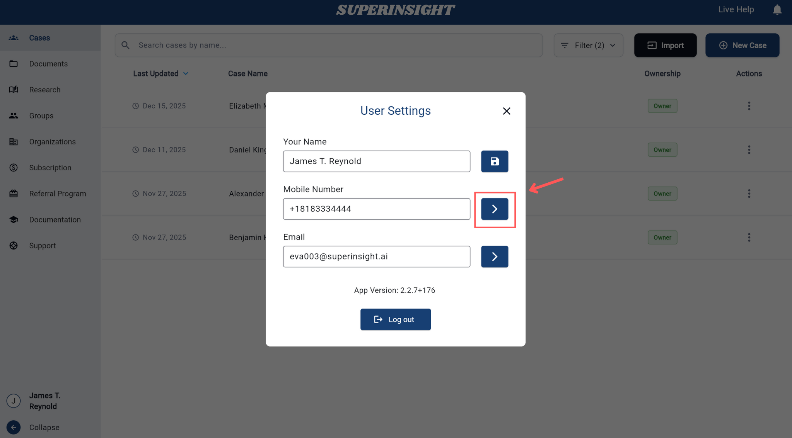
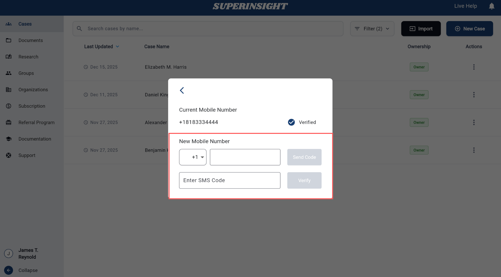
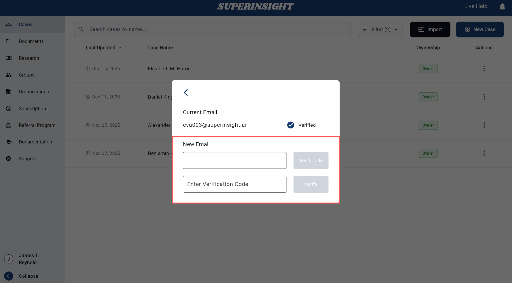

# User Profile

This section explains how to view and manage your user profile settings in Superinsight.

## Profile Settings

Your user profile allows you to update the following information:

- **Name**: Your display name in the application
- **Mobile Number**: Your contact phone number
- **Email**: Your registered email address

## Updating Your Profile

### Update Name

To update your name, simply edit the name field directly and click **Update** to save your changes.

### Update Mobile Number

Step 1: Click the **Change** button next to your mobile number to enter the change page.

Step 2: Enter your new mobile number and input the SMS verification code to complete the update.

### Update Email

Step 1: Click the **Change** button next to your email to enter the change page.

Step 2: Enter your new email address and input the verification code sent to your new email to complete the update.

If you need further assistance with your profile settings, please contact our **Live Help** support.
