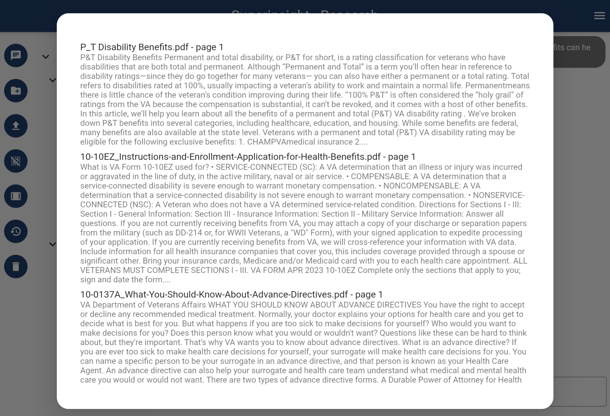

# Quickstart

This is a quickstart guide on how to use Superinsight.
You will learn how to create your knowledge base of case contacts and how to discover insights from veterans' massive and messy documentation even hand-written files like medical reports.

If you don't have an account yet, sign up [for access](https://app.superinsight.me) here.

## 1. Start a New Case

Build up your case information before everything, the first step is to add your contacts. Fill in all the mandatory fields and save.

## 2. Upload a File

You can upload all the files that can help the veteran claim like STRs, medical evidence, rating decisions, and so on to the folders that Superinsight prepares and organizes for you.

After file is uploaded, you will see it in the folder as a gray color and can not be clicked on. Behind the scenes, Superinsight is processing and analyzing all the contents in your file. Depending on how big your files are, this process can take a few minutes to up to hours.

Once the file is ready, as shown in the screenshots below, you can continue to the next step.

=== "Upload File To Folder"

    

=== "File In Progress"

    

=== "File Is Ready"

    

## 3. Get Insights

Once your file is ready, you can click on the file you uploaded earlier and Superinsight will show all the key points and insights that are found in the file.

=== "Original File"

    

=== "File Analysis"

    

## 4. Ask Questions

If you have ANY further questions on VA, VA claims, or files you uploaded, click the menu on the right-up corner and switch to "Research" ask Superinsight, and get your answer immediately.

After you get your response, you will see two icons on the right top of the message as well. The copy icon allows you to copy your message.
The information icon will show you the references that was used for this response.

=== "Research"

    

=== "Ask Question"

    

=== "Get Response"

    

=== "Check Reference"

    

## 5. Try More

If you like to learn more advance features, please continue our guide for [How To Guide](guide/index.md)
