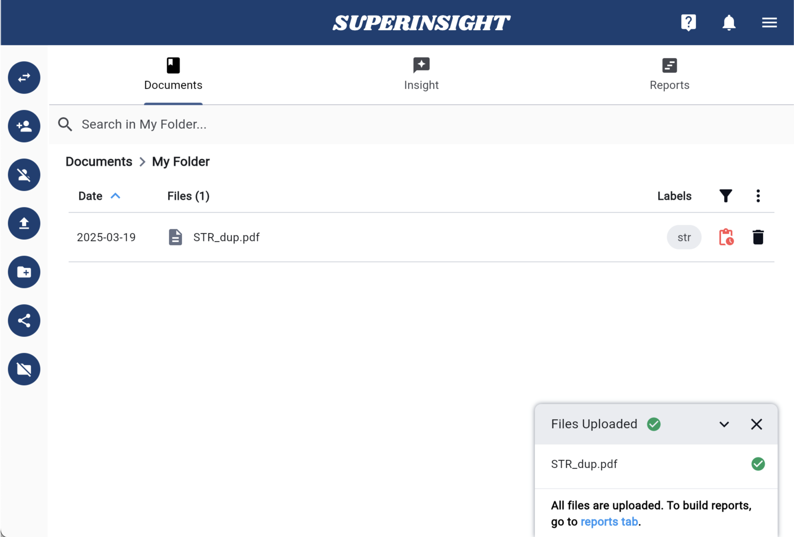

# Quickstart

This is a quickstart guide on how to use Superinsight.
You will learn how to create your knowledge base of case contacts and how to discover insights from your daily massive and messy documentation even hand-written files like medical reports.

If you don't have an account yet, sign up [for access](https://www.superinsight.ai/trial) here.

## 1. Start a New Case

Build up your case information before everything, the first step is to add your contacts. Fill in all the mandatory fields and save.

## 2. Upload a File

Depending on the purpose, you can upload files that can help your legal claims to the folders you created or Superinsight prepared and organized for you after you click into the folder level.

After the file is uploaded, you will see it in the folder as a gray color and can not be clicked on. Behind the scenes, Superinsight is processing all the contents in your file. Depending on how large your files are, this process can take a few minutes to hours.

Once the file is ready, as shown in the screenshots below, you can continue to the next step.

=== "Click to Upload"

    

=== "File In Progress"

    

=== "File Is Ready"

    

## 3. Get Insights

Once your file is ready, you can click on the file you uploaded earlier and Superinsight will show all the key points and insights that are found in the file.

=== "Original File"

    

=== "File Analysis"

    

## 4. Try More

If you like to learn more advance features, please continue our guide for [How To Guide](guide/index.md)
